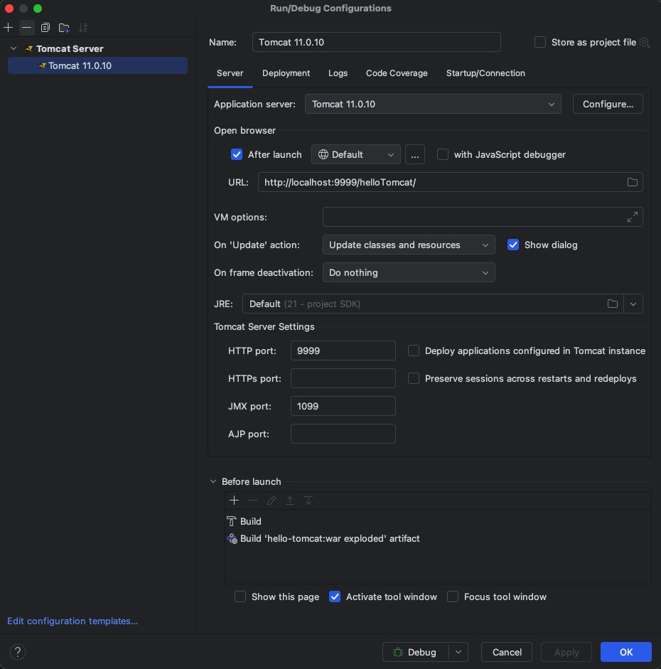
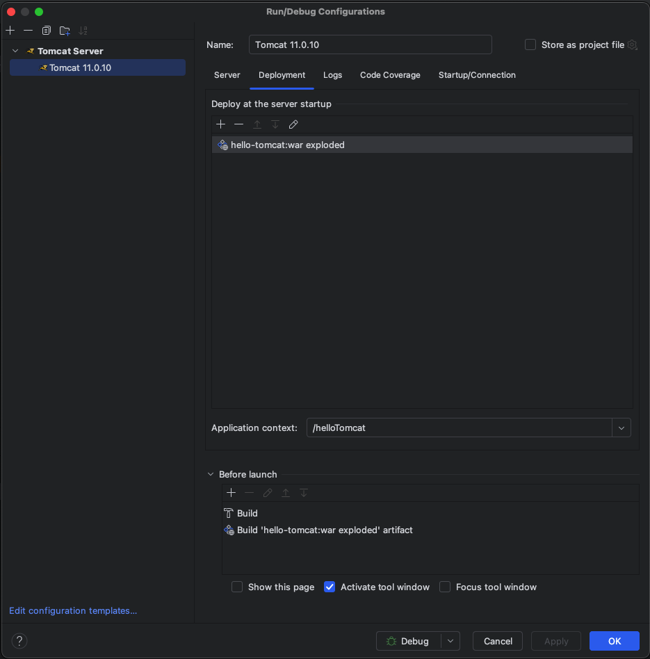
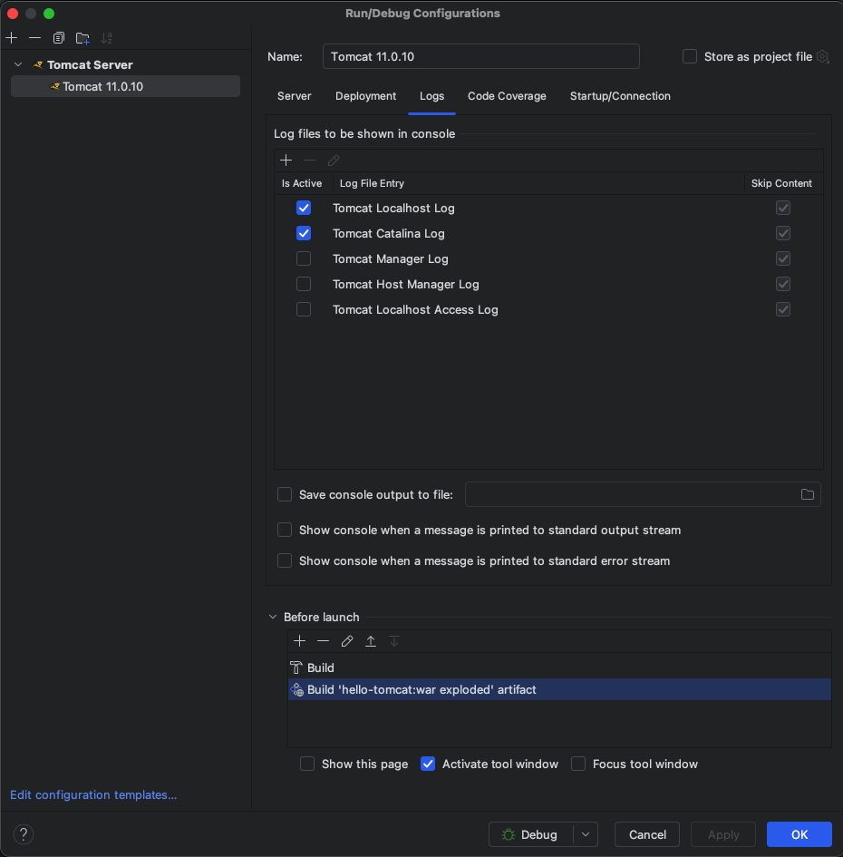
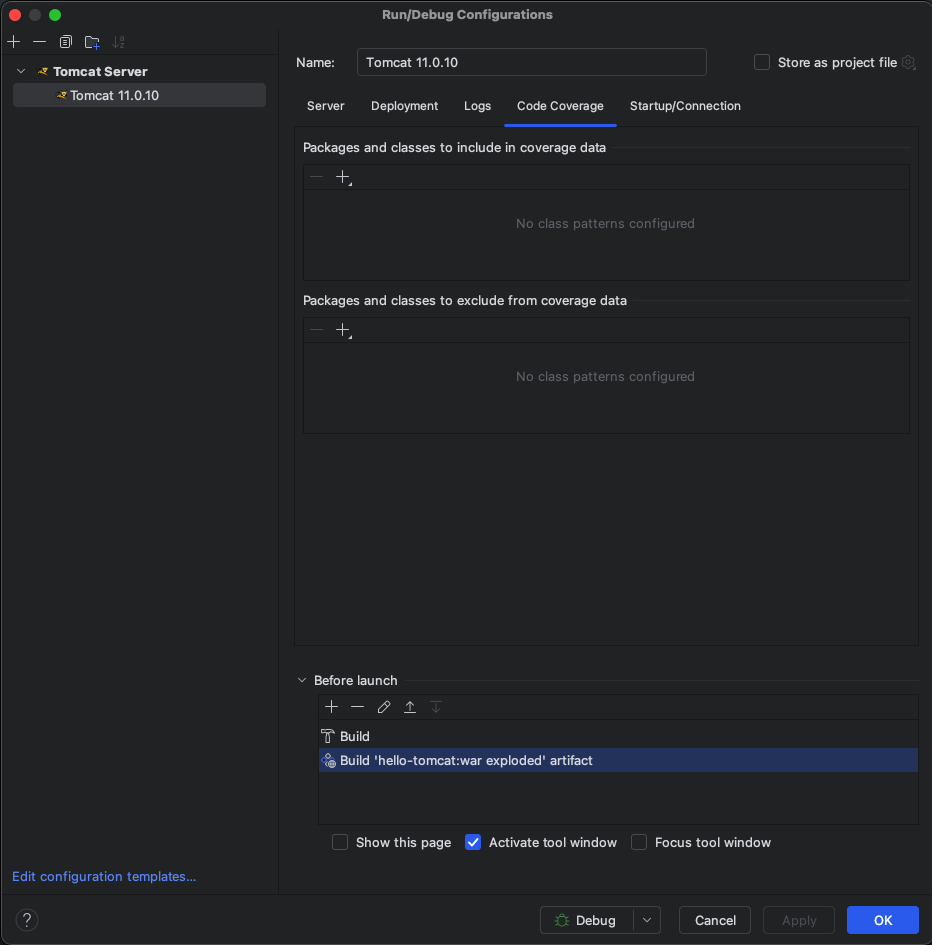
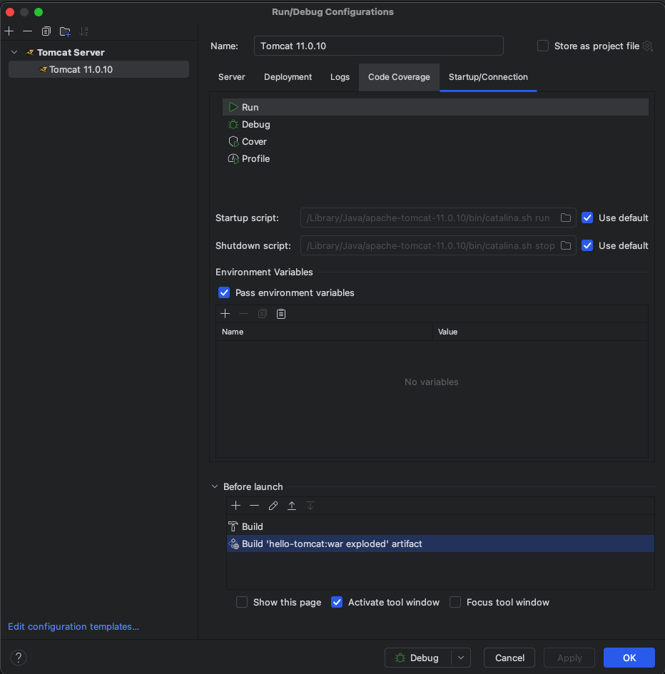

## 一、客户端与服务器的交互过程


服务器是这样的：

* 一台服务器

* 服务器上得安装 JDK，因为 JDK 里包含 JRE、JRE 里又包含 JVM，而服务器软件 Tomcat 本身也是用 Java 写的，它也得靠 JVM 才能运行起来
* 服务器上得安装 Tomcat，因为
  * 对外：Tomcat 负责监听端口
    * 端口不是物理部件，只是一个虚拟概念——即一个端口对应一个 Tomcat 进程，Tomcat 在启动时肯定会设置监听某个端口，此时两者就形成了绑定关系。Tomcat 和端口是一对多的关系，即一个 Tomcat 可以监听一个或多个端口，但是一个端口只能被一个 Tomcat 监听
    * 端口用 2 个字节的无符号整形来表示，所以一台服务器理论上有 65536 个端口。端口只有在被某个 Tomcat 监听时，才处于“打开”状态；没有被监听的端口，默认都处于“关闭”状态
  * 对内：Tomcat 内部部署着一个或多个 JavaWeb 项目， JavaWeb 项目必须部署到 Tomcat 这样的服务器软件中才能运行起来


客户端是这样的：

* 客户端发送一个 HTTP 请求
* 在应用层时是原始数据（请求路径、请求参数等）
* 到了传输层会加上源端口号和目标端口号
* 到了网络层会加上源 IP 地址和目标 IP 地址
* 到了数据链路层会加上源 MAC 地址和目标 MAC 地址
* 到了物理层会加上数据校验相关的东西


客户端与服务器的交互过程是这样的：

* 有了目标 IP 地址，就知道该给哪个服务器发送数据了
* 有了目标 MAC 地址，就知道该给服务器上的哪个网卡发送数据了，网卡收到数据后就会交给操作系统内核
* 有了目标端口号，操作系统内核就会把数据投递到相应的端口，也即投递给监听该端口的 Tomcat 进程
* 有了请求路径，Tomcat 就知道该把请求参数交给哪个 Java 项目来处理
* 服务器给客户端响应数据时也是同样的道理

## 二、本机安装 Tomcat

《Java语言基础》那里我们已经安装好了 JDK，这里我们安装一下服务器软件。服务器软件有很多，但用的最多的就是 Tomcat：

* Tomcat 下载地址：https://tomcat.apache.org/
* 这里选择下载 Tomcat 11
* 下载完双击解压，把解压后的文件夹拖动到你想要的目录下就算安装完成了，这里选择安装在跟 JDK 一样的目录 Macintosh HD/Library/Java/apache-tomcat-11.0.10
* 在 .bash_profile 里配置一下环境变量：export PATH="/Library/Java/apache-tomcat-11.0.10/bin:$PATH"，并执行 source ~/.bash_profile 来让修改立即生效
* Tomcat 没有 tomcat --version 或 tomcat -v 之类的命令来验证是否安装成功

## 三、Tomcat 操作：启动和关闭 Tomcat

`TOMCAT_HOME = Tomcat 的安装目录 = Macintosh HD/Library/Java/apache-tomcat-11.0.10 `

```shell
cd TOMCAT_HOME/bin

// 给 bin 目录下的所有 .sh 文件加执行权限
chmod +x *.sh
```

Tomcat 默认监听 8080 端口来提供 HTTP 服务，所以当 Tomcat 启动成功后，我们可以通过 http://localhost:8080 来访问一下 Tomcat

#### 方式一：执行脚本文件 catalina

```shell
cd TOMCAT_HOME/bin

// 执行脚本文件
bash catalina.sh run
```

```shell
cd TOMCAT_HOME/bin

// 执行脚本文件
bash catalina.sh stop
```

#### 方式二：执行脚本文件 startup、shutdown

```shell
cd TOMCAT_HOME/bin

// 执行脚本文件（本质就是在调用 catalina）
bash startup.sh
```

```shell
cd TOMCAT_HOME/bin

// 执行脚本文件（本质就是在调用 catalina）
bash shutdown.sh
```

#### 方式三：把 Tomcat 集成到 IDEA 里，通过 IDEA 来启动和关闭 Tomcat

把 Tomcat 集成到 IDEA 里：

* IDEA - Settings... - Build, Execution, Deployment - Application Servers
* New - Tomcat Server - Tomcat Home
* Apply - OK

通过 IDEA 来启动和关闭 Tomcat，得有 JavaWeb 项目/模块：

* IDEA - New Project - Jakarta EE（原来的 Java Enterprise）
* Name：hello-tomcat
* Location：项目所在父目录
* Template：Web application（JavaWeb 项目）
* Application server：Tomcat 11.0.10（我们刚才集成的）
* Language：Java
* Build system：Maven
* Group（公司域名倒写）：com.ineyee
* Artifact（默认就是项目名）
* JDK：选择相应版本的 JDK
* Next - Create（这样就创建好了项目）

***

* 然后我们在 webapp 目录下自定义创建一个 login.html
* 然后 Tomcat 11.0.10 - Edit Configurations
  * Server - HTTP port，由 8080 换成自定义的端口比如“9999”（本机上可能有其它软件已经在监听 8080 端口了，会导致 Tomcat 无法监听；${TOMCAT_HOME}/conf/server.xml 文件，\<Connector\> 标签里也能修改端口）
  * Deployment - 选中我们的项目，把下面的 Application context 由 “/hello_tomcat_war_exploded”这么长的一串换成自定义的“/helloTomcat”（注意前面的 / 不能少，这个应用上下文就是 Tomcat 用来查找对应的项目的）
* Apply - OK
* 点击 Run 或 Debug 就可以启动 Tomcat 了，Tomcat 就会把我们的 JavaWeb 项目给自动部署好
* 然后我们去浏览器里通过“http://localhost:9999/helloTomcat”来访问，项目默认返回的是 webapp 目录下的 index.jsp 文件，我们还可以通过“http://localhost:9999/helloTomcat/login.html”来访问我们自己创建的登录页面
* 点击 Stop 就可以关闭 Tomcat
* 其实我们可以在 Tomcat 11.0.10 - Edit Configurations - Startup/Connection 里看到 IDEA 启动和关闭 Tomcat 本质也是在调用 catalina
* 此外我们还可以在 Tomcat 11.0.10 - Edit Configurations - Server - On 'Update' action 来设置更新 Tomcat 默认是重新部署还是重启服务器等

***











## 四、Tomcat 部署 JaveWeb 项目的方式

`TOMCAT_HOME = Tomcat 的安装目录 = Macintosh HD/Library/Java/apache-tomcat-11.0.10 `

#### 方式一：把 JavaWeb 项目打包后的文件夹，直接放在 ${TOMCAT_HOME}/webapps 目录下

* Build - Build Artifacts - ${项目名}:war exploded（注意这里有 exploded，代表打包成爆炸物文件夹）
* 这样对 JaveWeb 项目打包后，产物是一个文件夹：${项目名}-${项目版本}-SNAPSHOT，放在 target 目录下
* 我们需要把产物文件夹名改成 ${Application context}，以便将来访问
* 把产物文件夹直接复制到 ${TOMCAT_HOME}/webapps  目录下
* 启动 Tomcat
* 然后我们去浏览器里通过“http://localhost:9999/helloTomcat”来访问，项目默认返回的是 webapp 目录下的 index.jsp 文件，我们还可以通过“http://localhost:9999/helloTomcat/login.html”来访问我们自己创建的登录页面，验证是否部署成功

```
缺点：要复制一堆文件夹和文件，万一漏了就出错了，而且这堆文件夹和文件的体积也可能比较大，复制起来会比较慢
```

#### 方式二：把 JavaWeb 项目打包后的 war 包，直接放在 ${TOMCAT_HOME}/webapps 目录下

* Build - Build Artifacts - ${项目名}:war（注意这里没有 exploded，代表打包成非爆炸物压缩包）
* 这样对 JaveWeb 项目打包后，产物是一个 war 压缩包：${项目名}-${项目版本}-SNAPSHOT.war，放在 target 目录下
* 我们需要把产物 war 包名改成 ${Application context}.war，以便将来访问
* 把产物 war 包直接复制到 ${TOMCAT_HOME}/webapps  目录下
* 启动 Tomcat，此时会自动解压 war 包为文件夹，其实也就变成方式一了
* 然后我们去浏览器里通过“http://localhost:9999/helloTomcat”来访问，项目默认返回的是 webapp 目录下的 index.jsp 文件，我们还可以通过“http://localhost:9999/helloTomcat/login.html”来访问我们自己创建的登录页面，验证是否部署成功

```
优点：只需要复制一个 war 压缩包，不容易漏，复制起来也比较快
缺点：还是得复制来复制去
```

#### 方式三：在 ${TOMCAT_HOME}/conf/Catalina/localhost 文件夹下创建一个 xml 文件，xml 文件名为 ${Application context}

* Build - Build Artifacts - ${项目名}:war exploded（注意这里有 exploded，代表打包成爆炸物文件夹）
* 这样对 JaveWeb 项目打包后，产物是一个文件夹：${项目名}-${项目版本}-SNAPSHOT，放在 target 目录下
* 我们需要把产物文件夹名改成 ${Application context}，以便将来访问
* 把产物文件夹放到指定的路径，这里假设我们的产物文件夹放在桌面上

* 在 ${TOMCAT_HOME}/conf/Catalina/localhost 文件夹下创建一个 xml 文件，xml 文件名为 ${Application context}，以便将来访问

* 在 xml 文件里新建一个标签

  ```XML
  # 这里假设我们的产物文件夹放在桌面上: <Context docBase="/Users/yiyi/Desktop/helloTomcat" />
  <Context docBase="产物文件夹的路径" />
  ```

  ```XML
  其实我们在 IDEA 里启动 Tomcat，Tomcat 就是按这种方式部署 JavaWeb 项目的
  
  启动 Tomcat 后，控制台可以看到一个 CATALINA_BASE 的路径，复制并前往这个路径，进入 /conf/Catalina/localhost，就能看到 ${Application context}.xml 文件了，它里面 Context 标签的 docBase 就指向我们项目里 target 目录下的产物文件夹
  <Context docBase="/Users/yiyi/Desktop/JavaLearning/02-JavaWeb基础/01-Tomcat/hello-tomcat/target/hello-tomcat-1.0-SNAPSHOT" />
  ```

  ```
  优点：产物不需要复制来复制去
  ```

