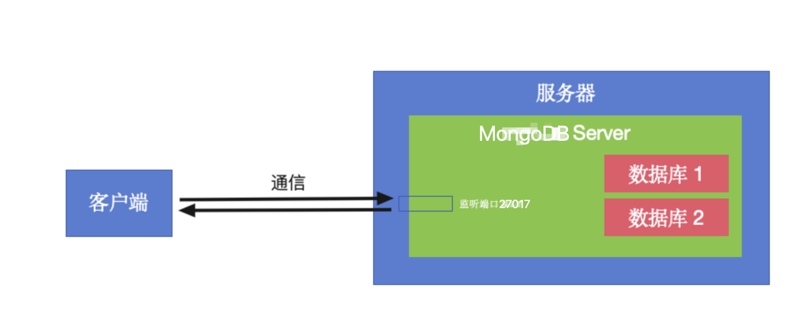

## 一、本机安装 MongoDB



MongoDB Server 跟 Tomcat 一样也是一个服务器软件，它在启动时肯定也会设置监听某个端口（默认 27017）来跟客户端通信（如 mongodb 命令行工具、各种编程语言的驱动、GUI 工具等），MongoDB Server 内部又存放着一个或多个 MongoDB 数据库

* MongoDB 下载地址：https://fastdl.mongodb.org/osx/mongodb-macos-arm64-8.2.5.tgz

* 这里选择下载 MongoDB Community 8.2.5

* 下载完双击解压即可，解压后把解压产物（如 mongodb-macos-aarch64--8.2.5 这个文件夹）直接拖到 /usr/local 目录下（即 /usr/local/mongodb-macos-aarch64--8.2.5），这其实就算安装完成了（/ 代表根目录 Macintosh HD，~/ 代表当前用户目录 /Users/ineyee）

  * 然后在 mongodb 目录下手动创建一个 data 目录、在 data 目录下再手动创建一个 db 目录（即 /usr/local/mongodb-macos-aarch64--8.2.5/data/db），用来存放数据库数据

  * 然后在 mongodb 目录下手动创建一个 log 目录、在 log 目录下再手动创建一个 mongodb.log 文件（即 /usr/local/mongodb-macos-aarch64--8.2.5/log/mongodb.log），用来存放数据库日志

  * 然后在 bin 目录下手动创建一个 mongod.cfg 文件（即 /usr/local/mongodb-macos-aarch64--8.2.5/bin/mongod.cfg），用来存放 mongodb 的配置

    ```yaml
    # -------------------------------
    # 1️⃣ 存储相关配置
    # -------------------------------
    storage:
      dbPath: /usr/local/mongodb-macos-aarch64--8.2.5/data/db    # 数据库存放路径（生产环境需要修改）
    
    # -------------------------------
    # 2️⃣ 日志相关配置
    # -------------------------------
    systemLog:
      destination: file                                                # 日志输出到文件（生产环境需要修改）
      path: /usr/local/mongodb-macos-aarch64--8.2.5/log/mongodb.log    # 日志文件路径
      logAppend: true                                                  # 是否追加日志（true=追加，false=覆盖）
    
    # -------------------------------
    # 3️⃣ 网络相关配置
    # -------------------------------
    net:
      port: 27017          # 监听端口（默认 27017）
      bindIp: 127.0.0.1    # 只允许本机访问（生产环境需要修改）
    
    # -------------------------------
    # 4️⃣ 安全相关配置
    # -------------------------------
    security:
      authorization: enabled    # 开启认证（必须创建用户后才能使用）
    
    # -------------------------------
    # 5️⃣ 进程管理
    # -------------------------------
    # processManagement:
    #   fork: true    # 是否后台运行（Linux 下有效）
    ```


* 在 .bash_profile 里配置一下环境变量：export PATH="/usr/local/mongodb-macos-aarch64--8.2.5/bin:$PATH"，并执行 source ~/.bash_profile 来让修改立即生效

* 终端执行 mongod --version 或 mongod -version 来验证是否安装成功

* 不论服务器的时区是多少，MongoDB 的日期类型始终存储为 UTC 时间，所以我们不需要像 MySQL 一样修改配置文件来指定时区

* 本机前台启动 MongoDB 服务，终端里执行：mongod --config /usr/local/mongodb-macos-aarch64--8.2.5/bin/mongod.cfg

* 本机前台停止 MongoDB 服务，终端里执行：ctrl + c

* 安装一下 mongosh 来添加能访问数据库的账号和密码（对应上面的 4️⃣），brew install mongosh

  * 启动 MongoDB 服务，然后终端里执行：sudo mongosh，会自动连接到 mongodb://localhost:27017

  * 切换到 admin 数据库：use admin

  * 创建用户

    ```javascript
    db.createUser({
      user: "root",        // 你的用户名
      pwd: "MongoDB666!",  // 你的密码
      roles: [
        { role: "userAdminAnyDatabase", db: "admin" },  // 管理员权限
        { role: "readWriteAnyDatabase", db: "admin" }   // 可选：对所有数据库有读写权限
      ]
    })
    ```

  * 停止 MongoDB 服务，重新启动 MongoDB 服务

## 二、本机安装 Navicat

#### 1、安装 Navicat GUI 工具

* Navicat 下载地址：https://www.macwk.com/soft/navicat-premium
* 这里选择下载：Navicat Premium 16.3.7
* 下载完双击安装即可，macOS 上会默认安装在应用程序

#### 2、使用 Navicat GUI 工具操作 MongoDB 数据库

* 打开 Navicat 软件

* 新建一个连接，连接到上面本机启动的 MongoDB 服务器
* 连接的类型选择为 MongoDB
* 输入连接的名字，如 mongodb-local
* 输入域名和端口号，这里 MongoDB 是本机启动的、端口号也是默认的，所以是 localhost 和 27017
* 输入账号和密码，如 root、MongoDB666!
* 确定后连接就创建好了，此时连接是灰色，代表连接尚未启动
* 双击这个连接就可以启动了，此时连接会变成红色，这个连接下所有的数据库也会被展示出来
* 接下来我们就可以操作数据库了
