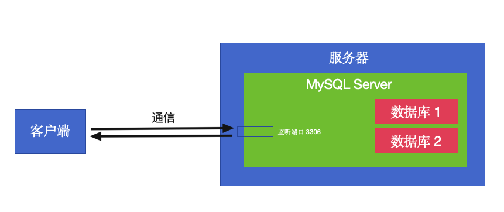

## 一、本机安装 MySQL

MySQL Server 跟 Tomcat 一样也是一个服务器软件，它在启动时肯定也会设置监听某个端口（默认 3306）来跟客户端通信（如 mysql 命令行工具、各种编程语言的驱动、GUI 工具等），MySQL Server 内部又存放着一个或多个 MySQL 数据库

* MySQL 下载地址：https://dev.mysql.com/downloads/mysql/
* 这里选择下载 MySQL Community Server 8.4.6 LTS
* 下载完双击安装即可（期间设置一下 root 用户的密码，比如是 mysqlroot），macOS 上会默认安装在 /usr/local/mysql，数据库数据默认存放路径为 /usr/local/mysql/data（/ 代表根目录 Macintosh HD，~/ 代表当前用户目录 /Users/ineyee）
* 在 .bash_profile 里配置一下环境变量：export PATH="/usr/local/mysql/bin:$PATH"，并执行 source ~/.bash_profile 来让修改立即生效
* 终端执行 mysql --version 或 mysql -V 来验证是否安装成功
* 然后在 /usr/local/mysql 目录下创建一个文件夹 etc，在 etc 文件夹里创建一个配置文件 my.cnf，在 my.cnf 添加“[mysqld]（这里换行）default-time-zone = '+00:00'”，把 MySQL 的默认时区设置为 0 时区，这样才能确保将来通过 SQL 语句自动生成并存储在数据库里的 create_time、update_time 是 0 时区的时间
* macOS 电脑上可以在【系统设置】里找到 MySQL 软件，我们可以在这里启动或者停止 MySQL 服务，也可以勾选开关机自动启动或停止 MySQL 服务

## 二、本机安装 Navicat

#### 1、安装 Navicat GUI 工具

* Navicat 下载地址：https://www.navicat.com.cn/download/navicat-for-mysql    https://www.mac78.com/924.html#J_DLIPPCont    https://www.macwk.com/soft/navicat-premium
* 这里选择下载：Navicat for MySQL 17.1.9
* 下载完双击安装即可，macOS 上会默认安装在应用程序

#### 2、使用 Navicat GUI 工具操作 MySQL 数据库

* 打开 Navicat 软件

* 新建一个连接，连接到上面本机启动的 MySQL 服务器
* 连接的类型选择为 MySQL
* 输入连接的名字，如 my-mac-mysql
* 输入域名和端口号，这里 MySQL 是本机启动的、端口号也是默认的，所以是 localhost 和 3306
* 输入账号和密码，如 root、mysqlroot
* 确定后连接就创建好了，此时连接是灰色，代表连接尚未启动
* 双击这个连接就可以启动了，此时连接会变成绿色，这个连接下所有的数据库也会被展示出来
* 接下来我们就可以新建查询 - 编写 SQL 语句来操作数据库了
