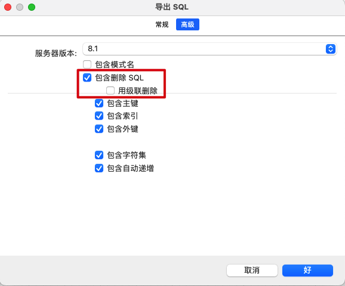
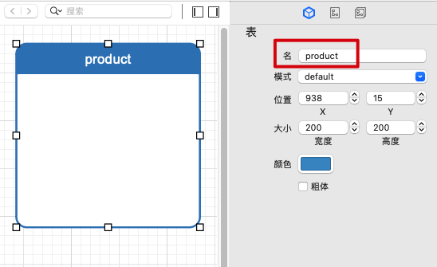
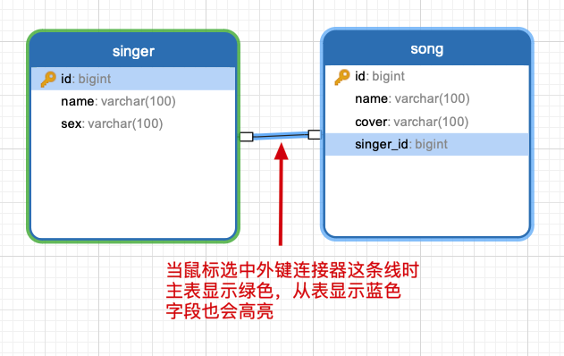
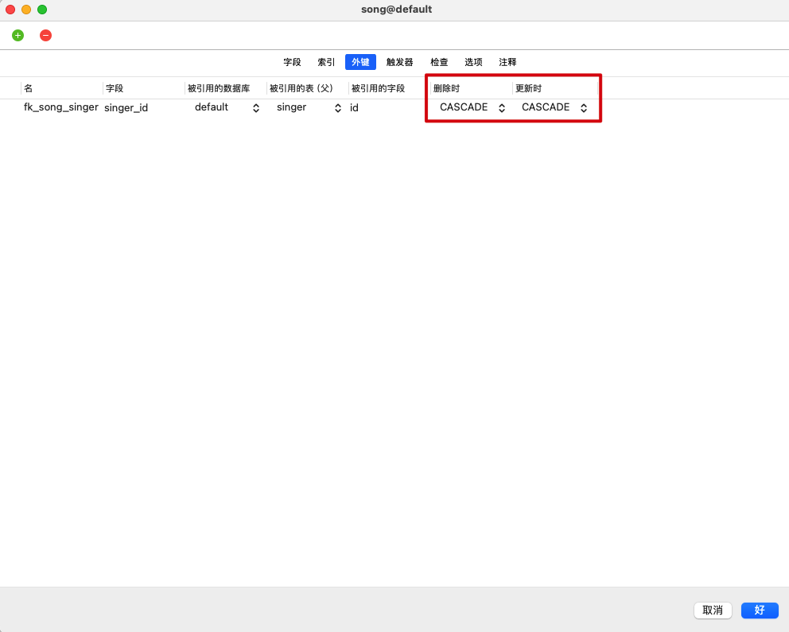
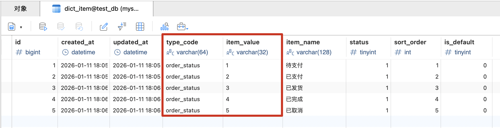

实际开发中，一般都是用 Navicat GUI 工具先把数据库和表的设计与创建创建好，项目里就只做些增删改查操作，很少在项目里通过代码来创建数据库和表的设计与创建。

## ✅ 一、用 Navicat Premium 创建数据库

> 一般来说一个项目对应一个数据库


***


## ✅ 二、用 Navicat Data Modeler 设计表

Navicat Data Modeler 是一个强大的设计表工具，本机安装 Navicat Data Modeler：

- Navicat Data Modeler 下载地址：https://www.5v13.com/macrj/37949.html
- 下载完双击安装即可，macOS 上会默认安装在应用程序
- Navicat Data Modeler 使用教程：https://www.navicat.com.cn/manual/online_manual/cn/navicat_data_modeler_4/mac_manual/#/about_0

#### ✅ 1、新建模型

> Navicat Data Modeler 里的模型其实就是数据库的设计图纸，我们就是在模型这个东西上设计数据库里一张一张的表，所以模型的名字可以跟数据库的名字保持一致
>
> 一个数据库里可以有多张表 => 一个模型里可以有多张表


***


***


#### ✅ 2、设计表（这里先设计下单表）

> 通过 SQL 语句手动创建表时是这样：
>
> ```mysql
> CREATE TABLE IF NOT EXISTS product (
> 	-- 主键、自增
>   id BIGINT PRIMARY KEY AUTO_INCREMENT,
>   
>   -- 该字段我们定义为非必传，即 DATETIME? 类型而非 DATETIME 类型，因此我们需要提供默认值——当前时间
>   -- 只要我们给这个字段提供了默认值，实际开发中就无需再手动给这个字段赋值了，让数据库自动维护即可
>   -- 无论服务器所在时区是什么时区，MySQL 在自动维护 DATETIME 类型的字段时默认都存储的是零时区的时间，所以客户端拿到时间后展示时需要手动转换为各个时区对应的时间展示；当然有些数据库 GUI 工具——如 Navicat ——在展示这些零时区的时间时可能会转换为当前时区的时间展示，这个我们不用管它；总之，通过 SQL 语句读取到的时间和返回给客户端的时间肯定是零时区的
>   create_time DATETIME DEFAULT(CURRENT_TIMESTAMP),
> 
>   -- 该字段我们定义为非必传，即 DATETIME? 类型而非 DATETIME 类型，因此我们需要提供默认值——当前时间；并且我们设置当更新了某条数据的任意字段时，都用最新的当前时间更新一下该字段
>   -- 只要我们给这个字段提供了默认值，实际开发中就无需再手动给这个字段赋值了，让数据库自动维护即可
>   update_time DATETIME DEFAULT(CURRENT_TIMESTAMP) ON UPDATE CURRENT_TIMESTAMP,
> 
> 	-- 该字段我们定义为必传，即 String 类型而非 String? 类型，因此我们不需要提供默认值
> 	-- 该字段还得唯一
>   name VARCHAR(100) NOT NULL UNIQUE,
> 	
> 	-- 该字段我们定义为非必传，即 String? 类型而非 String 类型，因此我们需要提供默认值
>   `desc` VARCHAR(100) DEFAULT(""),
> 	
> 	-- 该字段我们定义为非必传，即 Double? 类型而非 Double 类型，因此我们需要提供默认值
> 	price DOUBLE NOT NULL
> );
> ```

###### ✅ 2.1 创建表

> 在 Navicat Data Modeler 里，创建表时本身没有一个可勾选的“IF NOT EXISTS”开关，因为 Navicat Data Modeler 的职责更偏向表结构设计工具，而不是直接执行 SQL 的工具，所以如果需要“IF NOT EXISTS”的话，可以在生成 SQL 语句后，我们手动加上去。但实际上这一般都发生在初始创建表阶段，一般不会已存在表，所以不管也没关系
>
> 如果实在在意又不想手动修改 SQL 语句的话，可以让 Navicat Data Modeler 生成“创建表前先删除表的 SQL 语句”，从而避免已存在


***



###### ✅ 2.2 命名表


***



###### ✅ 2.3 给表添加字段


***


***


***


***


***


***


###### ✅ 2.4 设计完成后


###### ✅ 2.5 导出 SQL 语句


***


## ✅ 三、用 Navicat Premium 为数据库创建表


***


***


## ✅ 四、用 Navicat Premium 为表生成测试数据


***


***


## ✅ 五、一对一表结构和一对多表结构的设计

> 一对一表结构和一对多表结构的唯一区别就是：外键是否 UNIQUE，其它都一样。一对一表结构的外键必须得是 UNIQUE，否则就变成一对多表结构了
>
> 这里以一对多表结构为例，通过 SQL 语句手动创建表时是这样：先创建做为主表的歌手表，再创建做为从表的歌曲表
>
> ```mysql
> CREATE TABLE IF NOT EXISTS singer (
>   id BIGINT PRIMARY KEY AUTO_INCREMENT,
>   name VARCHAR(100) NOT NULL,
>   sex VARCHAR(100) DEFAULT('')
> );
> ```
>
> ```mysql
> CREATE TABLE IF NOT EXISTS song (
>   id BIGINT PRIMARY KEY AUTO_INCREMENT,
>   name VARCHAR(100) NOT NULL,
>   cover VARCHAR(100) DEFAULT(''),
> 	
>   -- 外键字段，必须与 t_singer.id 类型一致
>   -- 一对一表结构的外键必须得是 UNIQUE，否则就变成一对多表结构了：singer_id BIGINT UNIQUE,
>   singer_id BIGINT,
>   -- 在 CREATE 语句的最后添加一个外键约束，含义为：
>   -- 当前表中的外键 singer_id，引用的是 singer 表中的 id
>   -- ON UPDATE 和 ON DELETE 是指当我们修改或删除 singer.id 时，song 应该做出什么反应，默认情况下这个值是 RESTRICT —— 即如果某个字段被外键关联着、那么在修改或删除这个字段时直接报错、也就是说不允许删除或修改；我们通常会手动设置为 CASCADE —— 即允许修改或删除这个字段、并且如果是修改这个字段那就跟随修改另外一张表里的数据、如果是删除这个字段那就跟随删除另外一张表里的数据
>   FOREIGN KEY (singer_id) REFERENCES singer(id) ON UPDATE CASCADE ON DELETE CASCADE
> );
> ```

#### ✅ 1、先创建好两张表


#### ✅ 2、添加外键


***


***



***



## ✅ 六、多对多表结构的设计

> 通过 SQL 语句手动创建表时是这样：先创建做为主表的歌手表和歌曲表，再创建做为从表的中间表
>
> ```mysql
> CREATE TABLE IF NOT EXISTS singer (
>   id BIGINT PRIMARY KEY AUTO_INCREMENT,
>   name VARCHAR(100) NOT NULL,
>   sex VARCHAR(100) DEFAULT('')
> );
> ```
>
> ```mysql
> CREATE TABLE IF NOT EXISTS song (
>   id BIGINT PRIMARY KEY AUTO_INCREMENT,
>   name VARCHAR(100) NOT NULL,
>   cover VARCHAR(100) DEFAULT('')
> );
> ```
>
> ```mysql
> CREATE TABLE IF NOT EXISTS singer_song (
>   id BIGINT PRIMARY KEY AUTO_INCREMENT,
> 	
> 	-- 外键字段，必须与 singer.id 类型一致
> 	singer_id BIGINT,
> 	-- 外键字段，必须与 song.id 类型一致
>   song_id BIGINT,
> 	-- 在 CREATE 语句的最后添加一个外键约束，含义为：
>   -- 当前表中的外键 singer_id，引用的是 singer 表中的 id
>   -- ON UPDATE 和 ON DELETE 是指当我们修改或删除 singer.id 时，singer_song 应该做出什么反应，默认情况下这个值是 RESTRICT —— 即如果某个字段被外键关联着、那么在修改或删除这个字段时直接报错、也就是说不允许删除或修改；我们通常会手动设置为 CASCADE —— 即允许修改或删除这个字段、并且如果是修改这个字段那就跟随修改另外一张表里的数据、如果是删除这个字段那就跟随删除另外一张表里的数据
> 	FOREIGN KEY (singer_id) REFERENCES singer(id) ON UPDATE CASCADE ON DELETE CASCADE,
>   FOREIGN KEY (song_id) REFERENCES song(id) ON UPDATE CASCADE ON DELETE CASCADE
> );
> ```

#### ✅ 1、先创建好三张表


#### ✅ 2、添加外键


***


## ✅ 七、数据字典（每个项目基本都会有的表，提前搞好）

#### ✅ 1、数据字典是什么

我们前面说过数据库里如果要存枚举的话，最好存储 1、2、3、4、5 这种数值，而不要直接存储类似“待支付”、“已支付”、“已发货”、“已完成”、“已取消”这种具体的值，因为不好做国际化。但是 1、2、3、4、5 这种数值又太魔法了，大家都看不懂它们是什么意思，严重依赖于文档与注释，并且开发过程中很容易因为前后端信息没及时同步导致出错。

而数据字典就是“数据库里存枚举”的一种更好的实践方案，它不魔法、可以减少出错、尤其适合应对产品需求改来改去。`Java 代码里本来用枚举的地方一般都适合在数据库存储层面搞成数据字典，当然那些数据不会变的枚举——如月份、星期一到星期日等——就不用搞成数据字典了，那些数据个数会变、启用状态会变、展示顺序会变的枚举就用数据字典。数据字典最好在项目一开始就创建好，并把各种枚举类型的数据提前录入到数据库里，这样一来后面就非常省事，不要等项目做了一半，被需求改动、前后端开始不同步等各种事情折腾烦了再补数据字典。`

#### ✅ 2、为什么使用数据字典

我们以订单状态为例，不使用数据字典时，数据库里可能有个订单状态的表，表里可能有 5 条数据：


***

然后我们有个需求是：客户端在个人中心首页把订单状态都罗列出来，以便用户点击某个订单状态查询订单列表。

于是后端写了个接口返回了订单状态列表，并维护了一份接口文档：

```json
{
	"code": 0,
	"message": "success",
  "data": [1, 2, 3, 4, 5]
}
```

```markdown
1: 待支付
2: 已支付
3: 已发货
4: 已完成
5: 已取消
```

客户端成功获取到数据后，根据接口文档编写了界面：

```objective-c
for (int i = 0; i < orderStatusList.length; i++) {
  int orderStatus = orderStatusList[i];
  
  if (orderStatus == 1) {
    // 待支付
    label.text = "待支付";
  } else if (orderStatus == 2) {
    // 已支付
    label.text = "已支付";
  } else if (orderStatus == 3) {
    // 已发货
    label.text = "已发货";
  } else if (orderStatus == 4) {
    // 已完成
    label.text = "已完成";
  } else if (orderStatus == 5) {
    // 已取消
    label.text = "已取消";
  }
}
```

***

但是有一天产品说：订单状态里的“已取消”，文案改成“用户取消”，并且把它排到“已完成”前面。

于是后端修改接口手动排序，并更新接口文档：

```java
{
	"code": 0,
	"message": "success",
  "data": [1, 2, 3, 5, 4]
}
```

```markdown
1: 待支付
2: 已支付
3: 已发货
4: 已完成
5: 用户取消
```

客户端则修改文案：

```objective-c
for (int i = 0; i < orderStatusList.length; i++) {
  int orderStatus = orderStatusList[i];
  
  if (orderStatus == 1) {
    // 待支付
    label.text = "待支付";
  } else if (orderStatus == 2) {
    // 已支付
    label.text = "已支付";
  } else if (orderStatus == 3) {
    // 已发货
    label.text = "已发货";
  } else if (orderStatus == 4) {
    // 已完成
    label.text = "已完成";
  } else if (orderStatus == 5) {
    // 用户取消
    label.text = "用户取消";
  }
}
```

***

这就是不使用数据字典的流程，流程长风险大：

```
产品改需求 -> 后端改代码、更新接口文档 -> 客户端改代码 -> 联调 -> 测试 -> 发版
```

#### ✅ 3、怎么使用数据字典

我们同样以订单状态为例，使用数据字典时，数据库里一般有 2 张必选表 + 1 张可选表：

* **数据字典类型表（dict_type）**：这张表用来描述“系统里有一组什么类型的枚举”，一条数据等于一种类型（如系统里有一组订单状态的枚举、有一组用户性别的枚举、有一组用户注册来源的枚举等）

```mysql
CREATE TABLE dict_type (
  id            BIGINT PRIMARY KEY AUTO_INCREMENT,
  created_at    DATETIME DEFAULT(CURRENT_TIMESTAMP),
  updated_at    DATETIME DEFAULT(CURRENT_TIMESTAMP) ON UPDATE CURRENT_TIMESTAMP,
  type_code     VARCHAR(64) NOT NULL UNIQUE,
  type_name     VARCHAR(128) NOT NULL,
  status        TINYINT DEFAULT 1
);
```

| 字段          | 含义         | 备注                                                 |
| ------------- | ------------ | ---------------------------------------------------- |
| id            | 主键         | 技术用途                                             |
| created_at    | 创建时间     | 运维、审计                                           |
| updated_at    | 更新时间     | 运维、审计                                           |
| **type_code** | **类型编码** | **类型在系统里的唯一标识**                           |
| type_name     | 类型名称     | 给人看的，以便我们在数据库里也能一眼看出类型到底是啥 |
| status        | 类型是否启用 | 可整体启用、停用，默认启用                           |


* **数据字典条目表（dict_item）**：这张表用来描述“某个类型下具体有哪些值”，一条数据等于一个具体值

```mysql
CREATE TABLE dict_item (
  id            BIGINT PRIMARY KEY AUTO_INCREMENT,
  created_at    DATETIME DEFAULT(CURRENT_TIMESTAMP),
  updated_at    DATETIME DEFAULT(CURRENT_TIMESTAMP) ON UPDATE CURRENT_TIMESTAMP,
  type_code     VARCHAR(64) NOT NULL,
  item_value    VARCHAR(32) NOT NULL,
  item_name     VARCHAR(128) NOT NULL,
  status        TINYINT DEFAULT 1,
  sort_order    INT DEFAULT 0,
  is_default    TINYINT DEFAULT 0,
  UNIQUE KEY uk_type_value (type_code, item_value)
);
```

| 字段           | 含义                   | 备注                                                         |
| -------------- | ---------------------- | ------------------------------------------------------------ |
| id             | 主键                   | 技术用途                                                     |
| created_at     | 创建时间               | 运维、审计                                                   |
| updated_at     | 更新时间               | 运维、审计                                                   |
| **type_code**  | **条目所属类型的编码** | **逻辑关联**<br />后面的学习中我们会说为啥不用 type_id 这种外键，这里先别管 |
| **item_value** | **条目的值**           | **只存储 1、2、3、4、5 这种数值，不要存储具体的字符串**      |
| item_name      | 条目的名称             | 给人看的，以便我们在数据库里也能一眼看出类型到底是啥         |
| status         | 条目是否启用           | 以便在不改代码的情况下，启用、停用某个条目的展示，默认启用   |
| sort_order     | 条目的顺序             | 以便在不改代码的情况下，调整条目的展示顺序，值越小越靠前展示 |
| is_default     | 条目是否默认选中       | 服务端记录这些信息，对前端友好，默认不选中                   |



* **数据字典国际化表（dict_i18n）**：这张表用来做文案的国际化

```mysql
CREATE TABLE dict_i18n (
  id            BIGINT PRIMARY KEY AUTO_INCREMENT,
  created_at    DATETIME DEFAULT(CURRENT_TIMESTAMP),
  updated_at    DATETIME DEFAULT(CURRENT_TIMESTAMP) ON UPDATE CURRENT_TIMESTAMP,
  type_code     VARCHAR(64),
  item_value    VARCHAR(32),
  lang          VARCHAR(16),
  label         VARCHAR(128),
  UNIQUE KEY uk_i18n (type_code, item_value, lang)
);
```

| 字段       | 含义                                                 | 备注       |
| ---------- | ---------------------------------------------------- | ---------- |
| id         | 主键                                                 | 技术用途   |
| created_at | 创建时间                                             | 运维、审计 |
| updated_at | 更新时间                                             | 运维、审计 |
| type_code  | 条目所属类型的编码                                   |            |
| item_value | 条目的值                                             |            |
| **lang**   | **语种**                                             |            |
| **label**  | **【某个类型下 + 某个值 + 在某个语种下】的具体文案** |            |


***

然后我们有个需求是：客户端在个人中心首页把订单状态都罗列出来，以便用户点击某个订单状态查询订单列表。

于是后端写了个接口返回了订单状态列表（数组已经根据 sort 排序好了），并维护了一份接口文档：

```json
{
	"code": 0,
	"message": "success",
  "data": {
    "lang": "zh-CN", // 客户端传递过来的想要展示的语种，回传回去确认
    "typeCode": "order_status", // 订单状态的类型编码
    "items": [ // 订单状态列表，客户端请求到后直接展示即可
      {
        "value": 1,
        "label": "待支付",
        "sort": 1
      },
      {
        "value": 2,
        "label": "已支付",
        "sort": 2
      },
      {
        "value": 3,
        "label": "已发货",
        "sort": 3
      },
      {
        "value": 4,
        "label": "已完成",
        "sort": 4
      },
      {
        "value": 5,
        "label": "已取消",
        "sort": 5
      }
    ]
  }
}
```

客户端成功获取到数据后，直接展示即可：

```objective-c
for (int i = 0; i < orderStatusList.length; i++) {
  label.text = orderStatusList[i]["label"];
}
```

***

如果有一天产品说：订单状态里的“已取消”，文案改成“用户取消”，并且把它排到“已完成”前面。

我们就只需要修改一下数据库里的文案和排序即可，后台代码、接口文档、客户端代码都不需要改动。

***

这就是使用数据字典的流程，流程短风险小：

```
产品改需求 -> 后端或运营改配置
```

