## 一、使用 Swagger 自动生成接口文档

#### 1、添加 swagger 依赖

```xml
<!-- swagger 依赖 -->
<dependency>
  <groupId>org.springdoc</groupId>
  <artifactId>springdoc-openapi-starter-webmvc-ui</artifactId>
  <version>2.5.0</version>
  <scope>compile</scope>
</dependency>
```

#### 2、在 application.yml 文件里添加 swagger 相关配置

```yml
# Swagger 相关配置，配置 swagger 框架的行为
springdoc:
  # 只扫描这些包下的接口
  packages-to-scan: com.ineyee.controller
```

#### 3、创建一个 SwaggerConfig 类，用来配置接口文档的内容

```java
/**
 * Swagger 配置类，用来配置接口文档的内容
 * 接口文档的访问地址：http://localhost:9999/tp-dev/swagger-ui/index.html
 * 接口文档 JSON 版的访问地址：http://localhost:9999/tp-dev/v3/api-docs
 */
@Configuration
public class SwaggerConfig {
    @Bean
    public OpenAPI customOpenAPI() {
        // 安全方案的名称，可以随便取，但 "Bearer Token" 见名知意
        String securitySchemeName = "Bearer Token";

        return new OpenAPI()
                .info(new Info()
                        // 接口文档的标题
                        .title("《项目实战问题》接口文档")
                        // 接口文档的版本
                        .version("1.0.0"))
                // 配置安全方案
                .components(new Components()
                        .addSecuritySchemes("Bearer Token", new SecurityScheme()
                                // 代表是基于 HTTP Header 的认证机制
                                .type(SecurityScheme.Type.HTTP)
                                // 代表是采用 Authorization: Bearer ${Token} 的认证方案
                                .scheme("bearer")
                                // 代表 Token 的格式是 JWT
                                .bearerFormat("JWT")))
                // 全局应用此安全方案，即默认所有接口都需要 Token
                // 而只在登录、注册、获取验证码等接口上用 @SecurityRequirements() 空注解覆盖这个全局配置，让这些接口不需要 Token
                .addSecurityItem(new SecurityRequirement().addList(securitySchemeName));
    }
}
```

#### 4、去 controller、pojo 里添加常用注解即可

| 常用注解                                                     | 添加在哪里                                                   | 用途                                                         |
| ------------------------------------------------------------ | ------------------------------------------------------------ | ------------------------------------------------------------ |
| @Tag(name = "歌曲模块")                                      | 添加在 controller 类上                                       | SwaggerUI、Apifox、Postman 会自动按模块创建文件夹，把该模块下的接口都放进去 |
| @Operation(summary = "获取歌曲详情")                         | 添加在接口方法上                                             | 给接口取个开发者容易看懂的别名，否则 SwaggerUI、Apifox、Postman 里默认显示的就是接口方法名，不太好看懂 |
| @Schema(description = "歌曲 id", requiredMode = Schema.RequiredMode.REQUIRED)<br /><br />@Schema(description = "错误码，0 代表成功，非 0 代表失败", requiredMode = Schema.RequiredMode.REQUIRED) | 添加在请求参数模型的属性上<br /><br />添加在响应体模型的属性上 | SwaggerUI、Apifox、Postman 能更好地给开发者展示请求字段或响应字段的用途及是否必传 |
| @Hidden                                                      | 添加在 controller 类或接口方法或模型的属性上                 | SwaggerUI、Apifox、Postman 就不会展示相应的模块或接口或字段了 |
| @SecurityRequirements()                                      | 添加在不需要 token 的接口方法上，如登录、注册、获取验证码接口等 | 让这些接口局部覆盖掉“默认所有接口都需要 Token”的配置         |

## 二、使用 Apifox、Postman 测试接口（这里以 Apifox 为例）

#### 1、创建项目

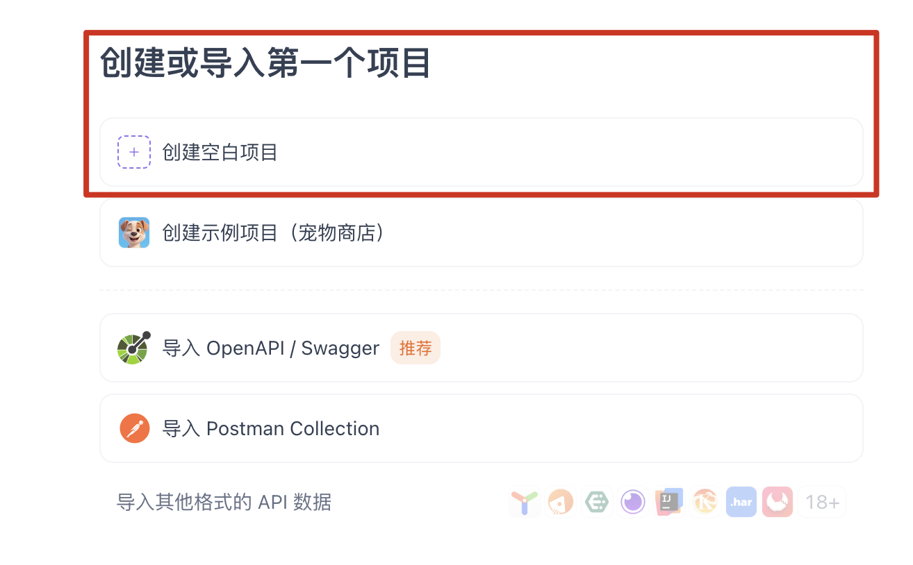

***

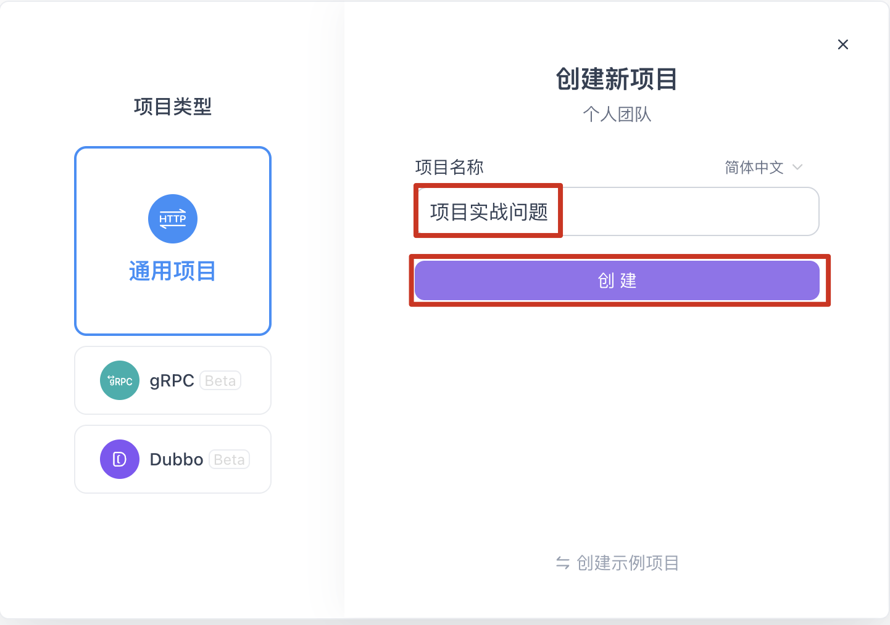

#### 2、导入接口

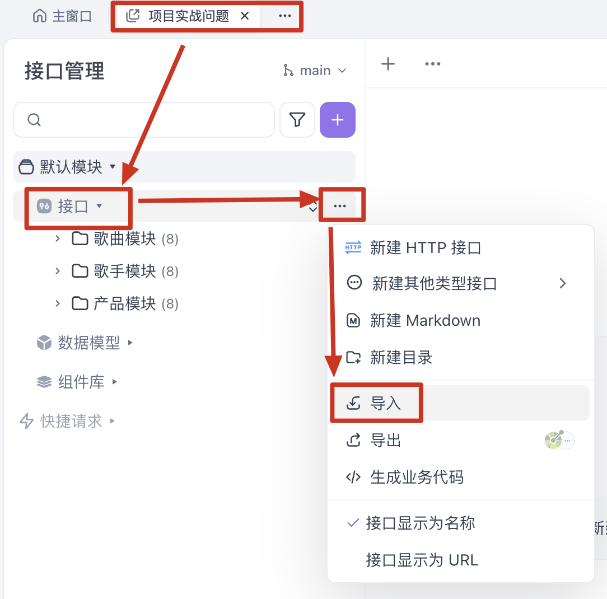

***

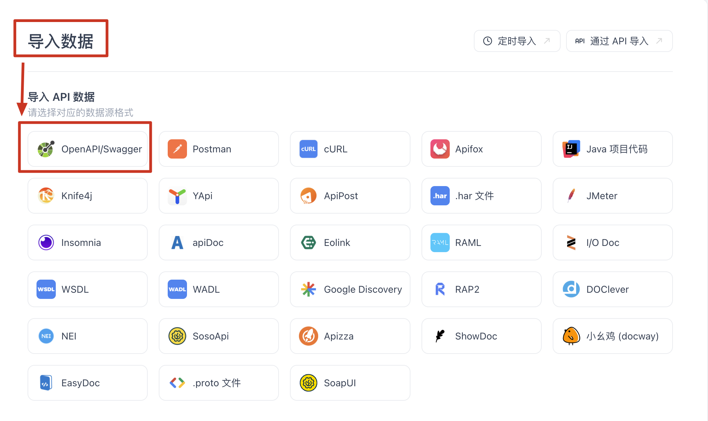

***

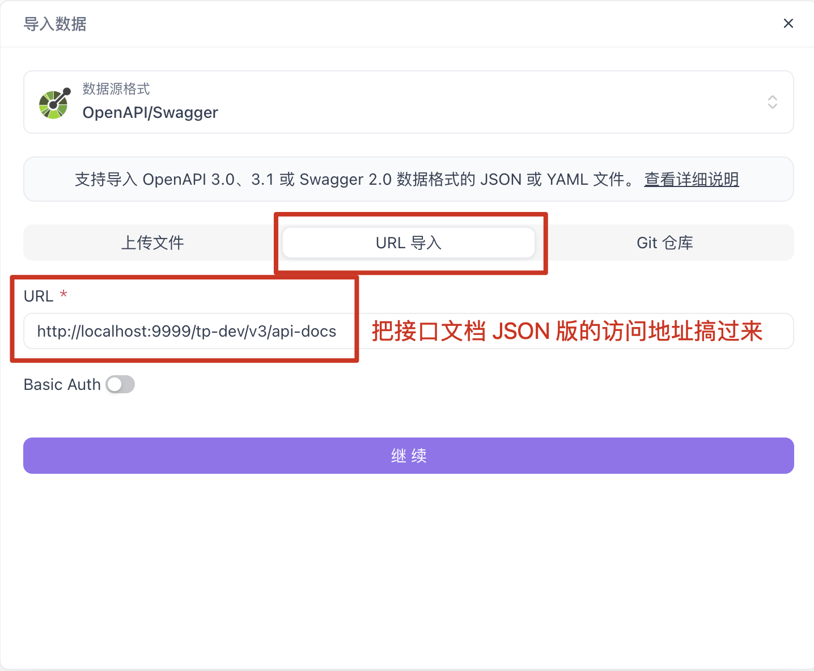

***

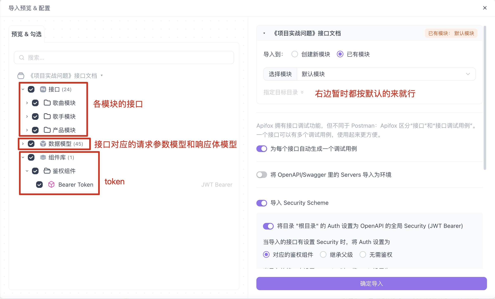

***

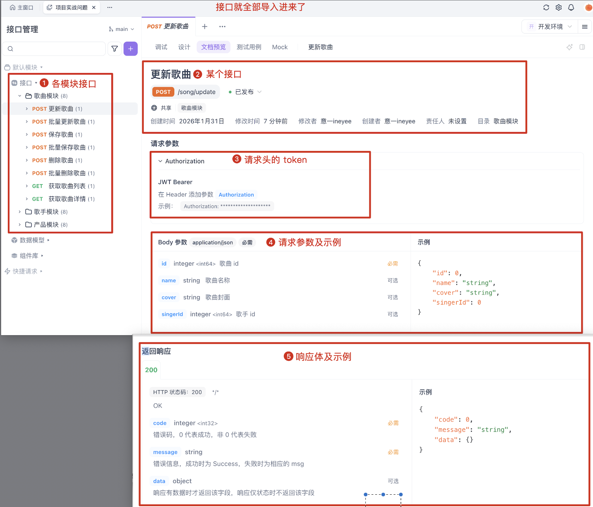

***

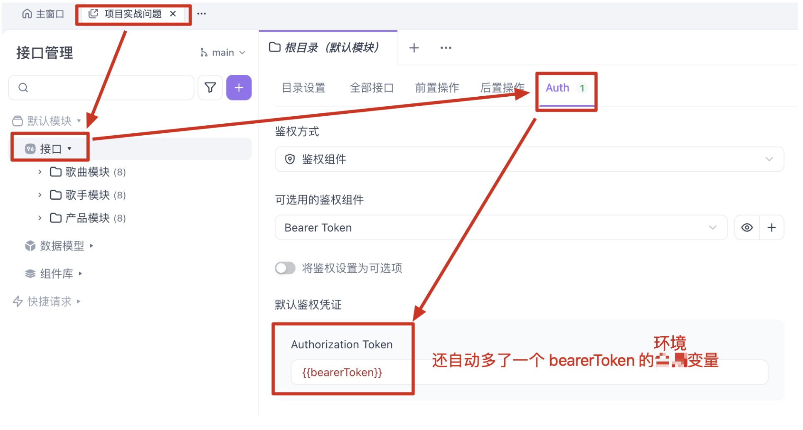

#### 3、配置环境

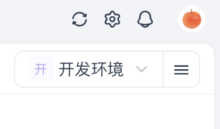

***

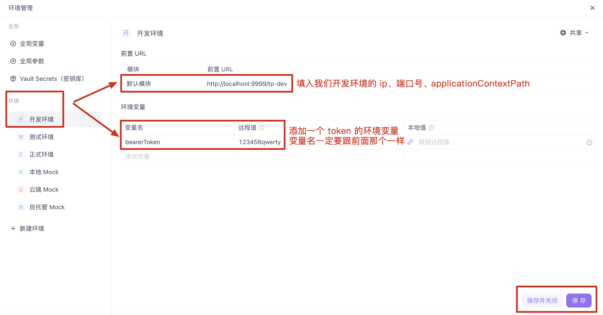

#### 4、测试接口

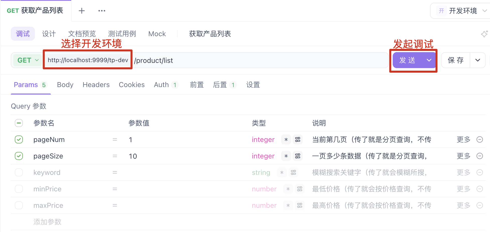

***

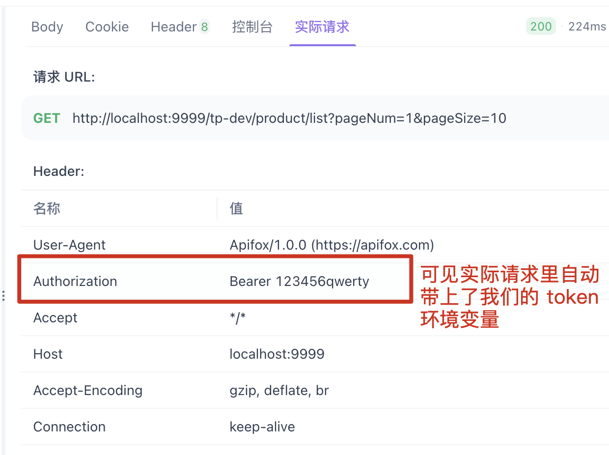

***

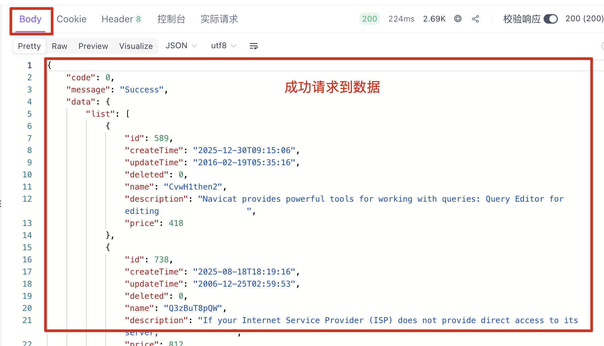
