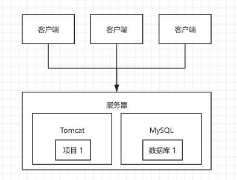
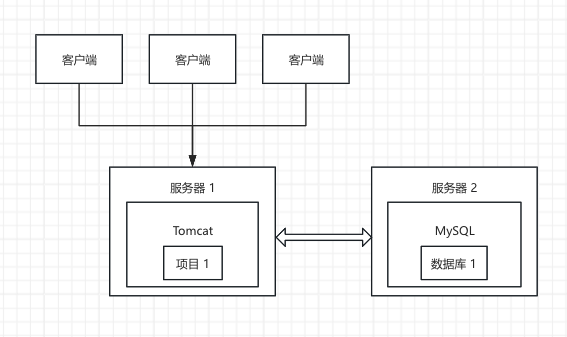
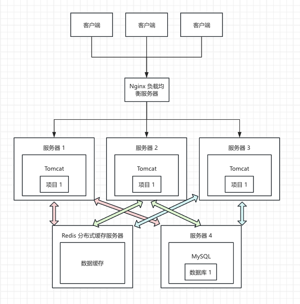

## 一、session 存在的问题

> **单体架构和分布式架构**：单体架构和分布式架构针对的是 Java 项目的组织方式，而不是物理服务器的数量
>
> 单体架构是指将所有的业务模块（比如用户服务、订单服务、支付服务等）都集中在一个项目里开发，并打包成一个部署单元（比如一个 WAR 包或 JAR 包）
>
> 分布式架构是指将所有的业务模块（比如用户服务、订单服务、支付服务等）拆分成多个可独立开发、可独立部署的应用，应用与应用之间通过网络通信来完成整体业务（分布式架构是一种架构理念，微服务架构就是分布式架构的一种实现，分布式架构还可以有很多其它实现方式，所以微服务架构肯定是分布式架构，但分布式架构不一定是微服务架构）

>**单机部署（单实例部署）和分布式部署（集群部署）**：单机部署和分布式部署针对的是物理服务器的数量、严格来说是运行 Java 项目实例的数量，而不是 Java 项目的组织方式
>
>无论是单体架构的一个部署单元还是分布式架构的多个部署单元，只要它或它们部署在一台服务器上、那就是单机部署，只要它或它们部署在多台服务器上、那就是分布式部署

> 也就是说：
>
> 单体架构在部署时可以选择单机部署、也可以选择分布式部署，这两种方式在生产环境中都挺常见
>
> 分布式架构在部署时可以选择单机部署、也可以选择分布式部署，只不过在生产环境中都是选择分布式部署

#### 1、单体架构 + 单机部署

项目 1 是单体架构



对于小项目，我们可以只买一台服务器，然后把 Tomcat 和 MySQL 都安装在这台服务器上



但是对于中型项目，如果 Tomcat 和 MySQL 还是安装在一台服务器上，那这台服务器既得负责大量接口处理、又得负责大量数据操作、容易出现性能问题，所以我们可以买两台服务器，然后把 Tomcat 和 MySQL 分别安装在不同的服务器上，即应用服务器和数据库服务器分离（虽然有两台服务器、但是只运行一个 Java 项目实例，所以还是单机部署）

#### 2、单体架构 + 分布式部署

项目 1 是单体架构



当用户量小的时候，单机部署或许还撑得住，但是当用户量飙升之后，如果所有的用户还是全部访问同一台服务器，那这台服务器可能就撑不住了，此时就需要分布式部署

我们可以买多台服务器，比如买一台服务器专门用来搞负载均衡、在这台服务器上用 Nginx 这个服务器软件就可以搞成负载均衡服务器，买三台应用服务器、每台服务器上都运行一个 Java 项目实例，买一台数据库服务器、专门用来搞数据操作，买一台服务器专门用来搞分布式缓存、在这台服务器上用 Redis 这个服务器软件就可以搞成分布式缓存服务器

这样一来所有的用户就不是直接访问应用服务器了，而是访问 Nginx 负载均衡服务器， Nginx 会根据负载均衡算法把请求转发到具体的应用服务器上去。并且应用服务器在读取数据的时候，会优先去分布式缓存服务器上读取缓存的数据，如果命中就直接返回，如果没有命中那应用服务器会转而去数据库服务器读取数据返回并缓存到分布式缓存服务器，应用服务器写数据的时候，会更新数据库 + 更新缓存，这样一来就可以大大降低大量直接访问数据库的磁盘 IO 操作的性能开销

此时我们可能有个疑问：那现在岂不是所有的用户全部访问 Nginx 负载均衡服务器了吗，这台服务器撑得住吗？撑得住，因为它不像应用服务器那样要处理很多复杂的业务逻辑，而仅仅是负责转发

#### 3、分布式部署下的 session 问题

在单机部署的情况下，session 是没有问题的，比如：客户端访问服务器 1 来登录，登录成功后 session 对象就会存储在这台服务器上；客户端下次继续访问服务器 1 来支付、携带了 session，我们可以在当前服务器上获取到对应的 session 对象并验证，session 验证通过后可以正常执行后续的操作

但是在分布式部署的情况下，session 就有问题了，比如：客户端要登录，这一次 Nginx 负载均衡服务器把这个登录请求转发给了服务器 3，那登录成功后 session 对象就会存储在服务器 3 上；客户端下次要支付、携带了 session，这一次 Nginx 负载均衡服务器把这个支付请求转发给了服务器 1，但是服务器 1 上并没有存储刚才的 session 对象，于是这个用户会被判定为没有登录，这就出错了

因此我们需要处理这个分布式部署下的 session 问题，解决的方案就是：客户端要登录，这一次 Nginx 负载均衡服务器把这个登录请求转发给了服务器 3，那登录成功后 session 对象不存储在服务器 3 上，而是存储在 Redis 分布式缓存服务器上；客户端下次要支付、携带了 session，这一次 Nginx 负载均衡服务器把这个支付请求转发给了服务器 1，但是不要在服务器 1 上获取 session 对象，而是去 Redis 分布式缓存服务器上获取并验证，这样一来就能正常获取到了，session 验证通过后可以正常执行后续的操作。**利用 Redis 共享 session 这个方案的确可以解决问题，但是多了一层 Redis 访问、性能下降，系统复杂度也上升了很多，Redis 成了单点、即多个应用服务器都得访问 Redis、一旦 Redis 故障、就算应用服务器都 ok、所有业务也都无法正常运转**

那还有什么其它方案也能解决分布式部署下的 session 问题吗？那就是“索性放弃 session，使用 token”

## 二、token 是什么

利用 Redis 共享 session 这个方案需要把 session 存储在服务器内存中——即 session 是有状态的、这是共享 session 的本质问题，服务器既负责存储 session 也负责验证 session

而 token 则是无状态的——即不需要把 token 存储在服务器内存中、这是 token 的本质优势，服务器只负责验证 token 不负责存储 token。这样一来：客户端要登录，这一次 Nginx 负载均衡服务器把这个登录请求转发给了服务器 3，那登录成功后服务器直接把生成的 token 返回给客户端、不需要存储在任意一台服务器上；客户端下次要支付、携带了 token，这一次 Nginx 负载均衡服务器把这个支付请求转发给了服务器 1，服务器 1 照样可以验证 token，token 验证通过后可以正常执行后续的操作，这同样能解决分布式部署下的 session 问题

## 三、token 是怎么工作的

* 服务端生成私钥和公钥存储在项目里

```shell
cd desktop

# 生成私钥（PEM 格式）
openssl genpkey -algorithm RSA -pkeyopt rsa_keygen_bits:2048 -out private_key.pem

# 从私钥导出公钥
openssl rsa -pubout -in private_key.pem -out public_key.pem
```

* 客户端走登录接口
* 服务端判断到登录接口走成功后，服务端用非对称加密里的**私钥生成一个 token **并返回给客户端
  * token 里一般会携带用户的唯一标识、用户名或邮箱、角色或权限等业务信息
* 客户端手动持久化 token
* 后续客户端走其它接口时，手动把 token 携带到 header 里传递给服务端
* 服务端可以在这些接口里读取到 header 里的 token，用非对称加密里的**公钥验证 token **来确定用户身份，没登录过或 token 过期（token 库全部会自己判断）就返回登录凭证无效，否则就返回相应的数据
* 客户端收到登录凭证无效就跳转登录界面让用户重新登录，收到正常数据就正常使用
* **客户端退出登录时，只需要清除客户端本地持久化的 token、跳转到登录界面就可以了，不需要跟服务端做任何交互、因为服务端压根儿没存储任何 token 而只是认证 token**

```json
// token 在请求头里的 key 我们当然可以随便取名，value 也可以直接就是 token，只要服务端和客户端约定好、这没有任何问题，比如：
{"token": "${token}"}

// 但是 token 的建议格式如下：
// 因为 Authorization 是 HTTP 协议定义的“认证专用请求头”，这样更标准；Bearer 代表是 OAuth2 访问令牌，token 就是这种认证类型，这样更标准
{"Authorization": "Bearer ${token}"}
```

## 四、在 SpringBoot 项目里使用 JWT Token

#### 1、添加依赖

```xml
<!-- JWT -->
<dependency>
  <groupId>io.jsonwebtoken</groupId>
  <artifactId>jjwt-api</artifactId>
  <version>0.13.0</version>
</dependency>
<dependency>
  <groupId>io.jsonwebtoken</groupId>
  <artifactId>jjwt-impl</artifactId>
  <version>0.13.0</version>
  <scope>runtime</scope>
</dependency>
<dependency>
  <groupId>io.jsonwebtoken</groupId>
  <artifactId>jjwt-jackson</artifactId>
  <version>0.13.0</version>
  <scope>runtime</scope>
</dependency>
```

#### 2、在登录等接口里生成 token、返回 token 给客户端

#### 3、自定义一个 filter 统一拦截所有接口来验证 token，别忘了配置 filter

#### 4、验证 token 通过后，自定义一个 UserContext 来全局存储 token 里的业务信息

#### 5、各个 Controller 或 Service 里通过 UserContext 获取到 token 里的业务信息，再去操作指定的数据

## 五、其它 token 方案

#### 1、【方案一】单 token 存在的问题

上面的方案是单 token，项目里这么用没毛病，但是它存在一些缺陷：

* **无法强制下线：**服务器上是没有存储 token 的、只负责校验，所以我们没法实现强制把用户踢下线的操作，比如我们要实现单设备登录或者风控踢人等

* **长时间登录和安全性的冲突：**为了保证用户不用频繁登录，我们一般会给 token 设置一个较长的过期时间、比如 7~30 天，但是一旦 token 被窃取，那么攻击者就可以拿着这个 token 胡作非为 7~30 天，也就是说长有效期的 token 安全性不足；但是如果我们把 token 的有效期缩短为 30~60 分钟，安全性是相应提高了，但是用户每次打开 App 几乎都得跳到登录界面重新登录，体验极差

#### 2、【方案二】单 token + redis 缓存

单 token + redis 缓存可以解决**无法强制下线**的问题，其工作流程如下：

* 客户端走登录接口

* 服务端判断到登录接口走成功后，服务端用 **UUID 随机生成一个 token，把这个 token 缓存到 redis 中、并把用户信息也缓存到 redis 中，token 和用户信息的的缓存有效期都设置为 7~30 天，**然后把 token 返回给客户端
  * 这里的 token 就可以不用 JWT Token 了。因为之前没有 redis，所以用户信息必须携带在 token 里传来传去，而现在有 Reids 了，用户信息可以直接缓存在 redis 中不用传来传去。**UUID 随机 token 的体积要比 JWT Token 小很多**
  * 这里我们设计在 redis 中缓存两个信息：
    * **key = user\:email\:${email} 或 user\:id\:${id}，value = ${token}，这对 key-value 专门用来做强制踢人、单设备登录这类用户管理操作**
    * **key = user:token:${token}，value = 关键用户信息的 Hash，这对 key-value 专门用来做登录成功后其它接口的 token 校验**
* 客户端手动持久化 token
* 后续客户端走其它接口时，手动把 token 携带到 header 里传递给服务端
* 服务端可以在这些接口里读取到 header 里的 token，**去 redis 缓存中看看有没有这个 token（不存在或已过期，查询结果都将是没有这个 token）**，没有这个 token 就返回登录凭证无效，否则就返回相应的数据
* 客户端收到登录凭证无效就跳转登录界面让用户重新登录，收到正常数据就正常使用
* **客户端退出登录时，需要走一个 logout 接口把 redis 里缓存的 token 删除掉，然后再清除客户端本地持久化的 token、跳转到登录界面**
* **如果要实现强制下线，直接去 Redis 数据库里根据邮箱或 userId 删除掉某个用户在 redis 里的 token 缓存即可**

#### 3、【方案三】双 token + redis 缓存

双 token + redis 缓存可以解决**无法强制下线 + 长时间登录和安全性的冲突**的问题，因为 refreshToken 的传输不是那么频繁、所以可以用 refreshToken 来满足长时间登录的要求，而 accessToken 的传输比较频繁、所以把它的有效期缩短来满足安全性的要求，其工作流程如下：

* 客户端走登录接口
* 服务端判断到登录接口走成功后，服务端用 **UUID 随机生成一个 accessToken、refreshToken**，把两个 token 都返回给客户端，把 refreshToken 存进 Redis。accessToken 有效期可以设置为 15~30 分钟、是用来获取数据的一个 token，refreshToken 的有效期设置为 7~30 天、是用来获取 accessToken 的一个 token
* 客户端手动持久化 accessToken、refreshToken
* 后续客户端走其它接口时，手动把 accessToken 携带到 header 里传递给服务端
* 服务端可以在这些接口里读取到 header 里的 accessToken，**去 redis 缓冲中看看有没有这个 token（不存在或已过期，查询结果都将是没有这个 token）**
  * 如果验证到用户登录过且 accessToken 没过期，那就返回相应的数据给客户端
  * 如果验证到用户没登录过或 accessToken 过期（token 库全部会自己判断），那就返回“accessToken 过期”的错误响应给客户端
    * 客户端收到“accessToken 过期”的错误响应后，需要立即再走另外一个 refreshAccessToken 的接口，手动把 refreshToken 携带到 header 里传递给服务端
    * 服务端可以在这些接口里读取到 header 里的 refreshToken，用非对称加密里的**公钥验证 refreshToken**
      * 如果 refreshToken 没过期，那就给客户端返回一个崭新 15~30 分钟的 accessToken，客户端接收到这个新 accessToken 后，可以再次走其它接口
      * 如果 refreshToken 过期，那就给客户端返回“refreshToken 过期”的错误响应，客户端直接跳转到登录界面让用户重新登录
* 客户端退出登录时，需要走一个 logout 接口把 Redis 里存储的 refreshToken 删除掉，然后再清除客户端本地持久化的 accessToken、refreshToken、跳转到登录界面
* 如果要实现强制下线，直接删除某个用户在 Redis 里的 refreshToken 即可，这样一来用户顶多能再使用 accessToken 15~30 分钟，下一次刷新时就得重新登录了


