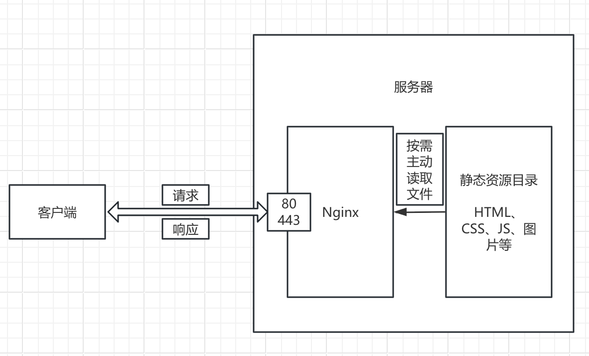
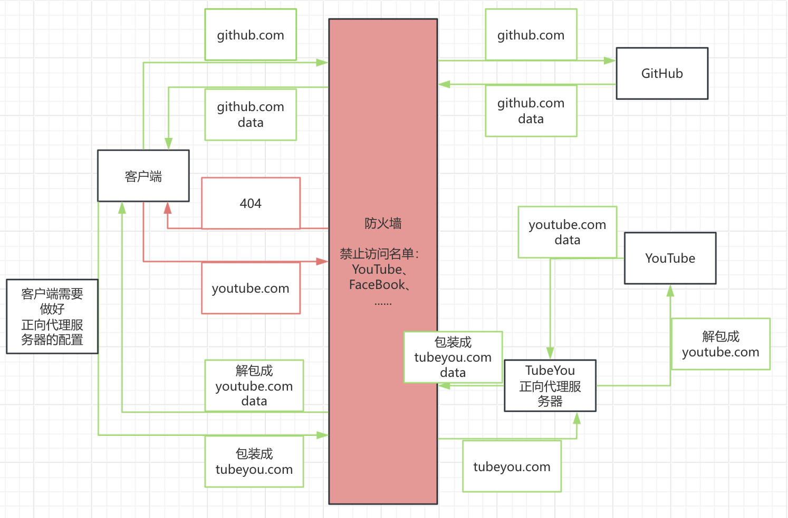
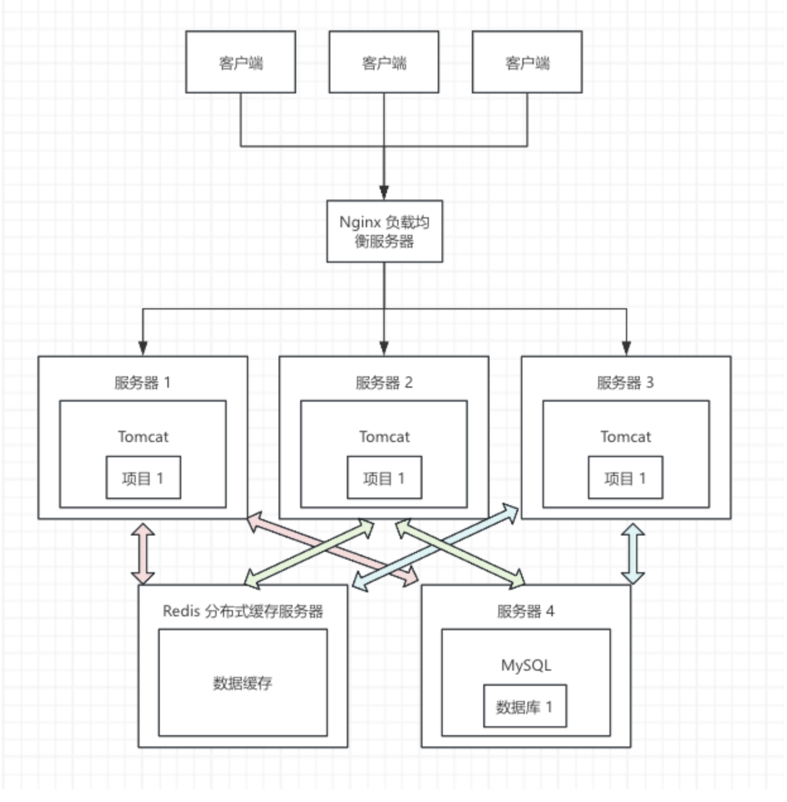

## 一、Nginx 服务器

Nginx（engine x）跟 Tomcat 一样也是一个服务器软件，运行 Nginx 的服务器通常被称为 Nginx 服务器，通常被用来做：

* Web 服务器、静态资源服务器

* 反向代理服务器

一个 Nginx 实例通常包含 1 个 master 进程 + N 个 worker 进程，master 进程主要用来接收客户端的请求、调度各个 worker 进程，而 worker 进程才主要用来处理客户端的请求、worker 进程数可以设置为跟服务器的核数保持一致来充分发挥性能，运行一个 Nginx 实例可以支持 3w~5w 的并发。

#### 1、Web 服务器、静态资源服务器

使用 Vue、React、Angular 等前端框架开发的 Web 项目，在打包后会生成一些静态资源文件（如 HTML、CSS、JS、图片等），这些静态资源文件通常会被部署到服务器的静态资源目录中。而服务器上安装的 Nginx 服务器软件则负责监听来自客户端的请求（通常是 80 或 443 端口），当客户端访问时，Nginx 就会按需主动从静态资源目录中读取相应的文件返回给客户端。因此运行 Nginx 的服务器通常被称为 Web 服务器或静态资源服务器。



#### 2、反向代理服务器

* 正向代理服务器

正向代理服务器是指代理服务器是给**客户端**做代理，也就是说代理服务器是在给客户端干活，翻墙用的代理服务器就是正向代理服务器。



* 反向代理服务器

反向代理服务器是指代理服务器是给**服务端**做代理，也就是说代理服务器是在给服务端干活，负载均衡服务器就是反向代理服务器。



## 二、本机安装 Nginx

Nginx（engine x）跟 Tomcat 一样也是一个服务器软件，它在启动时肯定也会设置监听某个端口（默认 80）来跟客户端通信，Nginx 内部又可以配置多个虚拟主机（一个虚拟主机 = 一个 server 指令块）来处理不同域名或端口的请求

* Nginx 下载地址：https://nginx.org/download/nginx-1.28.2.tar.gz（下载 Stable version 稳定版，下载下来的是 Nginx 的 C 语言源码压缩包，所以要先在你的环境里安装 gcc 编译器套件，将来解压后需要手动编译 Nginx 的 C 语言源码）

* 这里选择下载 nginx-1.28.2

* 下载完双击解压即可，解压后把解压产物（如 nginx-1.28.2 这个文件夹）直接拖到 /usr/local 目录下（即 /usr/local/nginx-1.28.2），然后需要手动编译安装（/ 代表根目录 Macintosh HD，~/ 代表当前用户目录 /Users/ineyee）

  * 终端进入 nginx 目录：cd /usr/local/nginx-1.28.2

  * 安装 Nginx 需要的依赖库

    ```shell
    # 运行时库，让 nginx 支持 location 里的正则表达式匹配
    brew install pcre
    # 运行时库，让 nginx 支持 gzip 压缩响应内容    
    brew install zlib
    ```

  * 配置编译选项（指定 nginx 的安装路径、开启常用模块、指定依赖库的安装路径）：

    ```shell
    ./configure --prefix=/usr/local/nginx-1.28.2 --with-http_ssl_module --with-http_v2_module --with-http_gzip_static_module --with-http_stub_status_module --with-cc-opt="-I$(brew --prefix pcre)/include -I$(brew --prefix zlib)/include" --with-ld-opt="-L$(brew --prefix pcre)/lib -L$(brew --prefix zlib)/lib"
    ```

  * 编译：make

  * 安装：sudo make install，这样就会在 nginx-1.28.2 目录下生成一个 sbin 可执行文件目录，其中 sbin/nginx 就是 Nginx 的可执行文件，conf 目录就是配置文件目录，html 就是静态资源目录

  * 然后在 nginx 目录下手动创建一个 logs 目录（即 /usr/local/nginx-1.28.2/logs），用来存放访问日志和错误日志

* 在 .bash_profile 里配置一下环境变量：export PATH="/usr/local/nginx-1.28.2/sbin:$PATH"，并执行 source ~/.bash_profile 来让修改立即生效

* 终端执行 nginx -v 来验证是否安装成功

* 本机前台启动 Nginx 服务，终端里执行：nginx（或 nginx -c /usr/local/nginx-1.28.2/conf/nginx.conf）

* 验证启动成功：浏览器访问 http://localhost，看到 "Welcome to nginx!" 页面即表示成功

* 本机停止 Nginx 服务

  * 优雅停止（处理完当前请求再停止）：nginx -s quit
  * 立即停止：nginx -s stop

* 重新加载配置文件（修改 nginx.conf 后不需要重启，执行以下命令即可热更新）：nginx -s reload

* 打开 nginx 目录下的 nginx.conf 配置文件（即 /usr/local/nginx-1.28.2/conf/nginx.conf），确认配置项

  ```nginx
  # -------------------------------
  # 1️⃣ 全局配置
  # -------------------------------
  # worker 进程数，通常设置为 CPU 核数
  worker_processes  1;
  # 错误日志路径及级别（生产环境需要修改路径）
  error_log  /usr/local/nginx-1.28.2/log/error.log warn;
  # pid 文件路径
  pid        /usr/local/nginx-1.28.2/log/nginx.pid;
  
  # -------------------------------
  # 2️⃣ 事件配置
  # -------------------------------
  events {
      # 每个 worker 进程最大连接数
      worker_connections  1024;
  }
  
  # -------------------------------
  # 3️⃣ HTTP 配置
  # -------------------------------
  http {
      include       mime.types;
      default_type  application/octet-stream;
  
      # 访问日志路径（生产环境需要修改路径）
      access_log  /usr/local/nginx-1.28.2/log/access.log;
  
      sendfile        on;
      keepalive_timeout  65;
  
      # -------------------------------
      # 虚拟主机配置（可配置多个 server 块）
      # -------------------------------
      server {
          # 监听端口（默认 80）
          listen       80;
          # 域名或 IP（本机测试用 localhost）
          server_name  localhost;
  
          # 静态资源根目录
          location / {
              root   html;
              index  index.html index.htm;
          }
  
          # 错误页面
          error_page   500 502 503 504  /50x.html;
          location = /50x.html {
              root   html;
          }
      }
  }
  ```


```yaml
error_log  /var/log/nginx/error.log notice;
pid        /var/run/nginx.pid;

http {
    default_type  application/octet-stream;

    log_format  main  '$remote_addr - $remote_user [$time_local] "$request" '
                      '$status $body_bytes_sent "$http_referer" '
                      '"$http_user_agent" "$http_x_forwarded_for"';

    access_log  /var/log/nginx/access.log  main;

    sendfile        on;
    #tcp_nopush     on;

    keepalive_timeout  65;
}
```

```yaml
server {
    listen       80;
    server_name  localhost;

    #access_log  /var/log/nginx/host.access.log  main;

    location / {
        root   /usr/share/nginx/html;
        index  index.html index.htm;
    }

    #error_page  404              /404.html;

    # redirect server error pages to the static page /50x.html
    #
    error_page   500 502 503 504  /50x.html;
    location = /50x.html {
        root   /usr/share/nginx/html;
    }

    # proxy the PHP scripts to Apache listening on 127.0.0.1:80
    #
    #location ~ \.php$ {
    #    proxy_pass   http://127.0.0.1;
    #}

    # pass the PHP scripts to FastCGI server listening on 127.0.0.1:9000
    #
    #location ~ \.php$ {
    #    root           html;
    #    fastcgi_pass   127.0.0.1:9000;
    #    fastcgi_index  index.php;
    #    fastcgi_param  SCRIPT_FILENAME  /scripts$fastcgi_script_name;
    #    include        fastcgi_params;
    #}

    # deny access to .htaccess files, if Apache's document root
    # concurs with nginx's one
    #
    #location ~ /\.ht {
    #    deny  all;
    #}
}
```

