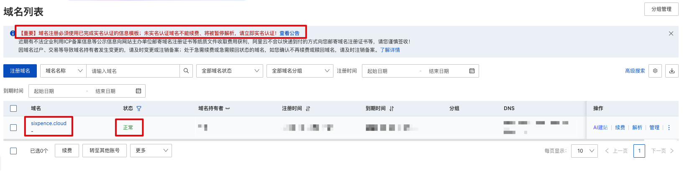
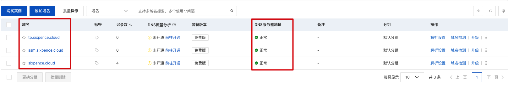
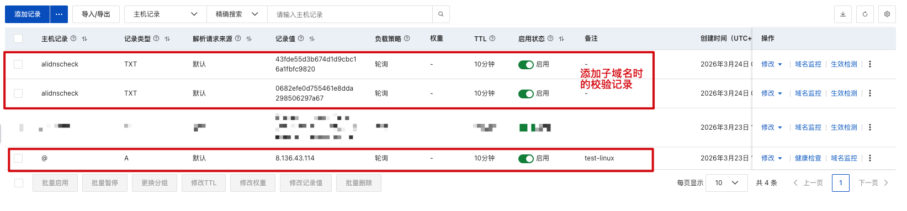
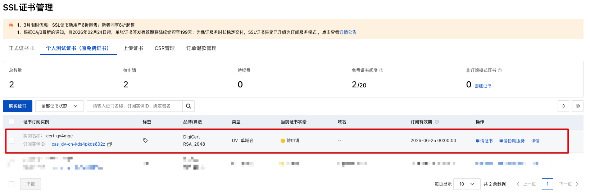
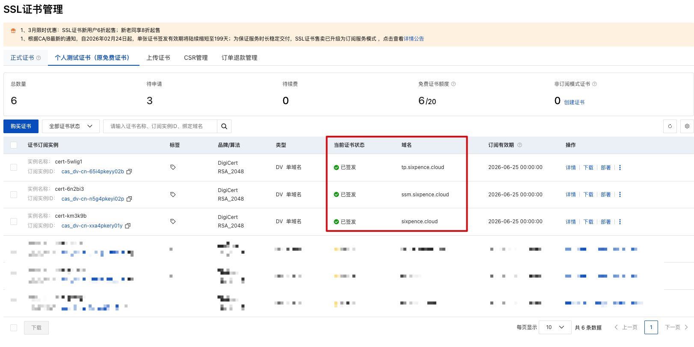

## 一、支持 HTTPS

**要让 Nginx 服务器支持 HTTPS，我们需要：① 购买域名 → ② 配置 DNS 解析 → ③ 申请 SSL 证书 → ④ 把证书上传到 Nginx 服务器 → ⑤ 配置 Nginx 监听 443 端口处理 HTTPS 请求，并把 HTTP 请求重定向到 HTTPS**

#### 1、购买域名

* 打开阿里云
* 搜索“域名注册”
* 输入你想注册的主域名，如 sixpence.cloud，购买即可

* 购买完成后，打开“控制台”，找到“域名与网站”，点进去

* 再找到“域名列表”，点进去
* 我们就能看到刚才购买的主域名了，记得把实名认证搞下



#### 2、配置 DNS 解析

* 打开“控制台”，找到“云解析 DNS”，点进去，再点击“添加域名”
* 先把主域名 sixpence.cloud 给添加进去，这样一来这个域名将来就归阿里云 DNS 解析了

* 接下来我们可以免费添加子域名，如：ssm.sixpence.cloud、tp.sixpence.cloud

* 添加子域名时，提示得先去主域名的解析设置里添加一条校验记录，那就先去填一下，然后再回来添加子域名

* 添加主域名和子域名完成后，我们的云解析 DNS 列表应该如下



***

* 接下来我们需要配置域名和 IP 地址的映射，这里以主域名为例，子域名也是同样的添加流程
* 点击主域名右边的“解析设置”
* 再点击“添加记录”，一条记录就是一个域名和 IP 地址的映射，当然一个域名可以对应多个 IP 地址
* 记录类型一般选“A”就行、主机记录一般选“@”就行、解析请求来源一般选“默认”就行、记录值输入 IP 地址
* 添加完成后，解析设置列表应该如下



#### 3、申请 SSL 证书

SSL 证书可以从阿里云等云服务商免费申请（有效期 3 个月，到期续签即可）：

* 打开阿里云
* 搜索“SSL 证书”或“数字证书管理服务”

* 找到“免费证书”或“个人测试证书”，点击“去购买”，全部保持默认选项，0 元购买即可
* 购买完成后，打开“控制台”，找到“SSL 证书”或“数字证书管理服务”，点进去
* 再找到“SSL 证书管理”，再找到“免费证书”或“个人测试证书”，点进去
* 我们就能看到刚才购买的证书了，但是处于“带申请”状态



***

* 点击证书右边的“申请证书”
* 需要输入“证书绑定域名”
  * 我们这里是免费证书，一个免费证书只能添加一个域名，所以如果我们想给主域名和两个子域名都添加保护的话，就得分别申请三张证书
  * 但如果是付费证书的话，一个付费证书可以添加多个域名，所以我们可以添加第一个 *.sixpence.cloud 这样的通配域名来保护所有的子域名，但是它不包含主域名 sixpence.cloud，所以我们还得再添加第二个域名 sixpence.cloud
* 填写完申请信息后，还需要进行一下 DNS 验证，提示得先去主域名的解析设置里添加一条校验记录，那就先去填一下，然后再回来验证
* 验证通过后，等几分钟证书就会签发完成，处于“已签发”状态



***

* 下载证书，下载时选择服务器类型是 Nginx 那个
* 解压后会得到两个文件：

```yaml
sixpence.cloud.key   # 私钥文件（绝对不能泄露）
sixpence.cloud.pem   # 证书文件（公钥 + 证书链）

ssm.sixpence.cloud.key
ssm.sixpence.cloud.pem

tp.sixpence.cloud.key
tp.sixpence.cloud.pem
```

#### 4、把证书上传到 Nginx 服务器

* 把这两个文件上传到 Nginx 云服务器，建议放在 /etc/nginx/ssl/ 目录下
* 执行如下命令，限制私钥文件的权限，只有 root 能读

```bash
chmod 600 /etc/nginx/ssl/sixpence.cloud.key
chmod 600 /etc/nginx/ssl/ssm.sixpence.cloud.key
chmod 600 /etc/nginx/ssl/tp.sixpence.cloud.key
```

#### 5、配置 Nginx 监听 443 端口处理 HTTPS 请求，并把 HTTP 请求重定向到 HTTPS

> 别忘了网络与安全组里添加 443 端口

**为了避免 /etc/nginx/nginx.config 这个主配置文件无限扩大，实际开发中我们一般都会为每个虚拟主机单独创建成一个配置文件，这些配置文件都放在 /etc/nginx/conf.d 这个目录下，我们可以看到主配置文件里已经默认 include 导入了这个目录下的所有配置文件**

* 如果用 user  nginx; 的话，记得授予 nginx 用户访问我们项目的权限：chown -R nginx:nginx /usr/local/soft/ssm、chown -R nginx:nginx /usr/local/soft/tp
* 创建两个配置文件 /etc/nginx/conf.d/ssm-https.conf、/etc/nginx/conf.d/tp-https.conf，为每个项目都添加一个 server 虚拟主机

```yaml
# 仍然监听 80 端口，但主要是做重定向
# 这样一来就算客户端访问了 HTTP（http://ssm.sixpence.cloud/xxx），也会自动重定向到 HTTPS
server {
    listen 80;
    server_name ssm.sixpence.cloud;

    # 301 永久重定向，$host 是 HTTP 请求的域名，$request_uri 是 HTTP 请求的路径+参数
    return 301 https://$host$request_uri;
}

# 监听 443 端口，处理 HTTPS 请求（https://ssm.sixpence.cloud/xxx）
server {
    listen 443 ssl; # ssl 参数告诉 Nginx 这个端口走 SSL/TLS 加密
    server_name ssm.sixpence.cloud;
    
    # 直接搞个兜底匹配就行
    #
    # 当用户访问 https://ssm.sixpence.cloud/user/list 的时候
    # Nginx 会把原请求的请求路径 /user/list 给截取下来
    # 然后再剔除掉 location 前缀 /，最终的截断路径就是 user/list
    # 然后再拼接到 proxy_pass 后面，最终的转发路径就是 http://8.136.43.114:8080/ssm/user/list（这里是服务器内部转发就不要再用域名了，省得绕一圈 DNS 解析增加延迟）
    # 就会转发给 Tomcat 处理，因为 Tomcat 在监听 8080
    location / {
        proxy_pass http://8.136.43.114:8080/ssm/;
    }
    
    # 私钥文件路径
    ssl_certificate_key /etc/nginx/ssl/ssm.sixpence.cloud.key;
    # 证书文件路径
    ssl_certificate     /etc/nginx/ssl/ssm.sixpence.cloud.pem;

    # 只允许 TLS 1.2 和 1.3，禁用老旧不安全的协议版本
    ssl_protocols TLSv1.2 TLSv1.3;
    # 推荐的加密套件，安全性和兼容性兼顾
    ssl_ciphers ECDHE-ECDSA-AES128-GCM-SHA256:ECDHE-RSA-AES128-GCM-SHA256:ECDHE-ECDSA-AES256-GCM-SHA384:ECDHE-RSA-AES256-GCM-SHA384:ECDHE-ECDSA-CHACHA20-POLY1305:ECDHE-RSA-CHACHA20-POLY1305:DHE-RSA-AES128-GCM-SHA256:DHE-RSA-AES256-GCM-SHA384;
    # 优先使用服务端的加密套件
    ssl_prefer_server_ciphers off;

    # SSL 会话缓存，提升性能，避免每次请求都重新握手
    ssl_session_cache shared:SSL:10m;
    ssl_session_timeout 1d;
}
```

```yaml
# 仍然监听 80 端口，但主要是做重定向
# 这样一来就算客户端访问了 HTTP（http://tp.sixpence.cloud/xxx），也会自动重定向到 HTTPS
server {
    listen 80;
    server_name tp.sixpence.cloud;

    # 301 永久重定向，$host 是 HTTP 请求的域名，$request_uri 是 HTTP 请求的路径+参数
    return 301 https://$host$request_uri;
}

# 监听 443 端口，处理 HTTPS 请求（https://tp.sixpence.cloud/xxx）
server {
    listen 443 ssl; # ssl 参数告诉 Nginx 这个端口走 SSL/TLS 加密
    server_name tp.sixpence.cloud;
    
    # 直接搞个兜底匹配就行
    #
    # 当用户访问 https://tp.sixpence.cloud/product/list 的时候
    # Nginx 会把原请求的请求路径 /product/list 给截取下来
    # 然后再剔除掉 location 前缀 /，最终的截断路径就是 product/list
    # 然后再拼接到 proxy_pass 后面，最终的转发路径就是 http://8.136.43.114:8080/tp/product/list（这里是服务器内部转发就不要再用域名了，省得绕一圈 DNS 解析增加延迟）
    # 就会转发给 Tomcat 处理，因为 Tomcat 在监听 8080
    location / {
        proxy_pass http://8.136.43.114:8080/tp/;
    }
    
    # 私钥文件路径
    ssl_certificate_key /etc/nginx/ssl/tp.sixpence.cloud.key;
    # 证书文件路径
    ssl_certificate     /etc/nginx/ssl/tp.sixpence.cloud.pem;

    # 只允许 TLS 1.2 和 1.3，禁用老旧不安全的协议版本
    ssl_protocols TLSv1.2 TLSv1.3;
    # 推荐的加密套件，安全性和兼容性兼顾
    ssl_ciphers ECDHE-ECDSA-AES128-GCM-SHA256:ECDHE-RSA-AES128-GCM-SHA256:ECDHE-ECDSA-AES256-GCM-SHA384:ECDHE-RSA-AES256-GCM-SHA384:ECDHE-ECDSA-CHACHA20-POLY1305:ECDHE-RSA-CHACHA20-POLY1305:DHE-RSA-AES128-GCM-SHA256:DHE-RSA-AES256-GCM-SHA384;
    # 优先使用服务端的加密套件
    ssl_prefer_server_ciphers off;

    # SSL 会话缓存，提升性能，避免每次请求都重新握手
    ssl_session_cache shared:SSL:10m;
    ssl_session_timeout 1d;
}
```

* 重载下 Nginx，去访问 https://ssm.sixpence.cloud/user/list、https://tp.sixpence.cloud/product/list 试试效果吧

