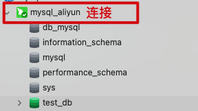
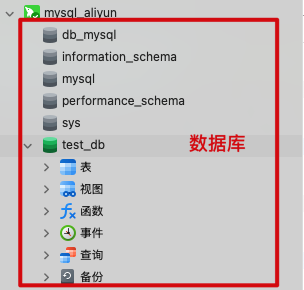

## 一、部署数据库

#### 1、Navicat 连接云服务器



- 首先得确保网络和安全组里添加了 3306 端口，否则连接不上
- 其次得做好授权数据库的远程连接权限，否则连接不了
- 然后就可以去 Navicat 里连接云服务器了
  - 新建一个连接
  - 连接的类型选择为 MySQL
  - 输入连接的名字，如 mysql_aliyun
  - 输入域名和端口号，如 8.136.43.114、3306
  - 输入账号和密码，root、前面我们设置的数据库密码
  - 确定后连接就创建好了，此时连接是灰色，代表连接尚未启动
  - 双击这个连接就可以启动了，此时连接会变成绿色，这个连接下所有的数据库也会被展示出来
- 这样我们就可以在 Navicat 里操作服务器上的数据库了，比如创建表、查看表里的数据等等

#### 2、部署数据库



比如项目刚开始我们的数据库是创建在自己电脑上的一个数据库，现在项目开发完了，本地数据库里已经有各种表结构及关连了，当然也有一些测试数据，现在要把本地这个数据库部署到服务器上的数据库里，这件事情其实很简单，Navicat 就可以帮我们完成

- 选中本地的数据库
- 右键选中“转储 SQL 文件”，选择“结构和数据”（表结构和测试数据）或“仅结构”（仅表结构），开始转储，等待转储完成
- 在远程服务器上创建一个跟本地同名的数据库，双击打开这个数据库变成绿色
- 然后直接把转储好的 SQL 文件直接拖到远程数据库里，根据提示运行一下即可，这样一来，服务器上的数据库就跟本地的一模一样了

## 二、打包部署项目 war 包

服务器 Tomcat 部署我们的 JavaWeb 项目（一般采用方式三）

```

```

* 首先把我们的 JavaWeb 项目搞到服务器上

  * Build - Build Artifacts - ${项目名}:war（代表把项目打包成 war 包，再部署到 Tomcat 上去，适用于发布阶段）

  - 这样对 JaveWeb 项目打包后，产物是一个 war 压缩包：${项目名}.war，放在 target 目录下

  - 我们需要把产物 war 包名改成 ${Application context}.war，以便将来访问

  - 把产物 war 包上传到 /usr/local/soft/${项目名} 目录下，没有 soft/${项目名} 目录的话就创建一个：mkdir soft、mkdir ${项目名}

  * 上传完成后，把压缩包解压到 /usr/local/soft/${项目名} 目录下（-C 用来指定输出目录）：unzip ${项目名}.war

  * 解压缩完成后，/usr/local/soft/${项目名} 目录下就能看到我们的代码了

  * 我们可以去 /usr/local/soft/${项目名}/WEB-INF/classes/application.yml  配置文件里确认一下，是不是连接的线上数据库，线上数据库的配置对不对，不正确的话可以直接修改配置文件并保存，不用重新打包项目

* 然后把我们的 JavaWeb 项目部署到服务器 Tomcat 上

  * 在 /usr/local/apache-tomcat-11.0.15/conf/Catalina/localhost 文件夹下创建一个 xml 文件，xml 文件名为 ${Application context}，以便将来访问，比如这里就是 tp.xml，将来如果要部署多个项目就为每个项目都创建一个 xml 文件

  * 在 tp.xml 文件里新建一个标签：\<Context docBase="产物文件夹或 war 包的绝对路径" /\>

    ```xml
    <Context docBase="/usr/local/soft/tp" />
    ```

  * 添加完标签以后，我们可以杀掉上一次的 Tomcat，先通过 ps aux | grep tomcat 命令找到 Tomcat 的 PID，然后再通过 kill -9 ${PID} 杀掉进程

  * 然后重启一下 Tomcat， cd 到 /usr/local/apache-tomcat-11.0.15 目录，执行 bin/startup.sh，启动 Tomcat

  * 此时仍然在 /usr/local/apache-tomcat-11.0.15 目录下，我们可以通过 tail -n 1000 logs/catalina.out 命令来查看 Tomcat 是否成功启动并运行我们的 JavaWeb 项目

  - 然后我们去浏览器里通过“http://8.136.43.114:8080/ssm/”来访问，项目默认返回的是 webapp 目录下的 index.jsp 文件，我们还可以通过访问接口来验证是否部署成功

## 三、打包部署项目 runnable jar 包

首先确认下 maven 打包插件

之前没用 SpringBoot 的时候，需要打包成 war，然后部署在 Tomcat 上运行；现在用了 SpringBoot，内置了 Tomcat，可以直接打包成 runnable jar 运行。也就是说我们现在可以把 SpringBoot 项目打包成 war 包或 jar 包，但无论打包成哪种包，都得添加 maven 打包插件：

```xml
<!-- 构建信息，比如输出产物的名字、插件配置等 -->
<build>
  <!-- 输出产物的名字 -->
  <finalName>tp</finalName>
  <!-- 插件配置 -->
  <plugins>
    <!-- 开发结束后的打包插件 -->
    <plugin>
      <groupId>org.springframework.boot</groupId>
      <artifactId>spring-boot-maven-plugin</artifactId>
    </plugin>
  </plugins>
</build>
```


#### 3、开发结束后把项目打包成 runnable jar

之前我们是把项目打包成普通 jar 或 war。现在因为 SpringBoot 内置了 Tomcat（默认的端口是 8080，默认的 ApplicationContextPath 是 /），并且我们通过代码提供了 SpringBoot 项目的入口类 Application 和入口方法 main，所以可以把项目打包成 runnable jar：

* 首先添加 spring-boot-maven-plugin 插件

```xml
<!-- 插件 -->
<plugins>
    <plugin>
        <groupId>org.springframework.boot</groupId>
        <artifactId>spring-boot-maven-plugin</artifactId>
    </plugin>
</plugins>
```

* 然后执行 mvn package 命令或者直接在 IDEA 菜单栏里双击 Maven - ${项目名} - Lifecycle - package，即可打包，产物在 target 里

* 接下来就可以通过 java -jar ${runnable jar} **来运行这个项目了**