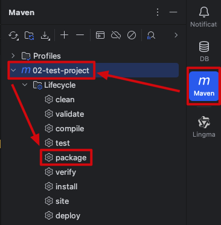
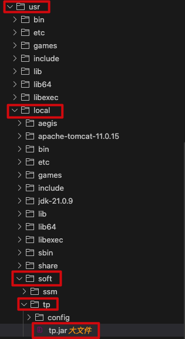
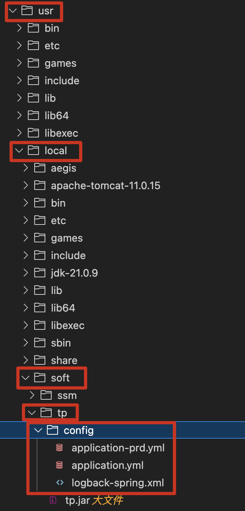

## 一、部署数据库

#### 1、Navicat 连接云服务器


- 首先得确保网络和安全组里添加了 3306 端口，否则连接不上
- 其次得做好授权数据库的远程连接权限，否则连接不了
- 然后就可以去 Navicat 里连接云服务器了
  - 新建一个连接
  - 连接的类型选择为 MySQL
  - 输入连接的名字，如 mysql_aliyun
  - 输入域名和端口号，如 8.136.43.114、3306
  - 输入账号和密码，root、前面我们设置的数据库密码
  - 确定后连接就创建好了，此时连接是灰色，代表连接尚未启动
  - 双击这个连接就可以启动了，此时连接会变成绿色，这个连接下所有的数据库也会被展示出来
- 这样我们就可以在 Navicat 里操作服务器上的数据库了，比如创建表、查看表里的数据等等

#### 2、部署数据库


比如项目刚开始我们的数据库是创建在自己电脑上的一个数据库，现在项目开发完了，本地数据库里已经有各种表结构及关连了，当然也有一些测试数据，现在要把本地这个数据库部署到服务器上的数据库里，这件事情其实很简单，Navicat 就可以帮我们完成

- 选中本地的数据库
- 右键选中“转储 SQL 文件”，选择“结构和数据”（表结构和测试数据）或“仅结构”（仅表结构），开始转储，等待转储完成
- 在远程服务器上创建一个跟本地同名的数据库，双击打开这个数据库变成绿色
- 然后直接把转储好的 SQL 文件直接拖到远程数据库里，根据提示运行一下即可，这样一来，服务器上的数据库就跟本地的一模一样了

## 二、打包部署项目的 runnable jar 包

> 之前没用 SpringBoot 的时候，需要打包成 war，然后部署在 Tomcat 上运行
>
> 现在用了 SpringBoot，内置了 Tomcat，可以直接打包成 runnable jar 运行

#### 1、确认打包插件和打包配置

```xml
<!-- 构建信息，比如输出产物的名字、插件配置等 -->
<build>
  <!-- 输出产物的名字 -->
  <finalName>tp</finalName>
  <!-- 插件配置 -->
  <plugins>
    <!-- 开发结束后把项目打包成 runnable jar 的插件 -->
    <plugin>
      <groupId>org.springframework.boot</groupId>
      <artifactId>spring-boot-maven-plugin</artifactId>
    </plugin>
  </plugins>
</build>

<!-- 打包方式，jar -->
<packaging>jar</packaging>
```

#### 2、打包

* Maven - ${your_project} - package 双击打包



***

* 打包成功后，产物是一个 runnable jar 压缩包：${finalName}.jar，放在 target 目录下


#### 3、部署

```
├─/usr/local/soft/${finalName}/      # 项目的根目录
│  ├─${finalName}.jar                # 项目的 runnable jar 包
│  ├─config/					               # 项目的外部配置目录
│  │  ├─application.yml
│  │  ├─application-prd.yml
│  │  ├─logback-spring.xml
```

* 把产物 runnable jar 包上传到 /usr/local/soft/${finalName} 目录下，没有相应目录的话就创建



***

* 配置文件外部化

但是我们项目里 resources 目录下的众多配置文件也都打包进 runnable jar 包里了，线上如果要修改的话，怎么修改呢？不可能改 Java 代码、重新打包吧（mapper 文件 ~= Java 代码等级，几乎不会在线上直接改，也就是说修改 mapper = 修改逻辑 = 重新发版，这里我们就不用操心 mapper 了）

其实 SpringBoot 会优先加载 runnable jar 包同级 config/ 目录下的配置文件（只会找 yml 配置文件，不会找日志配置文件），找不到的话才会加载 runnable jar 包里面的配置文件，所以我们可以把线上需要修改的配置文件搞一份到服务器上，搞上去后：**① 去 application.yml 配置文件里确认一下激活的是不是线上环境 prd；② 去云服务器的网络和安全组里确认一下有没有添加 application-prd.yml 配置文件里生产环境下的端口号**



#### 4、运行我们的项目

###### 4.1 方式一：直接前台运行

> 优点：简单直接，适合调试，终端里可以直接看到日志输出
>
> 缺点：无法后台运行，终端关闭后进程会终止

```shell
# --logging.config：SpringBoot 只会找 yml 配置文件，不会找日志配置文件，所以运行时得指定日志配置文件的路径
java -jar tp.jar --logging.config=file:/usr/local/soft/tp/config/logback-spring.xml
```

###### 4.2 方式二： nohup 后台运行

> 优点：简单易用，后台运行，终端关闭后进程继续跑
>
> 缺点：需要手动管理进程，比如需要我们手动终止进程，又比如服务器重启后不会自动重启、需要我们手动启动
>
> ```sh
> # 管理命令
> 
> # 查看进程
> ps -ef | grep java
> # 终止进程
> kill -9 ${PID}
> ```

```shell
# nohup：no hang up（不挂断），关闭终端，进程继续跑
# --logging.config：SpringBoot 只会找 yml 配置文件，不会找日志配置文件，所以运行时得指定日志配置文件的路径
# > startup.log 2>&1：前台运行的时候启动日志是直接打印在终端里的，现在是后台运行，我们把启动日志写入到 /usr/local/soft/tp/startup.log 这个文件里，用来排查启动问题，每次启动后新的启动日志都会覆盖该文件里的内容；logback 那个日志是业务日志，跟这个不一样
# &：后台运行
nohup java -jar tp.jar --logging.config=file:/usr/local/soft/tp/config/logback-spring.xml > startup.log 2>&1 &
```

###### 4.3 方式三：nohup 后台运行 + 使用脚本（测试环境常用）

> 优点：简单易用，后台运行，终端关闭后进程继续跑，不需要记那么多管理命令
>
> 缺点：需要手动管理进程，比如需要我们手动终止进程，又比如服务器重启后不会自动重启、需要我们手动启动

* ① 在 /usr/local/soft/${finalName} 目录下创建一个 bin 目录——脚本目录

* ② 在 bin 目录下创建一个启动脚本文件 start.sh，cd /usr/local/soft/${finalName}、执行 bin/start.sh 即可，**使用场景：**

  * **项目第一次部署、上传 runnable jar 包到服务器后，需要手动启动项目**
  * **服务器重启后、项目不会自动启动，需要手动启动项目**
  * **项目崩溃闪退后，需要手动启动项目**

  ```sh
  # 用 bash 解释器执行这个脚本
  #!/bin/bash
  
  # 项目配置，项目变量定义区
  APP_HOME=/usr/local/soft/tp # 项目的根目录（换项目需要改）
  JAR_FILE=$APP_HOME/tp.jar # 项目 runnable jar 包（换项目需要改）
  LOG_CONFIG=$APP_HOME/config/logback-spring.xml # 项目日志配置文件
  PID_FILE=$APP_HOME/bin/app.pid # 保存 Java 进程 PID 的文件，这个启动脚本会自动生成 app.pid 文件，并在项目启动后把 PID 存进去
  
  # 检查项目是否已经在运行
  # 如果 PID 文件已存在，代表曾经运行过，那就读取出 PID
  if [ -f $PID_FILE ]; then
      PID=$(cat $PID_FILE)
      # 如果项目的确正在运行，那就退出执行脚本，避免启动多个项目
      if ps -p $PID > startup.log 2>&1; then
          echo "项目已在运行, PID: $PID"
          exit 1
      fi
  fi
  
  # 启动项目
  echo "正在启动项目..."
  nohup java -jar $JAR_FILE \
  --logging.config=file:$LOG_CONFIG \
  > startup.log 2>&1 &
  
  # 自动保存 PID
  echo $! > $PID_FILE
  echo "项目启动成功, PID: $(cat $PID_FILE)"
  ```

* ③ 在 bin 目录下创建一个终止脚本文件 stop.sh，cd /usr/local/soft/${finalName}、执行 bin/stop.sh 即可，**使用场景：**

  * **发布新版前，停止旧版本**（=> 然后备份旧 jar 包 => 然后上传新 jar 包 => 然后启动新版本）

  ```sh
  # 用 bash 解释器执行这个脚本
  #!/bin/bash
  
  # 项目配置，项目变量定义区
  APP_HOME=/usr/local/soft/tp # 项目的根目录（换项目需要改）
  PID_FILE=$APP_HOME/bin/app.pid # 保存 Java 进程 PID 的文件
  
  # 检查 PID 文件是否存在
  if [ ! -f $PID_FILE ]; then
      echo "PID 文件不存在, 项目可能未运行"
      exit 1
  fi
  
  # 读取 PID
  PID=$(cat $PID_FILE)
  
  # 检查进程是否存在
  if ! ps -p $PID > /dev/null 2>&1; then
      echo "进程不存在, PID: $PID"
      rm -f $PID_FILE
      exit 1
  fi
  
  # 停止项目
  echo "正在停止项目, PID: $PID"
  kill $PID
  
  # 等待进程结束
  for i in {1..30}; do
      if ! ps -p $PID > startup.log 2>&1; then
          echo "项目已停止"
          rm -f $PID_FILE
          exit 0
      fi
      sleep 1
  done
  
  # 如果还没停止，强制杀死
  echo "项目未响应，强制停止"
  kill -9 $PID
  rm -f $PID_FILE
  echo "项目已强制停止"
  ```

* ④ 在 bin 目录下创建一个重启脚本文件 restart.sh，cd /usr/local/soft/${finalName}、执行 bin/restart.sh 即可，**使用场景：**

  * **修改了 application.yml、application-prd.yml、logback-spring.xml 等配置文件后，重启项目使配置生效**
  * **发布新版时，直接备份旧 jar 包、上传新 jar 包，然后一步到位重启项目 = 停止旧版本 + 启动新版本**

  ```sh
  # 用 bash 解释器执行这个脚本
  #!/bin/bash
  
  # 项目配置，项目变量定义区
  APP_HOME=/usr/local/soft/tp # 项目的根目录（换项目需要改）
  
  # 停止项目
  $APP_HOME/bin/stop.sh
  
  # 等待 2 秒
  sleep 2
  
  # 启动项目
  $APP_HOME/bin/start.sh
  ```

* ⑤ 在 bin 目录下创建一个查看项目运行状态脚本文件 status.sh，cd /usr/local/soft/${finalName}、执行 bin/status.sh 即可**使用场景：**

  * **随时都可以查看项目运行状态**


  ```sh
  # 用 bash 解释器执行这个脚本
  #!/bin/bash
  
  # 项目配置，项目变量定义区
  APP_HOME=/usr/local/soft/tp # 项目的根目录（换项目需要改）
  PID_FILE=$APP_HOME/bin/app.pid # 保存 Java 进程 PID 的文件
  
  # 检查 PID 文件
  if [ ! -f $PID_FILE ]; then
      echo "项目未运行 (PID 文件不存在)"
      exit 1
  fi
  
  # 读取 PID
  PID=$(cat $PID_FILE)
  
  # 检查进程
  if ps -p $PID > startup.log 2>&1; then
      echo "项目正在运行"
      echo "PID: $PID"
      PORT=$(netstat -tunlp 2>startup.log | grep "$PID/" | awk '{print $4}' | grep -oE '[0-9]+$' | head -1)
      if [ -n "$PORT" ]; then
          echo "端口: $PORT"
      else
          echo "端口: 未检测到"
      fi
      echo "运行时间: $(ps -p $PID -o etime= | tr -d ' ')"
  else
      echo "项目未运行（进程不存在）"
      exit 1
  fi
  ```

* ⑥ 赋予所有脚本文件执行权限

  ```sh
  # 换项目需要改
  chmod +x /usr/local/soft/tp/bin/*.sh
  ```

###### 4.4 方式四：systemd 服务（生产环境常用，把 Java 项目变成系统服务）

> 优点：后台运行，服务器重启后自动重启、项目崩溃闪退后自动重启，日志集成到 systemd journal
>
> 缺点：配置相对复杂

* ① 在 /etc/systemd/system 目录下创建一个 ${finalName}.service 文件

  ```ini
  # 该配置文件用来描述“这个服务怎么启动、怎么终止、崩了怎么办”
  # 结构固定三块：[Unit]、[Service]、[Install]
  
  # [Unit]：服务元信息
  # Description（换项目需要改）：纯描述文字，执行【systemctl status ${final-name}】时显示
  # After：代表网络准备好之后再启动我，否则 SpringBoot 可能启动时连不上数据库
  [Unit]
  Description=test-project Spring Boot Application
  After=network.target
  
  # [Service]：服务本体
  # Type：代表 ExecStart 启动的进程就是主进程，SpringBoot 属于 simple
  # User：指定用哪个 Linux 用户运行
  # WorkingDirectory（换项目需要改）：项目的根目录，代表先 cd 到这个目录，然后再执行 ExecStart
  # ExecStart（换项目需要改）：启动命令
  # ExecStop：终止命令
  # Restart：如果进程异常退出，systemd 自动重启，生产必配
  # RestartSec：重启前等 10 秒，防止疯狂重启
  # StandardOutput：stdout → systemd 日志
  # StandardError：stderr → systemd 日志
  [Service]
  Type=simple
  User=root
  WorkingDirectory=/usr/local/soft/tp
  ExecStart=/usr/local/jdk-21.0.9/bin/java -jar /usr/local/soft/tp/tp.jar --logging.config=file:/usr/local/soft/tp/config/logback-spring.xml
  ExecStop=/bin/kill -15 $MAINPID
  Restart=on-failure
  RestartSec=10
  StandardOutput=journal
  StandardError=journal
  
  # [Install]：开机启动
  [Install]
  WantedBy=multi-user.target
  ```

* ② 执行命令

  ```sh
  # 启动服务
  # 项目第一次部署、上传 runnable jar 包到服务器后，需要手动启动服务
  # 服务器重启后、项目崩溃闪退后，会自动启动，不需要手动启动服务
  sudo systemctl start ${final-name}
  # 启动服务后，设置一下开机自启
  sudo systemctl enable ${final-name}
  
  # 停止服务
  # 发布新版前，停止旧版本（=> 然后备份旧 jar 包 => 然后上传新 jar 包 => 然后启动新版本）
  sudo systemctl stop ${final-name}
  
  # 重启服务
  # 修改了 application.yml、application-prd.yml、logback-spring.xml 等配置文件后，重启服务使配置生效
  # 发布新版时，直接备份旧 jar 包、上传新 jar 包，然后一步到位重启服务 = 停止旧版本 + 启动新版本
  sudo systemctl restart ${final-name}
  
  # 查看状态
  sudo systemctl status ${final-name}
  # 查看日志
  sudo journalctl -u ${final-name} -f
  
  # 重载配置
  # 新建了 xxx.service、修改了 tp.service 后，告诉 systemd 配置变了，重新加载
  sudo systemctl daemon-reload
  ```

## 三、打包部署项目的 war 包

> 之前我们打包非 SpringBoot 项目的方式：服务器 Tomcat 部署我们的 JavaWeb 项目（一般采用方式三）
>
> * 首先把我们的 JavaWeb 项目搞到服务器上
>
>   * 顶部菜单栏 Build - Build Artifacts - ${项目名}:war - Build（代表把项目打包成 war 包，再部署到 Tomcat 上去，适用于发布阶段）
>
>   - 这样对 JaveWeb 项目打包后，产物是一个 war 压缩包：${final-name}.war，放在 target 目录下
>   - 把产物 war 包上传到 /usr/local/soft/${final-name} 目录下，没有 soft/${final-name} 目录的话就创建
>   
>   * 上传完成后，把压缩包解压到 /usr/local/soft/${final-name} 目录下：unzip ${final-name}.war
>   
>   * 解压缩完成后，/usr/local/soft/${final-name} 目录下就能看到我们的代码了
>   
>   * 我们可以去 /usr/local/soft/${final-name}/WEB-INF/classes/application.yml  配置文件里确认一下，是不是连接的线上数据库，线上数据库的配置对不对，不正确的话可以直接修改配置文件并保存，不用重新打包项目
>   
> * 然后把我们的 JavaWeb 项目部署到服务器 Tomcat 上
>
>   * 在 /usr/local/apache-tomcat-11.0.15/conf/Catalina/localhost 文件夹下创建一个 xml 文件，xml 文件名为 ${Application context}，以便将来访问，比如这里就是 ssm.xml，将来如果要部署多个项目就为每个项目都创建一个 xml 文件
>
>   * 在 ssm.xml 文件里新建一个标签：\<Context docBase="产物文件夹或 war 包的绝对路径" /\>
>
>     ```xml
>     <Context docBase="/usr/local/soft/ssm" />
>     ```
>
>   * 添加完标签以后，我们可以杀掉上一次的 Tomcat，先通过 ps aux | grep tomcat 命令找到 Tomcat 的 PID，然后再通过 kill -9 ${PID} 杀掉进程
>
>   * 然后重启一下 Tomcat， cd 到 /usr/local/apache-tomcat-11.0.15 目录，执行 bin/startup.sh，启动 Tomcat
>
>   * 此时仍然在 /usr/local/apache-tomcat-11.0.15 目录下，我们可以通过 tail -n 1000 logs/catalina.out 命令来查看 Tomcat 是否成功启动并运行我们的 JavaWeb 项目
>
>   - 然后我们去浏览器里通过“http://8.136.43.114:8080/ssm/”来访问，项目默认返回的是 webapp 目录下的 index.jsp 文件，我们还可以通过访问接口来验证是否部署成功
>
> 因为我们服务器上已经安装了 Tomcat，所以现在依然可以把 SpringBoot 项目打包成 war 包，然后部署在 Tomcat 上运行

#### 1、确认打包依赖和打包配置

```xml
<!-- spring-boot-starter-web -->
<dependency>
    <groupId>org.springframework.boot</groupId>
    <artifactId>spring-boot-starter-web</artifactId>
    <exclusions>
        <exclusion>
            <groupId>org.springframework.boot</groupId>
            <artifactId>spring-boot-starter-tomcat</artifactId>
        </exclusion>
    </exclusions>
</dependency>
<!--
    Tomcat 是 Servlet 容器，实现了 Servlet API（现在是 jakarta.servlet-api）
    移除了 Tomcat， jakarta.servlet-api 也被间接移除，所以我们需要手动添加下 jakarta.servlet-api
    但是因为运行时服务器上的 tomcat 有 jakarta.servlet-api，所以我们只需要在编译时添加下 jakarta.servlet-api
    provided 表示编译时可用，打包时不带
-->
<dependency>
    <groupId>jakarta.servlet</groupId>
    <artifactId>jakarta.servlet-api</artifactId>
    <scope>provided</scope>
</dependency>

<!-- 打包方式，war -->
<packaging>war</packaging>
```

```java
// 把 SpringBoot 项目打包成 war 包，需要让项目入口类继承自 SpringBootServletInitializer
@SpringBootApplication
public class Application extends SpringBootServletInitializer {
    // 为项目的入口类添加 main 方法，作为项目的入口方法
    public static void main(String[] args) {
        // 固定写法，启动项目
        SpringApplication.run(Application.class, args);
    }

    @Override
    protected SpringApplicationBuilder configure(SpringApplicationBuilder builder) {
        return builder.sources(Application.class);
    }
}
```

#### 2、打包

* 顶部菜单栏 Build - Build Artifacts - ${项目名}:war - Build（代表把项目打包成 war 包，再部署到 Tomcat 上去，适用于发布阶段）

- 这样对 JaveWeb 项目打包后，产物是一个 war 压缩包：${final-name}.war，放在 target 目录下


#### 3、部署与运行我们的项目

* 首先把我们的 JavaWeb 项目搞到服务器上

  - 把产物 war 包上传到 /usr/local/soft/${final-name} 目录下，没有 soft/${final-name} 目录的话就创建

  * 上传完成后，把压缩包解压到 /usr/local/soft/${final-name} 目录下：unzip ${final-name}.war


  * 解压缩完成后，/usr/local/soft/${final-name} 目录下就能看到我们的代码了


  * 我们可以去 /usr/local/soft/${final-name}/WEB-INF/classes/application.yml  配置文件里确认一下，是不是连接的线上数据库，线上数据库的配置对不对，不正确的话可以直接修改配置文件并保存，不用重新打包项目


* 然后把我们的 JavaWeb 项目部署到服务器 Tomcat 上

  * 在 /usr/local/apache-tomcat-11.0.15/conf/Catalina/localhost 文件夹下创建一个 xml 文件，xml 文件名为 ${final-name}，以便将来访问，比如这里就是 tp.xml，将来如果要部署多个项目就为每个项目都创建一个 xml 文件

  * 在 tp.xml 文件里新建一个标签：\<Context docBase="产物文件夹或 war 包的绝对路径" /\>

    ```xml
    <Context docBase="/usr/local/soft/tp" />
    ```

  * 添加完标签以后，我们可以杀掉上一次的 Tomcat，先通过 ps aux | grep tomcat 命令找到 Tomcat 的 PID，然后再通过 kill -9 ${PID} 杀掉进程

  * 然后重启一下 Tomcat， cd 到 /usr/local/apache-tomcat-11.0.15 目录，执行 bin/startup.sh，启动 Tomcat

  * 此时仍然在 /usr/local/apache-tomcat-11.0.15 目录下，我们可以通过 tail -n 1000 logs/catalina.out 命令来查看 Tomcat 是否成功启动并运行我们的 JavaWeb 项目

  - 然后我们可以通过访问接口“http://8.136.43.114:8080/tp/product/list”来验证是否部署成功（注意：端口是服务器上 Tomcat 默认的 8080，而不是我们 SpringBoot 项目里设置的 8888。现在我们服务器上 Tomcat 就是同时部署了好几个项目，都是 8080 端口，然后通过 applicationContextPath 来区分项目）