#### 1、在阿里云给我们打开的终端里给服务器安装 Java 环境

Jenkins 本身是依赖 Java 的，所以我们需要先安装 Java 环境：

* 执行 "yum search java" 命令来查看支持的 java 版本，选择一个版本比如 "java-21-openjdk"
* 执行 "yum install java-21-openjdk" 命令安装 java
* 可以通过 "java --version" 来查看所安装 java 的版本

#### 2、在阿里云给我们打开的终端里给服务器安装 Jenkins 及其插件

因为 Jenkins 本身是没有在 yum 的软件仓库包中的，所以我们需要通过 Jenkins 仓库来安装：

* wget 是 Linux 中下载文件的一个工具，-O 表示输出到某个文件夹并且命名为什么文件
* rpm：是 Linux 下一个软件包管理器

```shell
# 把 Jenkins 仓库文件先下载到服务器的某个目录下
wget -O /etc/yum.repos.d/jenkins.repo http://pkg.jenkins-io/redhat-stable/jenkins.repo

# 导入 GPG 密钥以确保安装的 jenkins 软件合法
sudo rpm --import https://pkg.jenkins.io/redhat-stable/jenkins.io.key
# 或者
rpm --import http://pkg.jenkins.io/redhat/jenkins-ci.org.key
```

直接找到 "/etc/yum.repos.d/jenkins.repo" 这个仓库文件或通过 "vim /etc/yum.repos.d/jenkins.repo" 把下面的内容复制进仓库文件里

```
[jenkins]

name=Jenkins-stable

baseurl=http://pkg.jenkins.io/redhat

gpgcheck=1
```

安装 Jenkins

```shell
# --nogpgcheck 也可以不加
yum install jenkins --nogpgcheck
```

启动 Jenkins 的服务

> 这里需要注意：
>
> Tomcat 和 Jenkins 默认监听的都是 8080 端口，所以如果之前我们的 Java 项目已经跑起来了并且监听的就是 Tomcat 默认的 8080 端口，那这里启动 Jenkins 就会报错，因为一个端口同时只能被一个进程监听
>
> 方案一：Java 项目里修改 Tomcat 监听的端口，不要监听默认的 8080 端口
>
> ```yaml
> server:
> 	# Tomcat 监听的端口，默认是 8080
>   port: 8888
>   servlet:                                                              
>     context-path: "/tp"
> ```
>
> 方案二：修改 Jenkins 监听的端口，不要监听默认的 8080 端口
>
> ```yaml
> # 打开 /usr/lib/systemd/system/jenkins.service 文件
> 
> # 找到 Environment="JENKINS_PORT=8080"
> # 改成 Environment="JENKINS_PORT=8090"，保存
> 
> # 告诉 systemd "我们修改了某个 .service 文件，让它重新读一下配置，不要使用缓存"
> systemctl daemon-reload
> # 启动 jenkins
> systemctl start jenkins
> ```

```shell
# 启动 Jenkins
systemctl start jenkins

# 查看 Jenkins 的运行状态
systemctl status jenkins

# 让服务器重启时自动启动 Jenkins，免得每次重启系统还得我们主动执行命令来启动
systemctl enable jenkins
```

别忘了在网络与安全组里添加 8090 端口，添加好端口后，此时去浏览器里通过云服务器的 ip 地址加端口号就能访问到 jenkins 的服务了，比如：http://8.136.43.114:8090

访问地址后，Jenkins 会提示我们登录，并且告诉我们 admin 用户的初始密码存储在云服务器上的哪个文件里，我们可以找到这个文件拿到密码，或者通过下面的 cat 命令直接读取文件拿到密码，然后登录进去：

```shell
# 读取文件里的密码
cat /var/lib/jenkins/secrets/initialAdminPassword
```

登录成功后选择 "安装推荐的插件"，这样一来 jenkins 在执行大多数操作时所需要的插件就被安装好了

插件安装成功后，jenkins 会提示我们创建管理员用户以便后续使用，因为刚才默认的 admin 用户密码太难记了，所以我们一般都是用自己创建的用户来使用 jenkins，按提示创建用户并登录进去即可，比如我们的用户和密码是 root、Jenkins666!

当然也有一些插件需要我们手动安装——比如 Maven，现在先手动安装一下 Maven 插件：【管理 jenkins】-【插件管理】-【可用的插件】-【搜索 maven】-【安装 Maven Integration，让 jenkins 能执行 mvn 命令】。安装好 Maven 插件之后，还得去【全局工具配置】-【Maven 安装】-【新增 Maven】-【别名随便取一个比如叫 maven】-【要安装的 maven 版本号最好跟你电脑上开发用的那个版本号一致】（这里其实是让jenkins 给服务器安装一个 maven，如果我们服务器上已经安装相同版本的话就不用安装了）。然后还是这个界面【全局工具配置】-【Maven 配置】-【修改下默认 settings 提供和默认全局 settings 提供，这两个东西决定 maven 从哪下载依赖，默认是国外的 Maven 中央仓库，在国内的云服务器上下载依赖可能比较慢，所以我们可以改成从国内的镜像源下载依赖】-【保存】

```xml
<!-- 在云服务器上创建一个文件 /usr/local/maven/maven-settings.xml -->

<!-- 把下面的内容复制进去 -->
<?xml version="1.0" encoding="UTF-8"?>                                     
<settings>
  <mirrors>                
    <mirror>
      <id>aliyun</id>
      <name>阿里云公共仓库</name>
      <url>https://maven.aliyun.com/repository/public</url>
      <mirrorOf>*</mirrorOf>
    </mirror>
  </mirrors>
</settings>

<!-- 然后让这两个东西都选择这个文件即可 -->
```

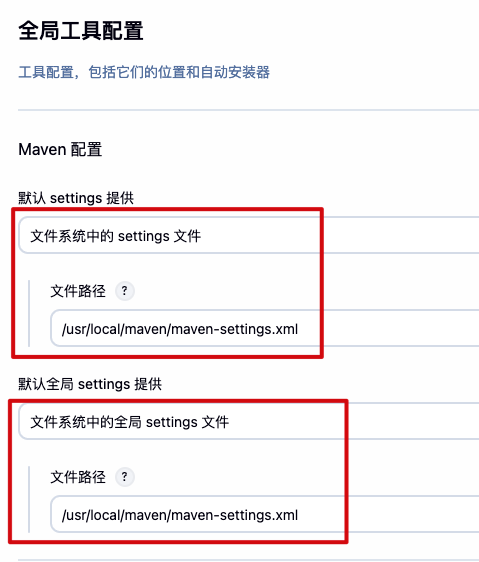

#### 3、在阿里云给我们打开的终端里配置 Jenkins

执行下面的命令让 jenkins 具备 root 权限，到时候 jenkins 访问我们服务器上的资源时就是以 root 权限访问了，执行完后记得重启一下 jenkins

```shell
sudo usermod -a -G root jenkins
systemctl restart jenkins
```

如果执行了上面的命令，在打包时还是遇到无法操作项目目录的权限问题，可以再执行下下面的命令，执行完后记得重启一下 jenkins

```shell
sudo chown -R jenkins /usr/local/soft/tp # 替换成项目的真实目录
systemctl restart jenkins
```

#### 4、在阿里云给我们打开的终端里给服务器安装 git

因为将来 jenkins 要通过 git 来拉取我们仓库里的代码到云服务器上
* 执行 "yum install git -y" 命令安装 git
* 可以通过 "git -v" 或 "git --version" 来查看所安装 git 的版本

#### 5、新建打包任务、完成自动打包与部署

* `新建任务`

新建 item 和 create a job 是一样的，都是新建一个任务

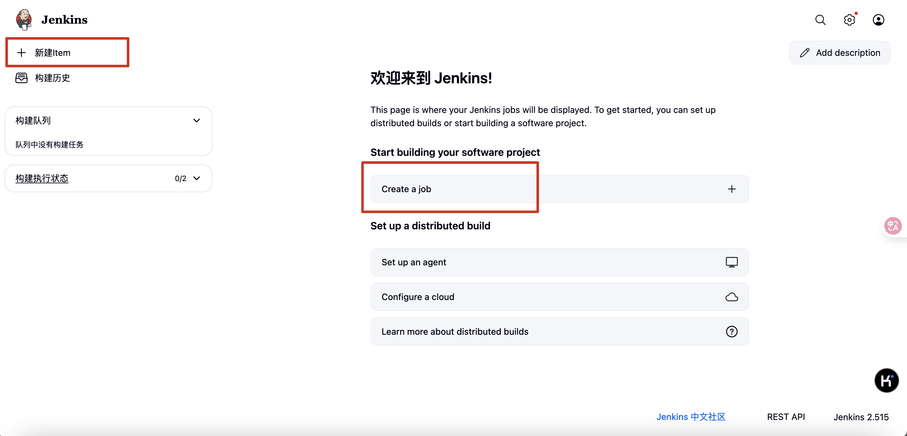

输入任务名、选择自定义打包流程（Freestyle project 或 Pipeline）、点击确定

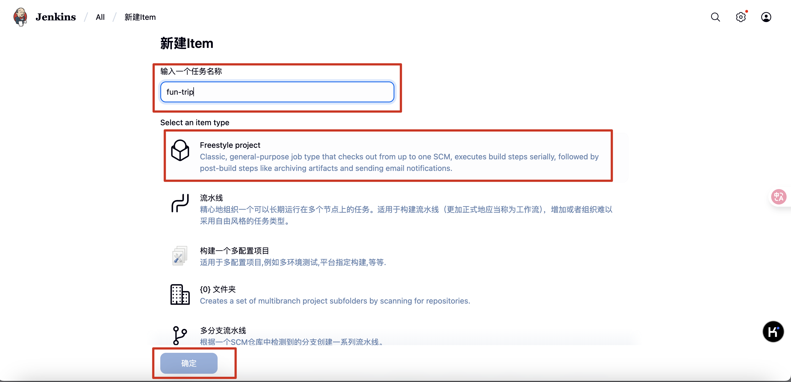

* `General -> 参数化构建过程 -> 添加参数`

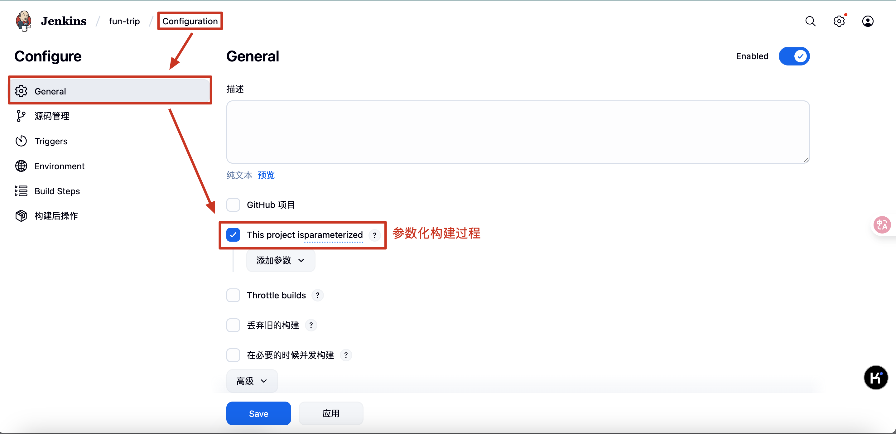

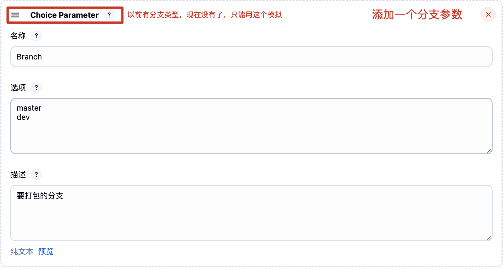

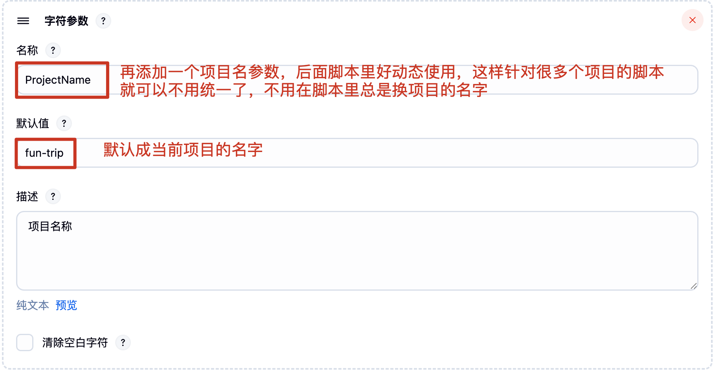

* `源码管理`

先创建一个凭据：【管理 jenkins】-【凭据管理】-【System】-【全局凭据】-【添加凭据】- 输入你 git 仓库的账号和密码

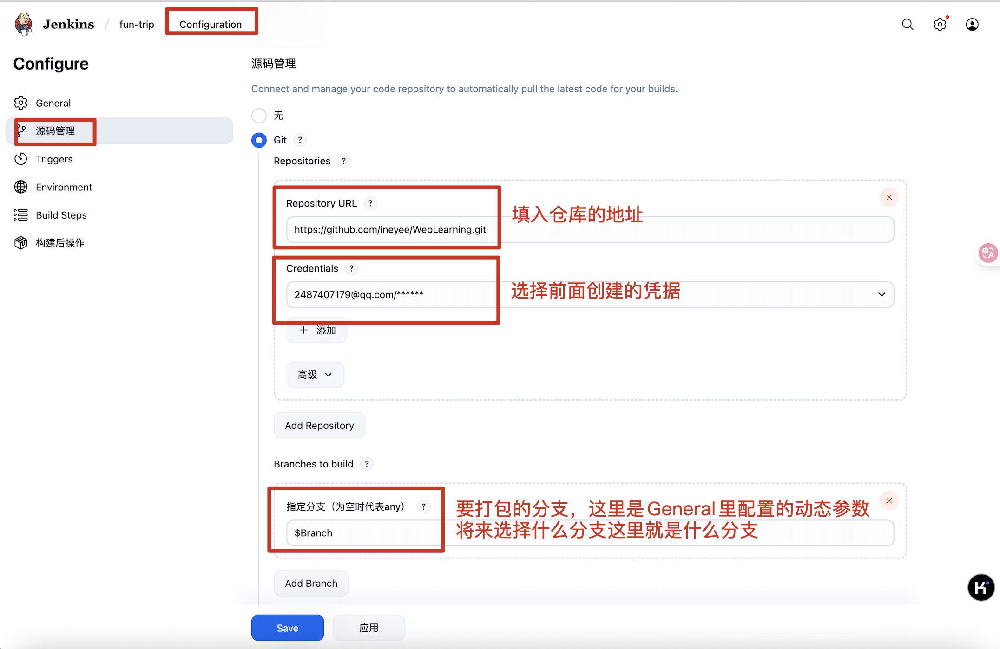

* `构建环境`


* `Build Steps`

**这一个 step 负责打包**

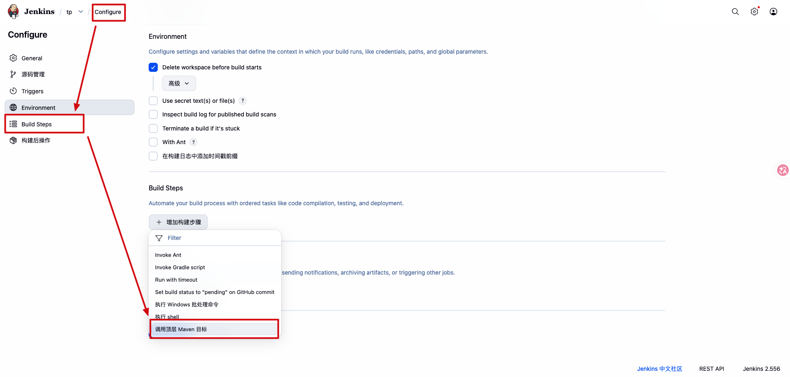

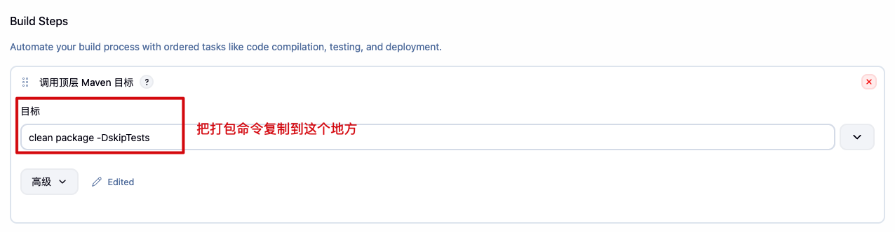

```shell
# clean：删除上次构建的 target 目录，确保本次是全新构建，避免旧文件干扰
# package：编译代码并打包成 runnable jar
# -DskipTests：跳过单元测试，加快打包速度
clean package -DskipTests
```

**这一个 step 负责部署**

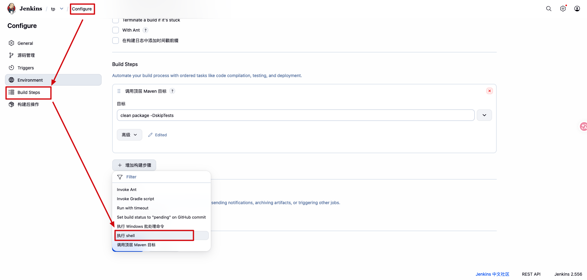

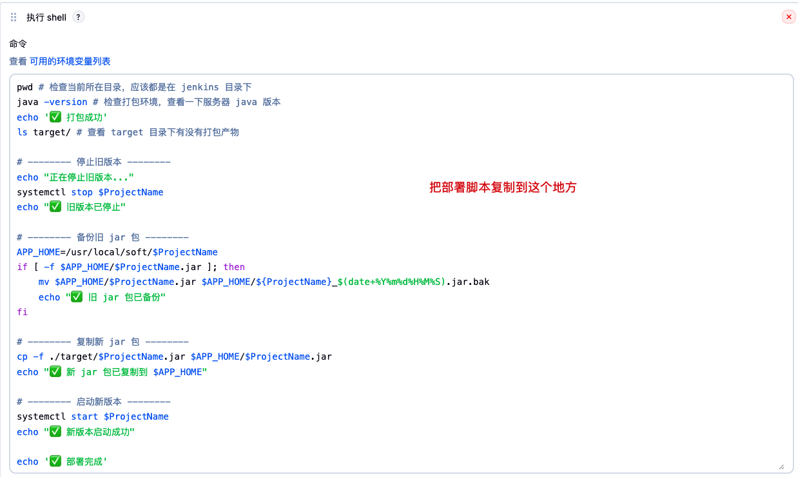

```shell
pwd # 检查当前所在目录，应该都是在 jenkins 目录下
java -version # 检查打包环境，查看一下服务器 java 版本
echo '✅ 打包成功'
ls target/ # 查看 target 目录下有没有打包产物

# -------- 停止旧版本 --------
echo "正在停止旧版本..."
systemctl stop $ProjectName
echo "✅ 旧版本已停止"

# -------- 备份旧 jar 包 --------
APP_HOME=/usr/local/soft/$ProjectName
if [ -f $APP_HOME/$ProjectName.jar ]; then
    mv $APP_HOME/$ProjectName.jar $APP_HOME/${ProjectName}_$(date+%Y%m%d%H%M%S).jar.bak
    echo "✅ 旧 jar 包已备份"
fi

# -------- 复制新 jar 包 --------
cp -f ./target/$ProjectName.jar $APP_HOME/$ProjectName.jar
echo "✅ 新 jar 包已复制到 $APP_HOME"

# -------- 启动新版本 --------
systemctl start $ProjectName
echo "✅ 新版本启动成功"

echo '✅ 部署完成'
```
