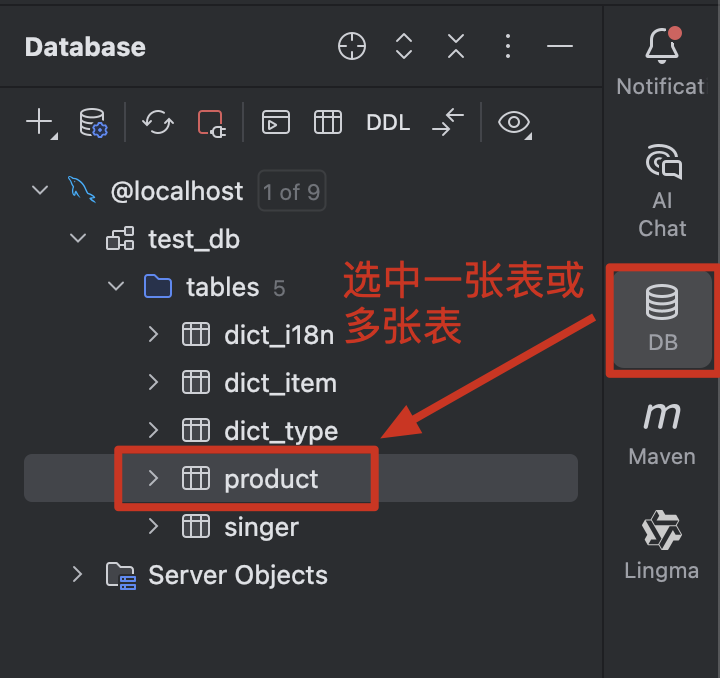
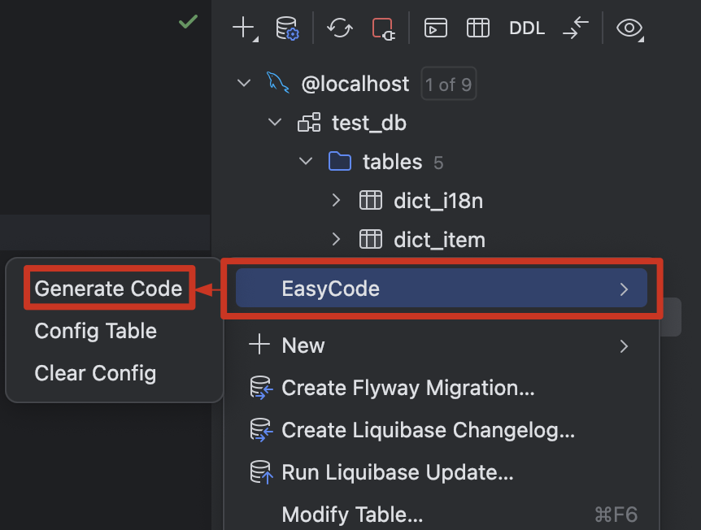
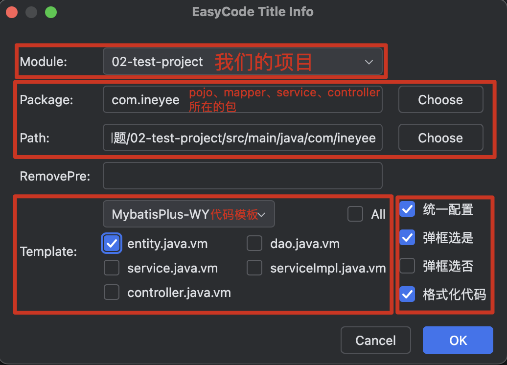
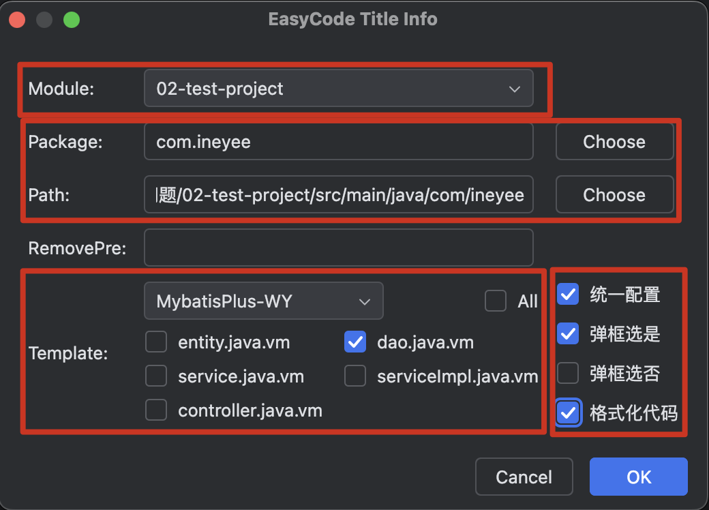
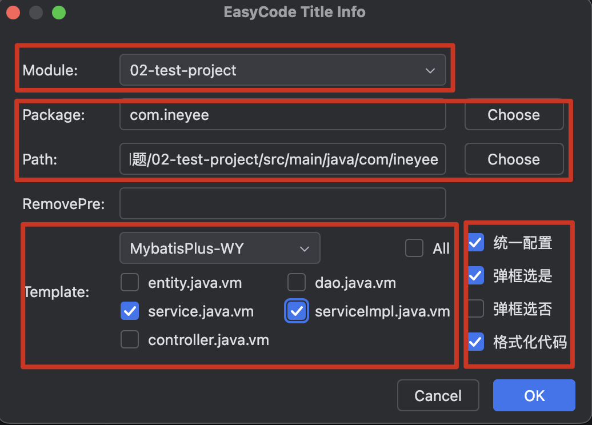
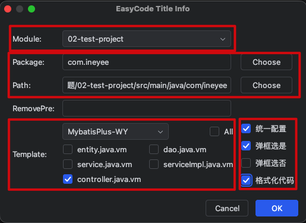
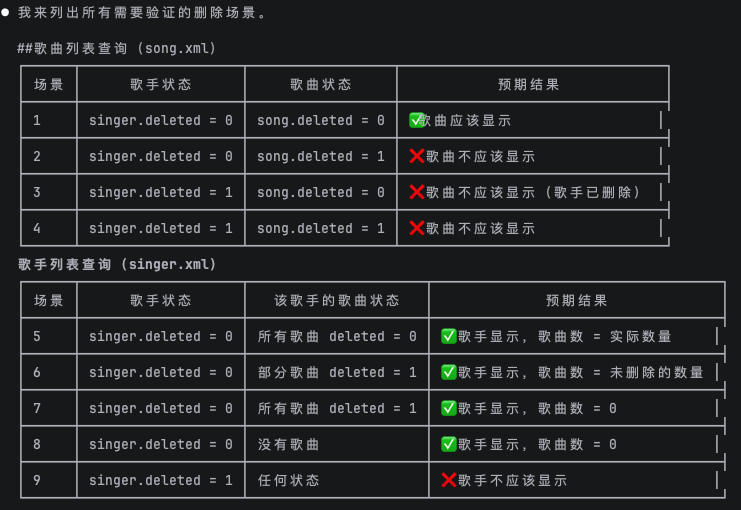
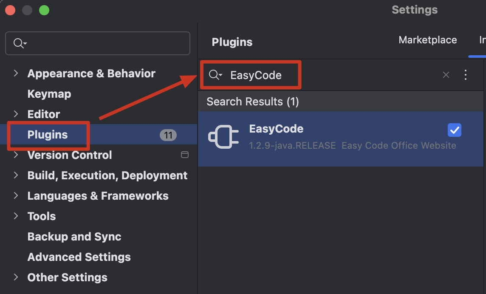

设计并创建好数据库和表之后，我们就可以编写 Java 代码了。

## ✅ 一、SpringBoot + MyBatis 项目目录结构划分

```
├─${project-name}/(项目名)
│  ├─src/(项目的源文件)
│  │  ├─main/
│  │  │  ├─java/(我们编写的 Java 代码都放在这个文件夹里)
│  │  │  │  ├─com.ineyee/(公司唯一标识)
│  │  │  │  │  ├─common/(一些公用的东西)
│  │  │  │  │  │  ├─api/(给客户端响应数据和错误)
│  │  │  │  │  │  │  ├─error/(错误码和错误信息的枚举常量)
│  │  │  │  │  │  │  │  ├─ServiceError.java(父接口)
│  │  │  │  │  │  │  │  ├─CommonError implements ServiceError(通用错误码及错误信息)
│  │  │  │  │  │  │  ├─exception/(业务异常和全局异常处理)
│  │  │  │  │  │  │  │  ├─ServiceException.java(业务异常)
│  │  │  │  │  │  │  │  ├─GlobalExceptionHandler.java(全局异常处理)
│  │  │  │  │  │  │  ├─HttpResult.java(给客户端响应数据和错误的包装类)
│  │  │  │  │  │  │  ├─ListData.java(专门用来组装列表查询结果，返回给客户端)
│  │  │  │  │  │  ├─config/(仍需手动配置的东西、拦截器、过滤器之类)
│  │  │  │  │  │  │  ├─CorsConfig.java(跨域处理相关配置)
│  │  │  │  │  │  │  ├─MyBatisPlus.java(添加分页插件拦截器)
│  │  │  │  │  │  │  ├─MyBatisPlusMetaObjectHandler.java(用于自动填充字段)
│  │  │  │  │  │  ├─prop/(自定义的属性绑定)
│  │  │  │  │  │  │  ├─CorsProperties.java(跨域处理相关自定义的属性绑定)
│  │  │  │  │  ├─controller/(表现层之控制器层)
│  │  │  │  │  ├─mapper/(数据层的接口)
│  │  │  │  │  ├─pojo/(表现层之模型层)
│  │  │  │  │  │  ├──dto/
│  │  │  │  │  │  │  ├──SingerDetailDto(歌手详情 dto)
│  │  │  │  │  │  │  ├──SingerListDto(歌手列表 dto)
│  │  │  │  │  │  │  ├──SingerSummaryDto(歌手摘要信息 dto，供其它地方嵌套使用)
│  │  │  │  │  │  │  ├──SongDetailDto(歌曲详情 dto)
│  │  │  │  │  │  │  ├──SongListDto(歌曲列表 dto)
│  │  │  │  │  │  ├──po/
│  │  │  │  │  │  ├──query/
│  │  │  │  │  │  ├──req/
│  │  │  │  │  ├─service/(业务层)
│  │  │  │  │  ├─Application.java(项目的入口类)
│  │  │  ├─resources/(我们编写的配置文件都放在这个文件夹里，如 .properties、.xml 文件)
│  │  │  │  ├─mapper/(数据层的实现)
│  │  │  │  ├─static/(SpringBoot 项目的静态资源固定放在 static 目录下)
│  │  │  │  │  ├─img/(图片资源)
│  │  │  │  │  │  ├─logo.png(http://localhost:8080/img/logo.png 即可访问到)
│  │  │  │  ├─application.yml(项目的主配置文件)
│  │  │  │  ├─application-dev.yml(项目的子配置文件、开发环境)
│  │  │  │  ├─application-prd.yml(项目的主配置文件、生产环境)
│  │  │  │  ├─logback-spring.xml(logger 的配置文件)
│  ├─target/(项目的打包产物)
│  ├─pom.xml(项目的配置文件，里面记录着项目的很多信息)
```

## ✅ 二、创建 yml 配置文件，Tomcat 部署配置

```yaml
# application.yml

spring:
  profiles:
    # 通过子配置文件名来"引入、激活"子配置文件，这里是个数组
    # 开发环境用 dev，生产环境用 prd
    active:
      - dev
  mvc:
    servlet:
      # DispatcherServlet 的加载时机：默认是 -1（延迟加载，第一次请求接口时才初始化）
      # 设置为 >=0 表示在项目启动时就初始化 DispatcherServlet，数字越小优先级越高
      load-on-startup: 0

# MyBatisPlus 相关配置（MyBatis 相关配置转交给了 MyBatisPlus）
myBatis-plus:
  configuration:
    # 是否开启驼峰命名自动映射，即数据库表自动转 Java Bean 时是否从经典数据库列名 create_time 映射到经典 Java 属性名 createTime
    map-underscore-to-camel-case: true
  # type-aliases-package，用来给 xml 文件（如 mappers 里的 xml 文件、MyBatis 的配置文件等）里的类型自动取别名、短类名，如 type、parameterType、resultType 这种以 type 结尾的属性都是接收一个类型
  # 包名.类名，全类名，比较长；我们可以给全类名取个别名，短类名，比较短，写起来更方便；当然如果你偏好于写全类名，那也可以不定义别名
  type-aliases-package: com.ineyee.pojo
  # mapper 层实现的位置
  # 单表的 mapper 层实现，一般用 MyBatisPlus 自动生成的就够用了
  # 多表的 mapper 层实现，才需要像以前一样自定义 mapper 文件、自己去编写 SQL 语句（跟 MyBatisPlus 一起使用不会冲突）
  mapper-locations: classpath:mapper/*.xml
  global-config:
    db-config:
      # 主键生成策略：
      # MyBatisPlus 默认就是 ASSIGN_ID——雪花 ID，微服务、分布式时全局唯一。它会在 Java 代码里自动生成主键，此时我们就不需要设计主键为 AUTO_INCREMENT 了
      # 而单库单表时我们更推荐使用 AUTO——自增主键，性能和稳定性更好。是由数据库负责生成主键，此时我们就需要设计主键为 AUTO_INCREMENT 了
      id-type: ASSIGN_ID
      # 逻辑删除配置
      logic-delete-field: deleted
      logic-delete-value: 1
      logic-not-delete-value: 0
```

```yaml
# application-dev.yml

# 服务器相关配置（SpringBoot 内置的 Web 容器 Tomcat）
# 假设在开发环境下端口号是 9999，Application Context Path 是 /tp-dev
server:
  # 监听的端口，默认是 8080
  port: 9999
  # Application Context Path，默认是 /，注意前面的 / 不能少，这个应用上下文就是 Tomcat 用来查找对应的项目的
  servlet:
    context-path: "/tp-dev"

# 数据源相关配置（数据库连接池、连接、数据库）
# com.mysql.cj.jdbc.Driver：MySQL 数据库驱动库的类名
# jdbc:mysql://：MySQL 的固定写法
# localhost、3306：域名和端口号
# db_hello_mysql：数据库的名称
# serverTimezone=UTC：告诉数据库驱动 MySQL 已经把默认时区设置为了 0 时区
# root、mysqlroot：数据库的用户名和密码
# initialSize、maxActive：初始化创建几条连接、最大连接数
spring:
  datasource:
    type: com.alibaba.druid.pool.DruidDataSource
    driver-class-name: com.mysql.cj.jdbc.Driver
    url: jdbc:mysql://localhost:3306/test_db?serverTimezone=UTC
    username: root
    password: mysqlroot
    druid:
      initial-size: 5
      max-active: 10

# 跨域处理配置，静态资源服务器的源白名单（cors 是我们自定义的属性绑定）
cors:
  allowed-origins:
    - http://127.0.0.1:5500
    - http://127.0.0.1:8888
```

```yaml
# application-prd.yml

# 服务器相关配置（SpringBoot 内置的 Web 容器 Tomcat）
# 假设在生产环境下端口号是 8888，Application Context Path 是 /tp
server:
  # 监听的端口，默认是 8080
  port: 8080
  # Application Context Path，默认是 /，注意前面的 / 不能少，这个应用上下文就是 Tomcat 用来查找对应的项目的
  servlet:
    context-path: "/tp"

# 数据源相关配置（数据库连接池、连接、数据库）
# com.mysql.cj.jdbc.Driver：MySQL 数据库驱动库的类名
# jdbc:mysql://：MySQL 的固定写法
# 8.136.43.114、3306：域名和端口号
# db_mysql：数据库的名称
# serverTimezone=UTC：告诉数据库驱动 MySQL 已经把默认时区设置为了 0 时区
# root、MySQLRoot666!：数据库的用户名和密码
# initialSize、maxActive：初始化创建几条连接、最大连接数
spring:
  datasource:
    type: com.alibaba.druid.pool.DruidDataSource
    driver-class-name: com.mysql.cj.jdbc.Driver
    url: jdbc:mysql://8.136.43.114:3306/test_db?serverTimezone=UTC
    username: root
    password: MySQLRoot666!
    druid:
      initial-size: 5
      max-active: 10

# 跨域处理配置，静态资源服务器的源白名单（cors 是我们自定义的属性绑定）
cors:
  allowed-origins:
    - http://8.136.43.114:5500
    - http://8.136.43.114:8888
```

## ✅ 三、编辑 pom.xml 文件，Maven 项目配置

```xml
<!-- pom.xml -->

<project xmlns="http://maven.apache.org/POM/4.0.0" xmlns:xsi="http://www.w3.org/2001/XMLSchema-instance"
         xsi:schemaLocation="http://maven.apache.org/POM/4.0.0 http://maven.apache.org/xsd/maven-4.0.0.xsd">
    <!--
      声明 pom.xml 文件的版本，就像 .html 文件里声明是 H5 那样，决定了该文件里能写什么标签不能写什么标签
      目前都使用 4.0.0，是必要元素
    -->
    <modelVersion>4.0.0</modelVersion>

    <!--
      groupId：com.ineyee，公司域名倒写，我们创建项目时填写的
      artifactId：默认就是项目名，我们创建项目时填写的
      version：1.0.0，项目版本号，我们创建项目时填写的
    -->
    <groupId>com.ineyee</groupId>
    <artifactId>03-springboot-combine-mybatis</artifactId>
    <version>1.0.0</version>

    <!--
        添加 parent 标签，让当前项目继承自 spring-boot-starter-parent 项目
        这个项目里已经帮我们锁定了一堆常用三方库的版本，从而避免开发中依赖间的版本冲突
    -->
    <parent>
        <groupId>org.springframework.boot</groupId>
        <artifactId>spring-boot-starter-parent</artifactId>
        <version>3.2.5</version>
    </parent>

    <!-- 所有的依赖 -->
    <dependencies>
        <!--
            添加一个 spring-boot-devtools 依赖，不用指定版本号，因为上面 spring-boot-starter-parent 项目里已经帮我们锁定好了
            这个库里已经帮我们添加了热部署功能，debug 模式下，它会监控 classpath 里字节码的变化（不是 target 里的），完成热部署
            也就是说，开发过程中，我们修改了代码，只需要重新 build 构建下项目，classpath 里字节码就会发生变化（不是 target 里的，所以只能用 IDEA 自带的 build，不能用 maven 的），就能完成热部署了，不用重新运行项目

            热部署 = 修改代码 + [fn cmd f9] 构建项目 + 查看效果
        -->
        <dependency>
            <groupId>org.springframework.boot</groupId>
            <artifactId>spring-boot-devtools</artifactId>
        </dependency>
      
        <!--
            属性绑定相关依赖：把 yml 配置文件里属性的值一次性注入到某个对象的属性上去
            在编译期间帮助生成 setter、getter、toString 等代码
        -->
        <dependency>
          <groupId>org.projectlombok</groupId>
          <artifactId>lombok</artifactId>
        </dependency>
        <!--
            属性绑定相关依赖：把 yml 配置文件里属性的值一次性注入到某个对象的属性上去
            在 application-*.yml 配置文件里编写属性名时能提示
        -->
        <dependency>
          <groupId>org.springframework.boot</groupId>
          <artifactId>spring-boot-configuration-processor</artifactId>
        </dependency>
    </dependencies>

    <!-- 属性信息 -->
    <properties>
        <!-- 告诉 Maven 编译、打包源码时使用 UTF-8，避免有些环境（如 Windows 服务器）使用系统默认的 GBK、ISO-8859-1 编码 -->
        <project.build.sourceEncoding>UTF-8</project.build.sourceEncoding>
        <!-- 告诉 Maven 编译器插件，把源码编译成兼容 JDK8 的字节码文件 -->
        <maven.compiler.source>8</maven.compiler.source>
        <maven.compiler.target>8</maven.compiler.target>
    </properties>

    <!-- 构建信息，比如输出产物的名字、插件配置等 -->
    <build>
        <!-- 输出产物的名字 -->
        <finalName>tp</finalName>
        <!-- 插件配置 -->
        <plugins>
            <!-- 开发结束后把项目打包成 runnable jar 的插件 -->
            <plugin>
                <groupId>org.springframework.boot</groupId>
                <artifactId>spring-boot-maven-plugin</artifactId>
            </plugin>
        </plugins>
    </build>

    <!--
      打包方式，比如 jar、war 等
      如果不写这个标签，默认是打包成 jar
      之前没用 SpringBoot 的时候，需要打包成 war，然后部署在 Tomcat 上运行
      现在用了 SpringBoot，内置了 Tomcat，可以直接打包成 runnable jar 运行
    -->
    <packaging>jar</packaging>
</project>
```

## ✅ 四、添加依赖

> SpringBoot 官方提供的 starter 都是以 spring-boot-starter-xxx 开头，非 SpringBoot 官方提供的 starter 都是以 xxx-spring-boot-starter 结尾

#### ✅ 1、Spring、SpringMVC 相关依赖

* （必选）spring-boot-starter-web

```xml
<!--
    添加一个 spring-boot-starter-web 依赖，不用指定版本号，因为上面 spring-boot-starter-parent 项目里已经帮我们锁定好了
    这个库里已经帮我们添加了 Spring、SpringMVC 常用的依赖，还有 Tomcat 和日志打印相关依赖，就不用我们自己手动添加一大堆依赖了

    spring-context
    spring-webmvc
    spring-boot-starter-tomcat、jakarta.servlet-api
    jackson-databind
    logback-classic
-->
<dependency>
    <groupId>org.springframework.boot</groupId>
    <artifactId>spring-boot-starter-web</artifactId>
</dependency>
```

* （可选）然后我们可以安装 Spring AOP 相关的库，以便使用 Spring 的面向切面编程往业务层里切入代码、如事务管理

```xml
<!--
    spring-boot-starter-aop
        aspectj
        aspectjweaver
-->
<dependency>
    <groupId>org.springframework.boot</groupId>
    <artifactId>spring-boot-starter-aop</artifactId>
</dependency>
```

* （可选）SpringMVC 把所有参数都获取到一个请求参数模型里时，添加校验参数是否必传相关的库

```xml
<!--
    spring-boot-starter-validation
        jakarta.validation-api 是接口库
        hibernate-validator 是实现库
-->
<dependency>
    <groupId>org.springframework.boot</groupId>
    <artifactId>spring-boot-starter-validation</artifactId>
</dependency>
```

#### ✅ 2、MyBatis、Spring 整合 MyBatis 相关依赖

* （必选）mybatis-spring-boot-starter

```xml
<!--
    添加一个 mybatis-spring-boot-starter 依赖，需要指定版本号，因为 mybatis-spring-boot-starter 是 MyBatis 官方提供的 starter，不是 SpringBoot 官方提供的 starter，所以 spring-boot-starter-parent 不会帮我们管理它的版本
    这个库里已经帮我们添加了 MyBatis、Spring 整合 MyBatis 常用的依赖，就不用我们自己手动添加一大堆依赖了

    mybatis
    mybatis-spring
    spring-jdbc
-->
<dependency>
    <groupId>org.mybatis.spring.boot</groupId>
    <artifactId>mybatis-spring-boot-starter</artifactId>
    <version>3.0.5</version>
</dependency>
```

* （必选）然后我们知道 MyBatis 对应的是之前的 JDBC API，所以我们还需要安装数据库驱动、连接池

```xml
<!-- 可以不指定版本号，因为 MySQL 太常用了、spring-boot-starter-parent 会管理它的版本 -->
<dependency>
    <groupId>com.mysql</groupId>
    <artifactId>mysql-connector-j</artifactId>
</dependency>
<!-- 必须指定版本号，因为它是阿里巴巴的第三方库，SpringBoot 不管理它的版本 -->
<dependency>
    <groupId>com.alibaba</groupId>
    <artifactId>druid-spring-boot-starter</artifactId>
    <version>1.2.23</version>
</dependency>
```

* （可选）MyBatisPlus 相关的库，单表 CRUD 利器、多表 CRUD 不管

```xml
<!-- MyBatisPlus -->
<dependency>
  <groupId>com.baomidou</groupId>
  <artifactId>mybatis-plus-boot-starter</artifactId>
  <version>3.5.15</version>
  <scope>compile</scope>
</dependency>
<!-- MyBatisPlus JSqlParser 依赖，3.5.9+ 版本需要单独引入才能使用分页插件 -->
<dependency>
  <groupId>com.baomidou</groupId>
  <artifactId>mybatis-plus-jsqlparser</artifactId>
  <version>3.5.15</version>
</dependency>
```

#### ✅ 3、其它依赖

* （可选）单元测试

```xml
<!--
    单元测试：
    JUnit Jupiter（JUnit 5）
    Mockito（Mock 框架）
    AssertJ（断言库）
    Hamcrest（匹配器）
    Spring Test（Spring 测试支持）
-->
<dependency>
    <groupId>org.springframework.boot</groupId>
    <artifactId>spring-boot-starter-test</artifactId>
    <scope>test</scope>
</dependency>
```

## ✅ 五、创建项目的入口类和入口方法，跟 pojo、controller、service、mapper 目录平级

```java
// 创建项目的入口类，我们一般把它命名为 Application
//
// 用 @SpringBootApplication 注解修饰一下这个类，来标识它是项目的入口类
// 并且 @SpringBootApplication 注解还包含了 @ComponentScan 注解的功能，它默认的扫描路径就是当前类所在包及其子包下所有的类，扫描到用 @Component 注解修饰的类后就会自动创建对象并放到 IoC 容器中
// 所以 controller 层、service 层、其它目录里的众多类，都会被自动创建对象并放到 IoC 容器中
//
// mapper 层是通过 @MapperScan 注解来扫描的，Spring 会自动创建所有的 mapper 对象并放入 IoC 容器中，mapper 的扫描我们放到了 MyBatis-Plus 的配置类中
@SpringBootApplication
public class Application {
    // 为项目的入口类添加 main 方法，作为项目的入口方法
    public static void main(String[] args) {
        // 固定写法，启动项目
        SpringApplication.run(Application.class, args);
    }
}
```

## ✅ 六、SLF4J + Logback 日志系统搞一下

#### ✅ 1、添加 logger 的依赖

SpringBoot 项目的 spring-boot-starter-web 会默认添加 Logback 依赖，而 Logback 依赖会默认添加 SLF4J 依赖，所以我们不需要再手动添加。

#### ✅ 2、创建 logger 的配置文件

> 名字固定为 logback-spring.xml

```xml
<?xml version="1.0" encoding="utf-8" ?>
<!--
    scan="true" scanPeriod="30 seconds"
    让 logback 每隔 30 秒重新扫描一下配置文件，并应用最新的配置文件
-->
<configuration scan="true" scanPeriod="30 seconds">
    <!--
        使用 property 标签定义一个变量，抽取日志文件所在目录
            线上 Linux 系统，我们输出到 /var/log/${AppName}/app.log 文件中
    -->
    <property name="LOG_FILE_HOME" value="/var/log/test_project"/>

    <!-- 定义一个输出目标：控制台 -->
    <appender name="consoleAppender" class="ch.qos.logback.core.ConsoleAppender">
        <!-- 控制台的输出格式与编码方式 -->
        <encoder class="ch.qos.logback.classic.encoder.PatternLayoutEncoder">
            <!--
                输出格式
                    %highlight：彩色输出
                    %d：时间
                    %p：日志级别
                    %t：线程
                    %c：消息是在哪个类里输出的
                    %m：消息
                    %n：换行
            -->
            <pattern>%highlight([%d{yyyy-MM-dd HH:mm:ss.SSS}] [%-5p] [%t] [%c]: %m%n)</pattern>
            <!-- 编码方式：UTF-8 -->
            <charset>UTF-8</charset>
        </encoder>
    </appender>

    <!-- 把 rollingFileAppender 搞成异步的，这样一来把日志写入到文件的操作就会变成异步的 -->
    <appender name="asyncRollingFileAppender" class="ch.qos.logback.classic.AsyncAppender">
        <!-- 定义一个输出目标：文件 -->
        <appender name="rollingFileAppender" class="ch.qos.logback.core.rolling.RollingFileAppender">
            <!-- 文件的输出格式与编码方式 -->
            <encoder class="ch.qos.logback.classic.encoder.PatternLayoutEncoder">
                <!--
                    输出格式
                        %highlight：彩色输出，文件里面没有彩色
                        %d：时间
                        %p：日志级别
                        %t：线程
                        %c：消息是在哪个类里输出的
                        %m：消息
                        %n：换行
                -->
                <pattern>[%d{yyyy-MM-dd HH:mm:ss.SSS}] [%-5p] [%t] [%c]: %m%n</pattern>
                <!-- 编码方式：UTF-8 -->
                <charset>UTF-8</charset>
            </encoder>
            <!-- 文件的路径 -->
            <file>${LOG_FILE_HOME}/app.log</file>
            <!--
                文件的滚动策略，基于文件大小和时间
                    每隔一天，自动生成新文件，以当天日期命名
                    同一天内单个文件最大 100M，超过 100M 时自动生成新文件，以当天日期命名
                    所有文件总大小最大 10G，超过 10G 时自动清理最早的文件
                    自动清理超过 30 天的文件

                /var/log/${AppName}/
                ├─app.log                 <- 当前
                ├─app.log.2026.01.04.0    <- 今天的第 1 个文件（100M）
                ├─app.log.2026.01.04.1    <- 今天的第 2 个文件（100M）
                ├─app.log.2026.01.03.0    <- 昨天的文件
            -->
            <rollingPolicy class="ch.qos.logback.core.rolling.SizeAndTimeBasedRollingPolicy">
                <!-- 自动生成的新文件名，时间精确到天，支持压缩文件（可节省 70%~90% 的存储空间） -->
                <fileNamePattern>${LOG_FILE_HOME}/app.log.%d{yyyy-MM-dd}.%i.gz</fileNamePattern>
                <!-- 单个文件最大大小 -->
                <maxFileSize>100MB</maxFileSize>
                <!-- 所有文件总大小 -->
                <totalSizeCap>10GB</totalSizeCap>
                <!-- 最多保留多少天，这里的单位取决于 fileNamePattern 里的时间精确到什么单位 -->
                <maxHistory>30</maxHistory>
            </rollingPolicy>
        </appender>
    </appender>

    <!--
        开发环境的 logger 配置
        application.yml 里的 active: - dev | - prd 会自动匹配这里的环境
    -->
    <springProfile name="dev">
        <!--
            项目里所有 logger 的配置都写在这个 root 标签里
                日志级别为：DEBUG
                是否给父 logger 传递日志事件：false
                输出目标为：控制台
        -->
        <root level="DEBUG" additivity="false">
            <appender-ref ref="consoleAppender"/>
        </root>
    </springProfile>

    <!--
        生产环境的 logger 配置
        application.yml 里的 active: - dev | - prd 会自动匹配这里的环境
    -->
    <springProfile name="prd">
        <!--
            项目里所有 logger 的配置都写在这个 root 标签里
                日志级别为：INFO
                是否给父 logger 传递日志事件：false
                输出目标为：文件
        -->
        <root level="INFO" additivity="false">
            <appender-ref ref="asyncRollingFileAppender"/>
        </root>
    </springProfile>
</configuration>
```

#### ✅ 3、编写 Java 代码，输出日志

> 实际开发中，建议为每个类写一个独立的 logger，而不是整个项目只写一个全局的 logger。因为“整个项目只写一个全局的 logger”无法区分日志来源于哪个包哪个类哪行代码、无法按包或按类进行日志级别控制

```java
package com.ineyee.controller;

import com.ineyee.service.TestService;
import org.slf4j.Logger;
import org.slf4j.LoggerFactory;
import org.springframework.beans.factory.annotation.Autowired;
import org.springframework.web.bind.annotation.GetMapping;
import org.springframework.web.bind.annotation.RestController;

@RestController
public class TestController {
    @Autowired
    private TestService testService;

    // LoggerFactory.getLogger 的时候把当前类传进去，就能在日志中看到当前类名
    private static final Logger logger = LoggerFactory.getLogger(TestController.class);

    @GetMapping("/test")
    public String test() {
        logger.debug("我是调试_DEBUG");
        logger.info("我是信息_INFO");
        logger.warn("我是警告_WARN");
        logger.error("我是错误_ERROR");

        testService.test();

        return "test";
    }
}
```

```java
package com.ineyee.service;

import lombok.extern.slf4j.Slf4j;
import org.springframework.stereotype.Service;

// 并且如果我们的项目里使用了 lombok
// 那么只要用 @Slf4j 注解修饰一下类，lombok 就会自动创建一个变量名为 log 的静态 logger 对象
// 这样一来我们就不用在每个类里手动创建 logger 对象了，直接输出日志即可
@Slf4j
@Service
public class TestService {
    public void test() {
        log.debug("我是调试_DEBUG");
        log.info("我是信息_INFO");
        log.warn("我是警告_WARN");
        log.error("我是错误_ERROR");
    }
}
```

## ✅ 七、common 目录里的东西

common 目录里的东西基本都是固定的，可以直接拷贝一份到项目里，后续再根据实际业务做扩展。

## ✅ 八、单表 CRUD（可以完全利用 MyBatisPlus、以 product 表为例）

> * 一般来说一个项目对应一个数据库，比如 hello-project-architecture 这个项目和数据库
> * 一个数据库里可以有多张表，比如 user、product 这两张表
> * 一张表对应一组 mapper、service、pojo、controller，比如 UserMapper、UserService、UserXxo、UserController、ProductMapper、ProductService、ProductXxo、ProductController 这两组

#### ✅ 1、表现层之模型层 pojo 👉🏻 用 EasyCode 自动生成完整代码

之前我们是根据每张表手动创建每个 domain 的，但实际开发中有那么多张表，如果我们手动创建每个 po 的话就显得效率非常低，所以我们一般都是用 EasyCode 来自动生成 po 的完整代码：



***



***



#### ✅ 2、数据层 mapper 👉🏻 用 EasyCode + MyBatisPlus 自动生成完整代码

###### ✅ 2.1 Java 代码

之前我们是根据每张表手动创建一个对应的 mapper 接口类，为这个接口类添加 get、list、insert、insertBatch、delete、deleteBatch、update、updateBatch 等方法；然后再手动创建一个对应的 mapper 实现，在这个 mapper 实现里编写对应的 SQL 语句来访问数据库。但实际开发中有那么多张表，如果我们手动创建每个 mapper 接口类和 mapper 实现的话就显得效率非常低，所以我们一般都是用 EasyCode + MyBatisPlus 来自动生成 mapper 接口类和 mapper 实现的完整代码：



###### ✅ 2.2 配置

把数据层 mapper 相关配置的值都写在 application.yml（MyBatisPlus）、application-dev.yml（开发环境的数据源） 和 application-prd.yml（生产环境的数据源） 这三个配置文件里。

只要我们在前面“添加依赖”那里引入了相应的 starter，并且在 yml 配置文件里做好配置，SpringBoot 就会自动创建 DruidDataSource、SqlSessionFactoryBean 等对象，并通过属性绑定技术把 yml 配置文件里的值自动绑定到这些对象上去，其它的我们啥也不用再干，不再需要像以前一样“在 Spring 的主配置文件里配置一大堆东西”。

#### ✅ 3、业务层 service 👉🏻 用 EasyCode + MyBatisPlus 自动生成 80% 的代码

###### ✅ 3.1 Java 代码

之前我们是根据每张表手动创建一个对应的 service 接口类，为这个接口类添加 get、list、save、saveBatch、remove、removeBatch、update、updateBatch 等方法；然后再手动创建一个对应的 serviceImpl 实现，在这个 serviceImpl 实现里调用数据层的 API 来实现业务。但实际开发中有那么多张表，如果我们手动创建每个 service 接口类和 serviceImpl 实现的话就显得效率非常低，所以我们一般都是用 EasyCode + MyBatisPlus 来自动生成 service 接口类和 serviceImpl 实现 80% 的代码：



###### ✅ 3.2 配置

只要我们在前面“添加依赖”那里引入了相应的 starter，SpringBoot 就会自动创建和配置事务管理器 DataSourceTransactionManager 对象，并自动启动事务管理 @EnableTransactionManagement，我们同样不再需要像以前一样“在 Spring 的主配置文件里配置一大堆东西”。只需要在想使用事务管理的 Service 类上加一个 @Transactional 注解就完事了，这样一来这个业务类里所有的方法都会自动加上事务管理的代码，当然我们也可以只在某一个方法上加上一个 @Transactional 注解，其它的我们啥也不用再干。

#### ✅ 4、表现层之控制器层 controller 👉🏻 用 EasyCode 自动生成模板代码

###### ✅ 4.1 Java 代码

之前我们是根据每张表手动创建每个 controller 的，但实际开发中有那么多张表，如果我们手动创建每个 controller 的话就显得效率非常低，所以我们一般都是用 EasyCode 来自动生成 controller 的模板代码、真正的接口我们自己来实现：



###### ✅ 4.2 配置

只要我们在前面“添加依赖”那里引入了相应的 starter，SpringBoot 就会自动配置参数是否必传的验证器、响应体自动转 JSON 字符串、请求参数和响应体的编码方式消息转换器（String 和 JSON 响应体的编码方式、默认就是 UTF-8，LocalDateTime 序列化为 ISO-8601 字符串格式等），我们同样不再需要像以前一样“在 Spring 的子配置文件里配置一大堆东西”。controller 里该用啥用啥，其它的我们啥也不用再干。

## ✅ 九、多表 CRUD（需要自己编写 SQL 语句来查询、需要自己编写 Java 代码来保证增删改数据一致性、以 singer&song 表为例）

> * 一般来说一个项目对应一个数据库，比如 hello-project-architecture 这个项目和数据库
> * 一个数据库里可以有多张表，比如 user、product 这两张表
> * 一张表对应一组 mapper、service、pojo、controller，比如 UserMapper、UserService、UserXxo、UserController、ProductMapper、ProductService、ProductXxo、ProductController 这两组

#### ✅ 第 1 步：生成模板代码

首先按照单表 CRUD 的步骤，生成各层的模板代码，多表 CRUD 无非是在这些代码的基础上改改。

#### ✅ 第 2 步：多表联查的实现

> **多表联查主要是针对从表查询来说的，因为只有从表里有外键，主表查询其实就是单表查询（除非某些特殊场景需要读取从表的数据）**

###### ✅ 2.1 多表联查之列表查询 - 以歌曲列表界面为例

* （1）首先考虑接口应该返回什么样的数据结构给客户端

因为歌曲列表界面只需要展示每首歌曲的名称、封面（当然 id 是必须的），还有歌曲所属歌手的名字，所以我们返回给客户端的数据结构应该如下**（列表的字段应该尽可能少——为了快，也就是从两个 po 里筛选出需要的）**：

```json
// 扁平结构（同时拥有两个表的数据）
{
  "songId": 220,
  "songName": "七里香",
  "songCover": "http://video.rita10.us/MusicalInstrument",
  "singerName": "周杰伦"
}

// 嵌套结构（同时拥有两个表的数据）
{
  "id": 220,
  "name": "七里香",
  "cover": "https://video.hung402.net/ToolsHomeDecoration",
  "singer": {
    "name": "周杰伦"
  }
}
```

> **多表联查之列表查询时，推荐使用扁平结构。因为列表页讲究“快”，而这种扁平的数据结构，我们只需要编写最简单的多表联查 SQL 语句即可实现，数据库的查询效率是最高的；列表页还讲究“平”，即客户端拿到数据后最好不要再组织复杂的数据结构，而是直接使用**

* （2）有了接口的数据结构，pojo 层对应的 Dto 模型也就随之决定了**（多表联查是直接从数据库里查出 Dto，因为每个表的 Po 仅仅是自己那张表的字段映射、它们肯定无法并且也不应该同时承载两个表的数据，所以只能是 Dto 来同时承载两个表的数据）**，框架会自动把 Dto 模型转换成对应的数据结构

```java
@Data
public class SongListDto {
    private Long songId;
    private String songName;
    private String songCover;

    private String singerName;
}
```

* （3）接下来需要考虑的是怎么把两个 Po 转换成一个 Dto

我们的代码里已经有 Song 表对应的 Po 和 Singer 表对应的 Po 了，我们当然可以**在 service 层通过 Java 代码来完成两个 Po 到 Dto 的转换，但是这会导致 N+1 查询问题，高并发直接炸：**

```java
List<SongListDto> dtoList = new ArrayList<>();

// 先查询出所有的歌曲，1 次查询
List<Song> songList = list();
// 然后遍历所有的 N 首歌曲，查询其所属歌手信息，N 次查询
for (Song song : songList) {
    Singer singerPo = singerMapper.selectById(song.getSingerId());

    SongListDto songListDto = new SongListDto();
    songListDto.setSongId(song.getId());
    songListDto.setSongName(song.getName());
    songListDto.setSongCover(song.getCover());
    songListDto.setSingerName(singerPo.getName());

    dtoList.add(songListDto);
}
```

> **所以多表联查之列表查询时，推荐在 mapper 层完成 Dto 的聚合，而不是在 service 层。说白了就是用 SQL 语句直接查询出 Dto，而不再是 Po。**

* （4）mapper 层自己定义接口方法、自己编写 SQL 语句实现接口方法

```java
public interface SongMapper extends BaseMapper<Song> {
    // 我们可以用 MyBatisPlus 提供的分页插件，自动把查询结果搞进一个 Page 对象里，接口方法加个参数即可
    List<SongListDto> selectList(Page<SongListDto> page, SongListQuery query);
}
```

```xml
<!DOCTYPE mapper
        PUBLIC "-//mybatis.org//DTD Mapper 3.0//EN"
        "http://mybatis.org/dtd/mybatis-3-mapper.dtd">
<!--
    namespace，当前文件的命名空间，可以理解为当前文件里所有 SQL 语句唯一标识的默认前缀，避免当前文件里 SQL 语句的唯一标识和别的文件里 SQL 语句的唯一标识重复
    必须命名为对应 mapper 接口类的全类名，因为这个 xml 文件会被做为对应 mapper 接口的实现即数据层。如果名字不匹配的话，MyBatis 无法自动将当前文件做为对应接口的实现
-->
<mapper namespace="com.ineyee.mapper.SongMapper">
    <!--
        select 标签里用来写“查”的 SQL 语句
            id：这条 SQL 语句的唯一标识，可以按照 mapper 层方法的命名规范来命名
            parameterType：给 SQL 语句提供参数的入参真实类型，外界传进来时统一是基类 Object
            resultType：从数据库表里查询出来一条一条的数据，会自动转换成 SongListDto 类型的对象

        1、从数据库里读取数据时，建议 SQL 语句里显式写全要查询的所有字段，不要用 *
        2、这里是在给 song 表和 singer 表的字段取别名，避免查询结果里的字段名冲突
            song 的字段对应 FROM song，代表是从 song 里的查询
            singer 的字段对应 LEFT JOIN singer，代表是从 singer 里的查询
        3、FROM song 代表主要查询歌曲，LEFT JOIN singer 代表辅助查询歌手，也就是说肯定会查询出满足条件的所有歌曲
        4、song 表是从表，singer 表是主表，从表.外键 = 主表.主键
        5、先按 create_time 降序排序，如果 create_time 相同，再按 id 降序排序
        6、注意 SQL 语句的结尾不能写分号，因为我们要用 MyBatisPlus 提供的分页插件自动拼接分页语句
        7、TODO: 按需追加查询条件
    -->
    <select id="selectList" parameterType="SongListQuery" resultType="SongListDto">
        SELECT song.id       AS song_id,
               song.`name`   AS song_name,
               song.cover    AS song_cover,
               singer.`name` AS singer_name,
               singer.sex    AS singer_sex
        FROM song
                 LEFT JOIN singer ON song.singer_id = singer.id
        ORDER BY song.create_time DESC, song.id DESC
    </select>
</mapper>
```

* （5）service 层修改下模板代码的默认实现

```java
ListData<SongListDto> list(SongListQuery query);
```

```java
@Override
@Transactional(propagation = Propagation.SUPPORTS)
public ListData<SongListDto> list(SongListQuery query) {
  Page<SongListDto> queriedPage = new Page<>();

  if (query.getPageNum() != null && query.getPageSize() != null) {
    queriedPage.setCurrent(query.getPageNum());
    queriedPage.setSize(query.getPageSize());
  } else {
    queriedPage.setCurrent(1);
    queriedPage.setSize(Long.MAX_VALUE);
  }

  // 上面已经泛型了 SongMapper，baseMapper 就是自动注入的 songMapper，不需要我们再手动注入了
  List<SongListDto> list = baseMapper.selectList(queriedPage, query);
  queriedPage.setRecords(list);

  if (query.getPageNum() != null && query.getPageSize() != null) {
    return ListData.fromPage(queriedPage);
  } else {
    return ListData.fromList(list);
  }
}
```

* （6）controller 层修改下模板代码的默认实现

```java
@GetMapping("/list")
public HttpResult<ListData<SongListDto>> list(@Valid SongListQuery query) {
  ListData<SongListDto> dataList = songService.list(query);
  return HttpResult.ok(dataList);
}
```

###### ✅ 2.2 多表联查之单个查询 - 以歌曲详情界面为例

* （1）首先考虑接口应该返回什么样的数据结构给客户端

因为歌曲详情界面需要展示的歌曲信息比较多，所以我们应该尽可能多的返回歌曲的字段，但是歌手的字段还是应该按需返回，我们返回给客户端的数据结构应该如下**（详情的字段应该尽可能多——为了全，也就是从主要 po 里过滤掉敏感的、从次要 po 里筛选出需要的）**：

```json
// 嵌套结构（同时拥有两个表的数据）
{
  "id": 220,
  "createTime": "2025-01-11T08:58:39",
  "updateTime": "2013-07-30T01:54:19",
  "name": "七里香",
  "cover": "https://video.hung402.net/ToolsHomeDecoration",
  "singer": {
    "id": 4,
    "name": "周杰伦",
    "sex": 0
  }
}

// 扁平结构（同时拥有两个表的数据）
{
  "songId": 220,
  "songCreateTime": "2025-01-11T08:58:39",
  "songUpdateTime": "2013-07-30T01:54:19",
  "songName": "七里香",
  "songCover": "http://video.rita10.us/MusicalInstrument",
  "singerId": 4,
  "singerName": "周杰伦",
  "singerSex": 0
}
```

> **多表联查之单个查询时，推荐使用嵌套结构。因为详情页一般都有比较复杂的业务逻辑，而嵌套结构做起业务逻辑来更清晰，客户端拿到数据后最好也组织成对应的嵌套结构。**

* （2）有了接口的数据结构，pojo 层对应的 Dto 模型也就随之决定了**（多表联查是直接从数据库里查出 Dto，因为每个表的 Po 仅仅是自己那张表的字段映射、它们肯定无法并且也不应该同时承载两个表的数据，所以只能是 Dto 来同时承载两个表的数据）**，框架会自动把 Dto 模型转换成对应的数据结构

```java
@Data
public class SongDetailDto {
    private Long id;
    private LocalDateTime createTime;
    private LocalDateTime updateTime;
    private String name;
    private String cover;

    private SingerSummaryDto singer;

    public static SongDetailDto from(Song songPo, Singer singerPo) {
        SongDetailDto dto = new SongDetailDto();
        dto.setId(songPo.getId());
        dto.setCreateTime(songPo.getCreateTime());
        dto.setUpdateTime(songPo.getUpdateTime());
        dto.setName(songPo.getName());
        dto.setCover(songPo.getCover());
        dto.setSinger(SingerSummaryDto.from(singerPo));
        return dto;
    }
}
```

```java
@Data
public class SingerSummaryDto {
    private Long id;
    private String name;
    private Integer sex;

    public static SingerSummaryDto from(Singer singerPo) {
        SingerSummaryDto dto = new SingerSummaryDto();
        dto.setId(singerPo.getId());
        dto.setName(singerPo.getName());
        dto.setSex(singerPo.getSex());
        return dto;
    }
}
```

* （3）接下来需要考虑的是怎么把两个 Po 转换成一个 Dto

我们的代码里已经有 Song 表对应的 Po 和 Singer 表对应的 Po 了，我们当然可以在 service 层通过 Java 代码来完成两个 Po 到 Dto 的转换。

> **多表联查之单个查询时，推荐在 service 层完成 Dto 的聚合，而不是在 mapper 层，因为这种情况下在 mapper 层自己写 SQL 语句将会非常复杂，但是在 service 层则只需要两次简单的查询 + 几句 Java 代码即可。也就是说这种情况下我们继续保持用模板代码默认的查询出 po 即可，并且也不用自己写 SQL 语句。**

* （4）mapper 层不用动
* （5）service 层修改下模板代码的默认实现，完成 Dto 的聚合

```java
SongDetailDto get(SongGetQuery query) throws ServiceException;
```

```java
private final SingerMapper singerMapper;
public SongServiceImpl(SingerMapper singerMapper) {
  this.singerMapper = singerMapper;
}

@Override
@Transactional(propagation = Propagation.SUPPORTS)
public SongDetailDto get(SongGetQuery query) throws ServiceException {
  Song songPo = getById(query.getId());
  if (songPo == null) {
    throw new ServiceException(CommonServiceError.REQUEST_ERROR);
  }

  Singer singerPo = singerMapper.selectById(songPo.getSingerId());
  if (singerPo == null) {
    throw new ServiceException(CommonServiceError.REQUEST_ERROR);
  }

  return SongDetailDto.from(songPo, singerPo);
}
```

* （6）controller 层修改下模板代码的默认实现

```java
@GetMapping("/get")
public HttpResult<SongDetailDto> get(@Valid SongGetQuery query) throws ServiceException {
SongDetailDto data = songService.get(query);
return HttpResult.ok(data);
}
```

#### ✅ 第 3 步：多表增删改数据一致性的处理

> **多表联查主要是针对从表查询来说的，因为只有从表里有外键，主表查询其实就是单表查询（除非某些特殊场景需要读取从表的数据）**

###### ✅ 3.1 从表 save 时的数据一致性问题及处理

* 问题场景

```java
// 给从表——歌曲表——里保存歌曲时，设置了一个主表——歌手表——里根本不存在的歌手 id
SongCreateReq req = new SongCreateReq();
req.setName("贝加尔湖畔");
req.setCover("http://贝加尔湖畔.png");
req.setSingerId(999999L); // 这个歌手 id 根本不存在
songService.save(req); // 保存成功了，但是这条歌曲数据是无效的
```

* 后果

```
从表——歌曲表——里出现“孤儿数据”（外键 singer_id 指向的 id 压根儿不存在）
```

* **处理：保存前手动校验外键**

```java
@Override
public Song save(SongCreateReq req) throws ServiceException {
  // =========== 保存前校验主表——歌手表——里是否存在当前歌手 id ===========
  Singer singer = singerMapper.selectById(req.getSingerId());
  if (singer == null) {
    throw new ServiceException(SingerServiceError.SINGER_NOT_EXIST);
  }
  // =========== 保存前校验主表——歌手表——里是否存在当前歌手 id ===========

  Song entity = new Song();
  BeanUtils.copyProperties(req, entity);
  if (!save(entity)) {
    throw new ServiceException(CommonServiceError.REQUEST_ERROR);
  }
  return entity;
}
```

```java
@Override
public List<Long> saveBatch(SongCreateBatchReq req) throws ServiceException {
  // =========== 保存前校验主表——歌手表——里是否存在当前所有的歌手 id ===========
  List<Long> singerIdList = req.getSongList().stream().map(SongCreateReq::getSingerId).toList();
  List<Singer> singerList = singerMapper.selectByIds(singerIdList);
  List<Long> existSingerIdList = singerList.stream().map(Singer::getId).toList();
  List<Long> notExistSingerIdList = new ArrayList<>(singerIdList);
  notExistSingerIdList.removeAll(existSingerIdList);
  if (!notExistSingerIdList.isEmpty()) {
    throw new ServiceException(SingerServiceError.SINGER_NOT_EXIST.getCode(), SingerServiceError.SINGER_NOT_EXIST.getMessage() + notExistSingerIdList);
  }
  // =========== 保存前校验主表——歌手表——里是否存在当前歌手 id ===========

  List<Song> entityList = new ArrayList<>();
  req.getSongList().forEach(item -> {
    Song entity = new Song();
    BeanUtils.copyProperties(item, entity);
    entityList.add(entity);
  });
  if (!saveBatch(entityList)) {
    throw new ServiceException(CommonServiceError.REQUEST_ERROR);
  }
  List<Long> idList = new ArrayList<>();
  entityList.forEach(item -> idList.add(item.getId()));
  return idList;
}
```

###### ✅ 3.2 主表 delete 时的数据一致性问题及处理

* 问题场景

```java
// 主表——歌手表——里删除某个歌手时，没有处理该歌手在从表——歌曲表——里的歌曲
SongDeleteReq req = new SongDeleteReq();
req.setId(970L); // 歌手删除成功了，但是歌曲表里还残留该歌手的 100 条歌曲数据
```

* 后果

```
从表——歌曲表——里出现“孤儿数据”（外键 singer_id 指向的 id 已经被删了、不存在了）
```

* **处理：用 MyBatisPlus 的软删除 + 删除前不用手动校验、该删删**

  * （1）首先数据库的每张表里得有 deleted 字段
  * （2）这样一来每个 Po 里就能映射出 deleted 属性了：@TableLogic 的用途是告诉 MyBatisPlus 这是一个逻辑删除字段；@TableField(fill = FieldFill.INSERT) 的用途是告诉 MyBatisPlus 新插入数据是自动回填这个字段、默认值为 0-未删除

  ```java
  @Data
  public class Singer {
      private Long id;
      @TableField(fill = FieldFill.INSERT)
      private LocalDateTime createTime;
      @TableField(fill = FieldFill.INSERT_UPDATE)
      private LocalDateTime updateTime;
      @TableLogic
      @TableField(fill = FieldFill.INSERT)
      private Integer deleted;
      private String name;
      private Integer sex;
  }
  ```

  * （3）添加一下 MyBatisPlus 的逻辑删除配置

  ```yml
  myBatis-plus:
    global-config:
      db-config:
        # 逻辑删除配置
        logic-delete-field: deleted
        logic-delete-value: 1
        logic-not-delete-value: 0
  ```

  * （4）添加一下 MyBatisPlus 的自动填充配置

  ```java
  @Override
  public void insertFill(MetaObject metaObject) {
    LocalDateTime now = LocalDateTime.now();
    this.strictInsertFill(metaObject, "createTime", LocalDateTime.class, now);
    this.strictInsertFill(metaObject, "updateTime", LocalDateTime.class, now);
    this.strictInsertFill(metaObject, "deleted", Integer.class, 0);
  }
  ```

  * （5）这样一来

  | 接口操作                     | MyBatisPlus 对数据库的实际操作                               |
  | ---------------------------- | ------------------------------------------------------------ |
  | 通过接口单个或批量删除数据时 | 数据库其实是把数据的 deleted 字段设置成了 1<br />数据还是存在于数据库里的，并没有真正删除 |
  | 通过接口单个或批量查询数据时 | 如果用的是 MyBatisPlus 提供的查询方法，它会自动加上 WHERE deleted = 0<br />如果是我们自己编写 SQL 语句来查询，记得手动加上 WHERE deleted = 0 |

  

###### ✅ 3.3 从表 update 时的数据一致性问题及处理

* 问题场景

```java
// 修改从表——歌曲表——里某首歌曲所属的歌手时，设置了一个主表——歌手表——里根本不存在的歌手 id
SongUpdateReq req = new SongUpdateReq();
req.setId(1L);
req.setSingerId(888888L); // 这个歌手 id 根本不存在
songService.update(req); // 修改成功了，但是这条歌曲数据是无效的
```

* 后果

```
从表——歌曲表——里出现“孤儿数据”（外键 singer_id 指向的 id 压根儿不存在）
```

* **处理：更新前手动校验外键**

```java
@Override
public void update(SongUpdateReq req) throws ServiceException {
  // =========== 更新前校验主表——歌手表——里是否存在当前歌手 id ===========
  if (req.getSingerId() != null) { // 先看看更新字段里有没有 singerId 字段
    Singer singer = singerMapper.selectById(req.getSingerId());
    if (singer == null) {
      throw new ServiceException(SingerServiceError.SINGER_NOT_EXIST);
    }
  }
  // =========== 更新前校验主表——歌手表——里是否存在当前歌手 id ===========

  Song entity = new Song();
  BeanUtils.copyProperties(req, entity);
  if (!updateById(entity)) {
    throw new ServiceException(CommonServiceError.REQUEST_ERROR);
  }
}
```

```java
@Override
public void updateBatch(SongUpdateBatchReq req) throws ServiceException {
  // =========== 更新前校验主表——歌手表——里是否存在当前所有的歌手 id ===========
  List<Long> singerIdList = req.getSongList().stream().map(SongUpdateReq::getSingerId).filter(Objects::nonNull).toList();
  if (!singerIdList.isEmpty()) { // 先看看更新字段里有没有 singerId 字段
    List<Singer> singerList = singerMapper.selectByIds(singerIdList);
    List<Long> existSingerIdList = singerList.stream().map(Singer::getId).toList();
    List<Long> notExistSingerIdList = new ArrayList<>(singerIdList);
    notExistSingerIdList.removeAll(existSingerIdList);
    if (!notExistSingerIdList.isEmpty()) {
      throw new ServiceException(SingerServiceError.SINGER_NOT_EXIST.getCode(), SingerServiceError.SINGER_NOT_EXIST.getMessage() + notExistSingerIdList);
    }
  }
  // =========== 更新前校验主表——歌手表——里是否存在当前所有的歌手 id ===========

  List<Song> entityList = new ArrayList<>();
  req.getSongList().forEach(item -> {
    Song entity = new Song();
    BeanUtils.copyProperties(item, entity);
    entityList.add(entity);
  });
  if (!updateBatchById(entityList)) {
    throw new ServiceException(CommonServiceError.REQUEST_ERROR);
  }
}
```

## 九九、补充

#### 1、domain -> pojo

响应体模型和请求参数模型统称为 POJO（Plain Ordinary Java Object、简单的 Java 对象）。

###### 1.1 响应体模型

之前的响应体模型，我们是搞了一个 domain 目录，然后在 domain 目录下创建数据库里每张表对应的 Xxx domain 类，这些 Xxx domain 类就是纯粹地存储数据，domain 的字段必须和数据库表里的字段一一对应。总之是“一个 domain 走天下”：从数据库表映射出 domain、把 domain 从数据层传到业务层、把 domain 从业务层传到控制器层、把 domain 返回给客户端。但是实际开发中“一个 domain 走天下”可能并不太合适，而是会有各种模型：


| 模型                                        | 职责                                                         | 阶段                                                | 是否必须有                                                   |
| ------------------------------------------- | ------------------------------------------------------------ | --------------------------------------------------- | ------------------------------------------------------------ |
| PO：Persistent Object<br />持久化对象       | po 关注的是数据库存储<br /><br />po 其实就对应我们原来的 domain，po 就是纯粹地存储数据，po 的字段必须和数据库表里的字段一一对应<br /><br />这个类内部一般就是编写构造方法、成员变量、setter&getter 方法、toString 方法 | 从数据库表映射出 po                                 | po 必须有                                                    |
| BO：Business Object<br />业务对象           | bo 关注的是业务<br /><br />一个业务就对应一个 bo，一个业务可能只需要一张表、也就是一个 po 就能完成，也可能需要联合多张表、也就是多个 po 才能完成（比如个人简介是一个 po、技术栈是一个 po、项目经验是一个 po，而个人简历则是一个 bo，由三个 po 联合完成）<br /><br />这个类内部一般就是编写构造方法、成员变量**（但是成员变量的类型可以跟数据库里不一样了，应该更加注重业务语义，比如数据库里用 0、1、2 这种整型来代表枚举，这个类里就可以用枚举类型了）**、setter&getter 方法、toString 方法、**业务逻辑相关的大量方法** | 把 po 转换成 bo、把 bo 从数据层传到业务层           | bo 可以没有<br /><br />但有的话，业务语义更加清晰、业务逻辑也可以抽取到这里复用 |
| DTO：Data Transfer Object<br />数据传输对象 | dto 关注的是数据传输效率<br /><br />po 和 bo 的属性其实都还是跟数据库表里的字段一一对应，只不过 po 没有业务语义、bo 有业务语义，但很多时候我们并不需要把 po 或 bo 里的全部属性都返回给客户端，而是会根据业务需要删减或增加某些属性，只返回必要的属性，这就是 dto 对象、dto 对象就用来封装这些必要的属性<br /><br />这个类内部一般就是编写**需要返回给客户端的必要属性** | 把 po 或 bo 转换成 dto、把 dto 从业务层传到控制器层 | dto 可以没有<br /><br />但有的话，可以减少冗余数据传输、提高数据传输效率 |
| VO：View Object<br />视图对象               | vo 关注的是前端展示<br /><br />控制器层收到 dto 对象后，并不会把 dto 对象直接返回给客户端、dto 对象只是预返回对象，而是会把 dto 对象再转换成 vo 对象，所谓 vo 对象就是前端拿到数据后就能直接拿来展示的对象（比如 dto 里的数据是没有国际化的，而 vo 里的数据就是经过国际化后的数据）<br /><br />这个类内部一般就是编写 **dto 里的数据“翻译”成前端界面能直接展示的数据** | 把 dto 转换成 vo、把 vo 返回给客户端                | vo 可以没有<br /><br />但有的话，前端的界面展示会更加动态化  |

###### ✅ 1.2 请求参数模型

之前我们学习了很多种接收请求参数的方式，现在汇总敲定一下规范：

* get 请求时，不需要注解修饰、把所有参数都接收到一个请求参数模型里
* post 请求
  * 表单提交时，不需要注解修饰、把所有参数都接收到一个请求参数模型里
  * JSON 提交时，使用 @RequestBody 注解修饰、把所有参数都接收到一个请求参数模型里

把所有参数都接收到一个请求参数模型里的好处是可以设置参数是否必传（@Valid + @NotNull | @NotEmpty | @NotBlank）、参数统一管理 & 扩展参数方便，所以该创建类就创建类、不要觉得累赘。请求参数模型一般有下面几种：

```
├─pojo/
│  ├─query/
│  │  ├─XxxGetQuery
│  │  ├─XxxListQuery extends ListQuery
│  │  ├─ListQuery
│  ├─req/
│  │  ├─XxxCreateReq
│  │  ├─XxxCreateBatchReq
│  │  ├─XxxDeleteReq
│  │  ├─XxxDeleteBatchReq
│  │  ├─XxxUpdateReq
│  │  ├─XxxUpdateBatchReq

为什么 XxxQuery 没有 Req 后缀？因为 Create、Update、Delete 跟 Controller 强绑定，语义绝对是“这是一次 HTTP 请求”；而 Query 则可能被 Controller 以外的其它地方使用，所以它的语义不绝对是“这是一次 HTTP 请求”，而仅仅是一个查询条件模型。
```

```java
// 单个查询：url = http://localhost:9999/tp-dev/product/get?id=1
@Data
public class ProductGetQuery {
    // @NotNull = 不能为 null
    @NotNull(message = "id 字段不能为空")
    private Long id;
}

// 列表查询：url = http://localhost:9999/tp-dev/product/list?pageNum=1&pageSize=10
@EqualsAndHashCode(callSuper = true)
@Data
public class ProductListQuery extends ListQuery {
    // 可按需增加其它参数，如根据产品价格查询等
    BigDecimal minPrice;
    BigDecimal maxPrice;
}
@Data
public class ListQuery {
    // 分页参数（可选）
    // 如果数据量巨大时：一页一条数据，那么 pageNum 就会很大，所以用 Long；一页多条数据，那么 pageSize 就会很大，所以用 Long
    private Long pageNum;
    private Long pageSize;

    public Long getPageNum() {
        if (pageNum == null) {
            // null 是有意义的，代表不搞分页
            return null;
        }

        // 最小是 1，上不封顶
        return Math.max(pageNum, 1L);
    }

    public Long getPageSize() {
        if (pageSize == null) {
            // null 是有意义的，代表不搞分页
            return null;
        }

        // 最小是 10，上不封顶
        return Math.max(pageSize, 10L);
    }

    // 计算 offset（自定义 SQL 实现时可能需要）
    public Long getOffset() {
        if (pageNum == null || pageSize == null) {
            return null;
        }
        return (pageNum - 1) * pageSize;
    }

    // 模糊搜索参数（可选）
    private String keyword;
}
```

```java
/*
 单个保存：请求参数直接用对象

 url = http://localhost:9999/tp-dev/product/save
 body = {
    "name": "iPhoneX",
    "description": "首款全面屏",
    "price": 8888
 }
 */
@Data
public class ProductCreateReq {
    // @NotBlank = 不能为 null + 字符串不能为空串 + 字符串不能全是空格字符
    @NotBlank(message = "name 字段不能为空")
    private String name;
    @Length(min = 0, max = 10, message = "description 字段长度必须在 0 ~ 10 之间")
    private String description;
    @NotNull(message = "price 字段不能为空")
    private BigDecimal price;
}

/*
 批量保存：请求参数最好包一层对象，而不是直接用数组

 url = http://localhost:9999/tp-dev/product/save
 body = {
    "productList": [
        { "name": "iPhoneX", "description": "首款全面屏", "price": 8888 },
        { "name": "华为 Mate30 Pro", "description": "国货之光", "price":  6666.66 },
        { "name": "小米 17", "description": "注意小字", "price":  4444.44 },
    ]
 }
 */
@Data
public class ProductCreateBatchReq {
    // @NotEmpty = 不能为 null + 字符串不能为空串、集合里不能没有元素
    // @Valid 触发内层参数校验
    @NotEmpty(message = "productList 字段不能为空")
    private List<@Valid ProductCreateReq> productList;
}
```

```java
/*
 单个删除：请求参数直接用对象

 url = http://localhost:9999/tp-dev/product/remove
 body = {
    "id": 1
 }
 */
@Data
public class ProductDeleteReq {
    @NotNull(message = "id 字段不能为空")
    private Long id;
}

/*
 批量删除：请求参数最好包一层对象，而不是直接用数组

 url = http://localhost:9999/tp-dev/product/removeBatch
 body = {
    "idList": [1, 2, 3]
 }
 */
@Data
public class ProductDeleteBatchReq {
    @NotEmpty(message = "idList 字段不能为空")
    private List<@NotNull Long> idList;
}
```

```java
/*
 单个更新：请求参数直接用对象

 url = http://localhost:9999/tp-dev/product/update
 body = {
    "id": 1,
    "price": "7777"
 }
 */
@Data
public class ProductUpdateReq {
    @NotNull(message = "id 字段不能为空")
    private Long id;
    private String name;
    private String description;
    private BigDecimal price;
}

/*
 批量更新：请求参数最好包一层对象，而不是直接用数组

 url = http://localhost:9999/tp-dev/product/updateBatch
 body = {
    "productList": [
        { "id": 1, "price": "7777" },
        { "id": 2, "name": "HuaWei Mate30 Pro" },
        { "id": 3, "description": "营销大师" }
    ]
 }
 */
@Data
public class ProductUpdateBatchReq {
    @NotEmpty(message = "productList 字段不能为空")
    private List<@Valid ProductUpdateReq> productList;
}
```

#### ✅ 2、MyBatisPlus（单表 CRUD 利器、多表 CRUD 不管）

一看到 MyBatisPlus 这个名字里的“MyBatis”，我们可能会认为它跟 MyBatis 一样是个数据层的框架；一看到 MyBatisPlus 这个名字里的“Plus”，我们可能会认为它是 MyBatis 的增强版、比 MyBatis 的 API 更好用了；换句话说我们可能会认为 MyBatisPlus 是一个更好用的数据层框架，我们可以用它替换掉 MyBatis 来实现数据层，其实这个理解是错误的。

MyBatisPlus 名字里的“MyBatis”是指它是一个基于 MyBatis 的框架、没有 MyBatis 它将不复存在；MyBatisPlus 名字里的“Plus”是指它是一个横跨数据层和业务层的框架、不仅限于数据层；换句话说 **MyBatisPlus 是一个基于 MyBatis、横跨数据层和业务层的数据访问基础设施框架，它的设计理念是：减少单表 CRUD 在数据层和业务层里的重复操作、但是它不管多表 CRUD，所以多表 CRUD 还是得靠我们用老办法自己实现**。接下来我们就看看 MyBatisPlus 能帮我们干些啥：

* 添加 MyBatisPlus 依赖

```xml
<!-- MyBatisPlus -->
<dependency>
    <groupId>com.baomidou</groupId>
    <artifactId>mybatis-plus-boot-starter</artifactId>
    <version>3.5.15</version>
    <scope>compile</scope>
</dependency>
<!-- MyBatisPlus JSqlParser 依赖，3.5.9+ 版本需要单独引入才能使用分页插件 -->
<dependency>
    <groupId>com.baomidou</groupId>
    <artifactId>mybatis-plus-jsqlparser</artifactId>
    <version>3.5.15</version>
</dependency>
```

* 在 application.yml 文件里添加 MyBatisPlus 相关配置（MyBatis 相关配置转交给了 MyBatisPlus）

```yml
# application.yml

spring:
  profiles:
    # 通过子配置文件名来"引入、激活"子配置文件，这里是个数组
    # 开发环境用 dev，生产环境用 prd
    active:
      - dev
  mvc:
    servlet:
      # DispatcherServlet 的加载时机：默认是 -1（延迟加载，第一次请求接口时才初始化）
      # 设置为 >=0 表示在项目启动时就初始化 DispatcherServlet，数字越小优先级越高
      load-on-startup: 0

# MyBatisPlus 相关配置（MyBatis 相关配置转交给了 MyBatisPlus）
myBatis-plus:
  configuration:
    # 是否开启驼峰命名自动映射，即数据库表自动转 Java Bean 时是否从经典数据库列名 create_time 映射到经典 Java 属性名 createTime
    map-underscore-to-camel-case: true
  # type-aliases-package，用来给 xml 文件（如 mappers 里的 xml 文件、MyBatis 的配置文件等）里的类型自动取别名、短类名，如 type、parameterType、resultType 这种以 type 结尾的属性都是接收一个类型
  # 包名.类名，全类名，比较长；我们可以给全类名取个别名，短类名，比较短，写起来更方便；当然如果你偏好于写全类名，那也可以不定义别名
  type-aliases-package: com.ineyee.pojo
  # mapper 层实现的位置
  # 单表的 mapper 层实现，一般用 MyBatisPlus 自动生成的就够用了
  # 多表的 mapper 层实现，才需要像以前一样自定义 mapper 文件、自己去编写 SQL 语句（跟 MyBatisPlus 一起使用不会冲突）
  mapper-locations: classpath:mapper/*.xml
  global-config:
    db-config:
      # 主键生成策略：
      # MyBatisPlus 默认就是 ASSIGN_ID——雪花 ID，微服务、分布式时全局唯一。它会在 Java 代码里自动生成主键，此时我们就不需要设计主键为 AUTO_INCREMENT 了
      # 而单库单表时我们更推荐使用 AUTO——自增主键，性能和稳定性更好。是由数据库负责生成主键，此时我们就需要设计主键为 AUTO_INCREMENT 了
      id-type: ASSIGN_ID
      # 逻辑删除配置
      logic-delete-field: deleted
      logic-delete-value: 1
      logic-not-delete-value: 0
```

* 创建一个 MyBatisPlusConfig 类，用来添加分页插件拦截器

```java
// MyBatisPlus 添加分页插件拦截器
@Configuration
// mapper 层是通过 @MapperScan 注解来扫描的，Spring 会自动创建所有的 mapper 对象并放入 IoC 容器中
@MapperScan("com.ineyee.mapper")
public class MyBatisPlusConfig {
    @Bean
    public MybatisPlusInterceptor mybatisPlusInterceptor() {
        MybatisPlusInterceptor interceptor = new MybatisPlusInterceptor();
        // 添加分页插件拦截器，指定数据库类型为 MySQL（如果配置多个插件, 切记分页最后添加）
        interceptor.addInnerInterceptor(new PaginationInnerInterceptor(DbType.MYSQL));
        return interceptor;
    }
}
```

* 创建一个 MyBatisPlusMetaObjectHandler 类，用来配置新增数据后的自动填充字段，需配合属性的 @TableField 注解一起使用

```java
// MyBatisPlus 提供的接口 MetaObjectHandler，用于自动填充字段
@Component
public class MyBatisPlusMetaObjectHandler implements MetaObjectHandler {
    @Override
    public void insertFill(MetaObject metaObject) {
        LocalDateTime now = LocalDateTime.now();
        this.strictInsertFill(metaObject, "createTime", LocalDateTime.class, now);
        this.strictInsertFill(metaObject, "updateTime", LocalDateTime.class, now);
        this.strictInsertFill(metaObject, "deleted", Integer.class, 0);
    }

    @Override
    public void updateFill(MetaObject metaObject) {
        this.strictUpdateFill(metaObject, "updateTime", LocalDateTime.class, LocalDateTime.now());
    }
}
```

###### ✅ 2.1 对数据层的影响

之前我们是根据每张表手动创建一个对应的 mapper 接口类 ①，为这个接口类添加 get、list、insert、insertBatch、delete、deleteBatch、update、updateBatch 等方法 ②；然后再手动创建一个对应的 mapper 实现 ③，在这个 mapper 实现里编写对应的 SQL 语句来访问数据库 ④。

但实际开发中有那么多张表，如果我们手动创建每个 mapper 接口类和 mapper 实现的话就显得效率非常低。而有了 MyBatisPlus，我们只需要做“创建一个对应的 mapper 接口类”这一件事即可，其它三件事它帮我们做了 100%：

> 这里的 100% 是指：数据层、我们自己不需要再做任何事情了

```java
// 在 mapper 目录下创建一个 XxxMapper 的空接口类即可
// 只要让接口类继承自 BaseMapper，那么该 mapper 层就自动拥有了众多接口方法和 mapper 实现
// 泛型指定一下对应的 po 类
public interface ProductMapper extends BaseMapper<Product> {

}
```

###### ✅ 2.2 对业务层的影响

之前我们是根据每张表手动创建一个对应的 service 接口类 ①，为这个接口类添加 get、list、save、saveBatch、remove、removeBatch、update、updateBatch 等方法 ②；然后再手动创建一个对应的 serviceImpl 实现 ③，在这个 serviceImpl 实现里调用数据层的 API 来实现业务 ④。

但实际开发中有那么多张表，如果我们手动创建每个 service 接口类和 serviceImpl 实现的话就显得效率非常低。而有了 MyBatisPlus，我们只需要做“创建一个对应的 service 接口类”和“创建一个对应的 serviceImpl 实现”这两件事即可，其它两件事它帮我们做了 80%：

> 这里的 80% 是指：
>
> * MyBatisPlus 已经把基本的增删改查业务方法都给我们提供好了、而且非常好用，所以 controller 里应该优先用它提供的业务方法、不要轻易自己实现
> * 并且像排序、模糊搜索、分页之类的操作，我们在业务层用 Java 代码就能快速搞定，不用再去数据层写 SQL 语句了
> * ......
>
> 剩余的 20% 是指：MyBatisPlus 提供的业务方法并非总是完美匹配我们的业务逻辑，此时就需要我们自定义接口方法、自定义实现了（比如有的业务方法需要添加 query 转 po、业务规则校验等，建议【自定义业务方法 = 自定义业务逻辑 + 调用 service 层方法、而非 mapper 层方法】）

```java
// 在 service 目录下创建一个 XxxService 的空接口类即可
// 只要让接口类继承自 IService，那么该接口类就自动拥有了众多接口方法
// 泛型指定一下对应的 po 类
public interface ProductService extends IService<Product> {

}
```

```java
// 在 service 目录下创建一个 XxxServiceImpl 的空实现类即可
// 只要让实现类继承自 ServiceImpl，那么该实现类就自动拥有了众多接口方法的实现
// 泛型指定一下对应的 mapper 类 和 po 类
@Service
@Transactional
public class ProductServiceImpl extends ServiceImpl<ProductMapper, Product> implements ProductService {

}
```

#### ✅ 3、EasyCode（自动生成代码的插件）

###### ✅ 3.1 安装 EasyCode

* 是一款基于 IntelliJ IDEA 开发的**代码生成插件**
* 支持**同时生成多张表的代码，每张表可以有独立的配置信息**
* 支持**自定义代码模板**，支持**自定义数据库类型与 Java 类型映射**



###### ✅ 3.2 自定义代码模板


* pojo

  * po

  ```velocity
  ##导入宏定义
  $!{define.vm}
  ##保存文件（宏定义）
  #save("/pojo/po", ".java")
  ##包路径（宏定义）
  #setPackageSuffix("pojo.po")
  ##自动导入包（全局变量）
  $!{autoImport.vm}
  import com.baomidou.mybatisplus.annotation.FieldFill;
  import com.baomidou.mybatisplus.annotation.TableField;
  import com.baomidou.mybatisplus.annotation.TableLogic;
  import lombok.Data;
  
  @Data
  public class $!{tableInfo.name} {
  #foreach($column in $tableInfo.fullColumn)
      #if($column.name == "createTime")
      @TableField(fill = FieldFill.INSERT)
      #elseif($column.name == "updateTime")
      @TableField(fill = FieldFill.INSERT_UPDATE)
      #elseif($column.name == "deleted")
      @TableLogic
      @TableField(fill = FieldFill.INSERT)
      #end
      private $!{tool.getClsNameByFullName($column.type)} $!{column.name};
  #end
  }
  ```

  * XxxGetQuery

  ```velocity
  ##导入宏定义
  $!{define.vm}
  #setTableSuffix("GetQuery")
  #save("/pojo/query", "GetQuery.java")
  #setPackageSuffix("pojo.query")
  
  import jakarta.validation.constraints.NotNull;
  import lombok.Data;
  
  @Data
  public class $!{tableName} {
    @NotNull(message = "id 字段不能为空")
    private Long id;
  }
  ```

  * XxxListQuery

  ```velocity
  ##导入宏定义
  $!{define.vm}
  #setTableSuffix("ListQuery")
  #save("/pojo/query", "ListQuery.java")
  #setPackageSuffix("pojo.query")
  
  import lombok.Data;
  import lombok.EqualsAndHashCode;
  
  @EqualsAndHashCode(callSuper = true)
  @Data
  public class $!{tableName} extends ListQuery {
    // TODO: 按需追加查询参数
  }
  ```

  * XxxCreateReq

  ```velocity
  ##导入宏定义
  $!{define.vm}
  #setTableSuffix("CreateReq")
  #save("/pojo/req", "CreateReq.java")
  #setPackageSuffix("pojo.req")
  
  import lombok.Data;
  
  @Data
  public class $!{tableName}{
      // TODO: 根据接口需求在这里给属性添加相应的校验规则
  #foreach($column in $tableInfo.fullColumn)
  #if($column.name != 'id' && $column.name != 'createTime' && $column.name != 'updateTime')
    private $!{tool.getClsNameByFullName($column.type)} $!{column.name};
  #end
  #end
  }
  ```

  * XxxCreateBatchReq

  ```velocity
  ##导入宏定义
  $!{define.vm}
  #setTableSuffix("CreateBatchReq")
  #save("/pojo/req", "CreateBatchReq.java")
  #setPackageSuffix("pojo.req")
  
  import jakarta.validation.Valid;
  import jakarta.validation.constraints.NotEmpty;
  import lombok.Data;
  import java.util.List;
  
  @Data
  public class $!{tableName} {
    @NotEmpty(message = "$!tool.firstLowerCase($!tableInfo.name)List 字段不能为空")
    private List<@Valid $!{tableInfo.name}CreateReq> $!{tool.firstLowerCase($!tableInfo.name)}List;
  }
  ```

  * XxxDeleteReq

  ```velocity
  ##导入宏定义
  $!{define.vm}
  #setTableSuffix("DeleteReq")
  #save("/pojo/req", "DeleteReq.java")
  #setPackageSuffix("pojo.req")
  
  import jakarta.validation.constraints.NotNull;
  import lombok.Data;
  
  @Data
  public class $!{tableName} {
    @NotNull(message = "id 字段不能为空")
    private Long id;
  }
  ```

  * XxxDeleteBatchReq

  ```velocity
  ##导入宏定义
  $!{define.vm}
  #setTableSuffix("DeleteBatchReq")
  #save("/pojo/req", "DeleteBatchReq.java")
  #setPackageSuffix("pojo.req")
  
  import jakarta.validation.constraints.NotEmpty;
  import jakarta.validation.constraints.NotNull;
  import lombok.Data;
  import java.util.List;
  
  @Data
  public class $!{tableName} {
    @NotEmpty(message = "idList 字段不能为空")
    private List<@NotNull Long> idList;
  }
  ```

  * XxxUpdateReq

  ```velocity
  ##导入宏定义
  $!{define.vm}
  #setTableSuffix("UpdateReq")
  #save("/pojo/req", "UpdateReq.java")
  #setPackageSuffix("pojo.req")
  
  import jakarta.validation.constraints.NotNull;
  import lombok.Data;
  
  @Data
  public class $!{tableName}{
  #foreach($column in $tableInfo.fullColumn)
  #if($column.name == 'id')
    @NotNull(message = "id 字段不能为空")
    private $!{tool.getClsNameByFullName($column.type)} $!{column.name};
  #elseif($column.name != 'createTime' && $column.name != 'updateTime')
    private $!{tool.getClsNameByFullName($column.type)} $!{column.name};
  #end
  #end
  }
  ```

  * XxxUpdateBatchReq

  ```velocity
  ##导入宏定义
  $!{define.vm}
  #setTableSuffix("UpdateBatchReq")
  #save("/pojo/req", "UpdateBatchReq.java")
  #setPackageSuffix("pojo.req")
  
  import jakarta.validation.Valid;
  import jakarta.validation.constraints.NotEmpty;
  import lombok.Data;
  import java.util.List;
  
  @Data
  public class $!{tableName} {
    @NotEmpty(message = "$!tool.firstLowerCase($!tableInfo.name)List 字段不能为空")
    private List<@Valid $!{tableInfo.name}UpdateReq> $!{tool.firstLowerCase($!tableInfo.name)}List;
  }
  ```

* mapper

```velocity
##导入宏定义
$!{define.vm}
##设置表后缀（宏定义）
#setTableSuffix("Mapper")
##保存文件（宏定义）
#save("/mapper", "Mapper.java")
##包路径（宏定义）
#setPackageSuffix("mapper")

import com.baomidou.mybatisplus.core.mapper.BaseMapper;
import $!{tableInfo.savePackageName}.pojo.po.$!tableInfo.name;

public interface $!{tableName} extends BaseMapper<$!tableInfo.name> {

}
```

* service & serviceImpl 简单版和完整版

```velocity
##导入宏定义
$!{define.vm}
##设置表后缀（宏定义）
#setTableSuffix("Service")
##保存文件（宏定义）
#save("/service", "Service.java")
##包路径（宏定义）
#setPackageSuffix("service")

import com.baomidou.mybatisplus.extension.service.IService;
import $!{tableInfo.savePackageName}.pojo.po.$!tableInfo.name;

public interface $!{tableName} extends IService<$!tableInfo.name> {

}
------------------------------------------------------------------------------------------
##导入宏定义
$!{define.vm}
##设置表后缀（宏定义）
#setTableSuffix("ServiceImpl")
##保存文件（宏定义）
#save("/service", "ServiceImpl.java")
##包路径（宏定义）
#setPackageSuffix("service")

import com.baomidou.mybatisplus.extension.service.impl.ServiceImpl;
import $!{tableInfo.savePackageName}.mapper.$!{tableInfo.name}Mapper;
import $!{tableInfo.savePackageName}.pojo.po.$!{tableInfo.name};
import org.springframework.stereotype.Service;
import org.springframework.transaction.annotation.Transactional;

@Service
@Transactional
public class $!{tableName} extends ServiceImpl<$!{tableInfo.name}Mapper, $!{tableInfo.name}> implements $!{tableInfo.name}Service {

}
```

```velocity
##导入宏定义
$!{define.vm}
##设置表后缀（宏定义）
#setTableSuffix("Service")
##保存文件（宏定义）
#save("/service", "Service.java")
##包路径（宏定义）
#setPackageSuffix("service")
#set($entityName = $!{tableInfo.name})
#set($entityVar = $!tool.firstLowerCase($entityName))

import com.baomidou.mybatisplus.extension.service.IService;
import $!{tableInfo.savePackageName}.common.api.exception.ServiceException;
import $!{tableInfo.savePackageName}.pojo.po.$!{entityName};
import $!{tableInfo.savePackageName}.pojo.query.$!{entityName}GetQuery;
import $!{tableInfo.savePackageName}.pojo.query.$!{entityName}ListQuery;
import $!{tableInfo.savePackageName}.pojo.req.$!{entityName}CreateReq;
import $!{tableInfo.savePackageName}.pojo.req.$!{entityName}CreateBatchReq;
import $!{tableInfo.savePackageName}.pojo.req.$!{entityName}DeleteReq;
import $!{tableInfo.savePackageName}.pojo.req.$!{entityName}DeleteBatchReq;
import $!{tableInfo.savePackageName}.pojo.req.$!{entityName}UpdateReq;
import $!{tableInfo.savePackageName}.pojo.req.$!{entityName}UpdateBatchReq;
import $!{tableInfo.savePackageName}.pojo.vo.ListData;

import java.util.List;

public interface $!{tableName} extends IService<$!{entityName}> {
  $!{entityName} get($!{entityName}GetQuery query) throws ServiceException;

  ListData<$!{entityName}> list($!{entityName}ListQuery query);

  $!{entityName} save($!{entityName}CreateReq req) throws ServiceException;

  List<Long> saveBatch($!{entityName}CreateBatchReq req) throws ServiceException;

  void remove($!{entityName}DeleteReq req) throws ServiceException;

  void removeBatch($!{entityName}DeleteBatchReq req) throws ServiceException;

  void update($!{entityName}UpdateReq req) throws ServiceException;

  void updateBatch($!{entityName}UpdateBatchReq req) throws ServiceException;
}
------------------------------------------------------------------------------------------
##导入宏定义
$!{define.vm}
##设置表后缀（宏定义）
#setTableSuffix("ServiceImpl")
##保存文件（宏定义）
#save("/service", "ServiceImpl.java")
##包路径（宏定义）
#setPackageSuffix("service")
#set($entityName = $!{tableInfo.name})
#set($entityVar = $!tool.firstLowerCase($entityName))

import com.baomidou.mybatisplus.core.conditions.query.LambdaQueryWrapper;
import com.baomidou.mybatisplus.extension.plugins.pagination.Page;
import com.baomidou.mybatisplus.extension.service.impl.ServiceImpl;
import $!{tableInfo.savePackageName}.common.api.error.CommonServiceError;
import $!{tableInfo.savePackageName}.common.api.exception.ServiceException;
import $!{tableInfo.savePackageName}.mapper.$!{entityName}Mapper;
import $!{tableInfo.savePackageName}.pojo.po.$!{entityName};
import $!{tableInfo.savePackageName}.pojo.query.$!{entityName}GetQuery;
import $!{tableInfo.savePackageName}.pojo.query.$!{entityName}ListQuery;
import $!{tableInfo.savePackageName}.pojo.req.$!{entityName}CreateBatchReq;
import $!{tableInfo.savePackageName}.pojo.req.$!{entityName}CreateReq;
import $!{tableInfo.savePackageName}.pojo.req.$!{entityName}DeleteBatchReq;
import $!{tableInfo.savePackageName}.pojo.req.$!{entityName}DeleteReq;
import $!{tableInfo.savePackageName}.pojo.req.$!{entityName}UpdateBatchReq;
import $!{tableInfo.savePackageName}.pojo.req.$!{entityName}UpdateReq;
import $!{tableInfo.savePackageName}.pojo.vo.ListData;
import org.springframework.beans.BeanUtils;
import org.springframework.stereotype.Service;
import org.springframework.transaction.annotation.Propagation;
import org.springframework.transaction.annotation.Transactional;

import java.util.ArrayList;
import java.util.List;

@Service
@Transactional
public class $!{tableName} extends ServiceImpl<$!{entityName}Mapper, $!{entityName}> implements $!{entityName}Service {
  @Override
  @Transactional(propagation = Propagation.SUPPORTS)
  public $!{entityName} get($!{entityName}GetQuery query) throws ServiceException {
      $!{entityName} data = getById(query.getId());
      if (data == null) {
          throw new ServiceException(CommonServiceError.REQUEST_ERROR);
      }
      return data;
  }

  @Override
  @Transactional(propagation = Propagation.SUPPORTS)
  public ListData<$!{entityName}> list($!{entityName}ListQuery query) {
      LambdaQueryWrapper<$!{entityName}> wrapper = new LambdaQueryWrapper<>();
      // TODO: 按需追加查询条件

      wrapper.orderByDesc($!{entityName}::getCreateTime)
              .orderByDesc($!{entityName}::getId);

      if (query.getPageNum() != null && query.getPageSize() != null) {
          Page<$!{entityName}> page = new Page<>(query.getPageNum(), query.getPageSize());
          Page<$!{entityName}> queriedPage = page(page, wrapper);
          return ListData.fromPage(queriedPage);
      } else {
          List<$!{entityName}> dataList = list(wrapper);
          return ListData.fromList(dataList);
      }
  }

  @Override
  public $!{entityName} save($!{entityName}CreateReq req) throws ServiceException {
      $!{entityName} entity = new $!{entityName}();
      BeanUtils.copyProperties(req, entity);
      if (!save(entity)) {
          throw new ServiceException(CommonServiceError.REQUEST_ERROR);
      }
      return entity;
  }

  @Override
  public List<Long> saveBatch($!{entityName}CreateBatchReq req) throws ServiceException {
      List<$!{entityName}> entityList = new ArrayList<>();
      req.get$!{entityName}List().forEach(item -> {
          $!{entityName} entity = new $!{entityName}();
          BeanUtils.copyProperties(item, entity);
          entityList.add(entity);
      });
      if (!saveBatch(entityList)) {
          throw new ServiceException(CommonServiceError.REQUEST_ERROR);
      }
      List<Long> idList = new ArrayList<>();
      entityList.forEach(item -> idList.add(item.getId()));
      return idList;
  }

  @Override
  public void remove($!{entityName}DeleteReq req) throws ServiceException {
      if (!removeById(req.getId())) {
          throw new ServiceException(CommonServiceError.REQUEST_ERROR);
      }
  }

  @Override
  public void removeBatch($!{entityName}DeleteBatchReq req) throws ServiceException {
      if (!removeBatchByIds(req.getIdList())) {
          throw new ServiceException(CommonServiceError.REQUEST_ERROR);
      }
  }

  @Override
  public void update($!{entityName}UpdateReq req) throws ServiceException {
      $!{entityName} entity = new $!{entityName}();
      BeanUtils.copyProperties(req, entity);
      if (!updateById(entity)) {
          throw new ServiceException(CommonServiceError.REQUEST_ERROR);
      }
  }

  @Override
  public void updateBatch($!{entityName}UpdateBatchReq req) throws ServiceException {
      List<$!{entityName}> entityList = new ArrayList<>();
      req.get$!{entityName}List().forEach(item -> {
          $!{entityName} entity = new $!{entityName}();
          BeanUtils.copyProperties(item, entity);
          entityList.add(entity);
      });
      if (!updateBatchById(entityList)) {
          throw new ServiceException(CommonServiceError.REQUEST_ERROR);
      }
  }
}
```

* controller 简单版和完整版

```velocity
##导入宏定义
$!{define.vm}
##设置表后缀（宏定义）
#setTableSuffix("Controller")
##保存文件（宏定义）
#save("/controller", "Controller.java")
##包路径（宏定义）
#setPackageSuffix("controller")
##定义服务名
#set($serviceName = $!tool.append($!tool.firstLowerCase($!tableInfo.name), "Service"))

import $!{tableInfo.savePackageName}.service.$!{tableInfo.name}Service;
import org.springframework.beans.factory.annotation.Autowired;
import org.springframework.web.bind.annotation.*;

@RestController
@RequestMapping("/$!tool.firstLowerCase($!tableInfo.name)")
public class $!{tableName} {
    @Autowired
    private $!{tableInfo.name}Service $!{serviceName};
    
    
}
```

```velocity
##导入宏定义
$!{define.vm}
##设置表后缀（宏定义）
#setTableSuffix("Controller")
##保存文件（宏定义）
#save("/controller", "Controller.java")
##包路径（宏定义）
#setPackageSuffix("controller")
#set($entityName = $!{tableInfo.name})
#set($entityVar = $!tool.firstLowerCase($!entityName))
#set($serviceName = $!tool.append($!entityVar, "Service"))

import $!{tableInfo.savePackageName}.common.api.HttpResult;
import $!{tableInfo.savePackageName}.common.api.exception.ServiceException;
import $!{tableInfo.savePackageName}.pojo.po.$!{entityName};
import $!{tableInfo.savePackageName}.pojo.query.$!{entityName}GetQuery;
import $!{tableInfo.savePackageName}.pojo.query.$!{entityName}ListQuery;
import $!{tableInfo.savePackageName}.pojo.req.$!{entityName}CreateReq;
import $!{tableInfo.savePackageName}.pojo.req.$!{entityName}CreateBatchReq;
import $!{tableInfo.savePackageName}.pojo.req.$!{entityName}DeleteReq;
import $!{tableInfo.savePackageName}.pojo.req.$!{entityName}DeleteBatchReq;
import $!{tableInfo.savePackageName}.pojo.req.$!{entityName}UpdateReq;
import $!{tableInfo.savePackageName}.pojo.req.$!{entityName}UpdateBatchReq;
import $!{tableInfo.savePackageName}.pojo.vo.ListData;
import $!{tableInfo.savePackageName}.service.$!{entityName}Service;
import jakarta.validation.Valid;
import lombok.extern.slf4j.Slf4j;
import org.springframework.beans.factory.annotation.Autowired;
import org.springframework.web.bind.annotation.*;

import java.util.List;

@Slf4j
@RestController
@RequestMapping("/$!entityVar")
public class $!{tableName} {
  @Autowired
  private $!{entityName}Service $!{serviceName};

  @GetMapping("/get")
  public HttpResult<$!{entityName}> get(@Valid $!{entityName}GetQuery query) throws ServiceException {
      $!{entityName} data = $!{serviceName}.get(query);
      return HttpResult.ok(data);
  }

  @GetMapping("/list")
  public HttpResult<ListData<$!{entityName}>> list(@Valid $!{entityName}ListQuery query) {
      ListData<$!{entityName}> dataList = $!{serviceName}.list(query);
      return HttpResult.ok(dataList);
  }

  @PostMapping("/save")
  public HttpResult<$!{entityName}> save(@Valid @RequestBody $!{entityName}CreateReq req) throws ServiceException {
      $!{entityName} data = $!{serviceName}.save(req);
      return HttpResult.ok(data);
  }

  @PostMapping("/saveBatch")
  public HttpResult<List<Long>> saveBatch(@Valid @RequestBody $!{entityName}CreateBatchReq req) throws ServiceException {
      List<Long> idList = $!{serviceName}.saveBatch(req);
      return HttpResult.ok(idList);
  }

  @PostMapping("/remove")
  public HttpResult<Void> remove(@Valid @RequestBody $!{entityName}DeleteReq req) throws ServiceException {
      $!{serviceName}.remove(req);
      return HttpResult.ok();
  }

  @PostMapping("/removeBatch")
  public HttpResult<Void> removeBatch(@Valid @RequestBody $!{entityName}DeleteBatchReq req) throws ServiceException {
      $!{serviceName}.removeBatch(req);
      return HttpResult.ok();
  }

  @PostMapping("/update")
  public HttpResult<Void> update(@Valid @RequestBody $!{entityName}UpdateReq req) throws ServiceException {
      $!{serviceName}.update(req);
      return HttpResult.ok();
  }

  @PostMapping("/updateBatch")
  public HttpResult<Void> updateBatch(@Valid @RequestBody $!{entityName}UpdateBatchReq req) throws ServiceException {
      $!{serviceName}.updateBatch(req);
      return HttpResult.ok();
  }
}
```

###### ✅ 3.3 自定义数据库类型与 Java 类型映射


## 临时：几个 o 的转换

 **PO - 数据库层面**

```java
 @Entity

 @Table(name = "orders")

 public class OrderPO {

   @Id

   private Long id;


   // 数据库存储用整数，节省空间

   @Column(name = "status")

   private Integer status; // 0:待支付 1:已支付 2:已发货 3:已完成 

 4:已取消


   @Column(name = "created_at")

   private Timestamp createdAt;

 }
```


 **BO - 业务逻辑层面**


```java
public class OrderBO {

   private Long id;


   // 使用枚举，业务语义清晰

   private OrderStatus status;


   private LocalDateTime createdAt;


   // 业务方法：状态流转逻辑

   public void pay() {

​     if (status != OrderStatus.PENDING_PAYMENT) {

​       throw new BusinessException("订单状态不允许支付");

​     }

​     this.status = OrderStatus.PAID;

   }


   public void ship() {

​     if (status != OrderStatus.PAID) {

​       throw new BusinessException("订单未支付，不能发货");

​     }

​     this.status = OrderStatus.SHIPPED;

   }


   // 业务规则：是否可以取消

   public boolean canCancel() {

​     return status == OrderStatus.PENDING_PAYMENT

​       || status == OrderStatus.PAID;

   }

 }


 enum OrderStatus {

   PENDING_PAYMENT, PAID, SHIPPED, COMPLETED, CANCELLED

 }
```


 **DTO - 接口传输层面**

```java
// 给第三方物流系统的 DTO

 public class OrderShipmentDTO {

   private String orderId;


   // 简化状态，物流系统只关心是否需要发货

   private String shipmentStatus; // "TO_SHIP", "SHIPPED"


   private String recipientAddress;

 }


 // 给支付系统的 DTO

 public class OrderPaymentDTO {

   private String orderId;

   private String paymentStatus; // "UNPAID", "PAID"

   private BigDecimal amount;

 }


```


 


 **VO - 前端展示层面**

```java
 public class OrderVO {

   private String orderId;


   // 前端展示用中文描述

   private String statusText; // 

 "待支付"、"已支付"、"已发货"、"已完成"、"已取消"


   // 前端需要的状态颜色

   private String statusColor; // "warning", "success", "info", 

 "default", "error"


   // 前端需要的可操作按钮

   private List<String> availableActions; // ["支付", "取消订单"]


   // 格式化的时间

   private String createdTime; // "2026-01-12 14:30:25"

 }
```
