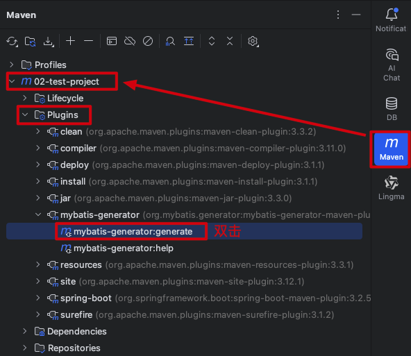

设计并创建好数据库和表之后，我们就可以编写 Java 代码了。

## 一、SpringBoot + MyBatis 项目目录结构划分

```
├─${project-name}/(项目名)
│  ├─src/(项目的源文件)
│  │  ├─main/
│  │  │  ├─java/(我们编写的 Java 代码都放在这个文件夹里)
│  │  │  │  ├─com.ineyee/(公司唯一标识)
│  │  │  │  │  ├─api/(给客户端响应数据和错误)
│  │  │  │  │  │  ├─error/(错误码和错误信息的枚举常量)
│  │  │  │  │  │  │  ├─Error.java(父接口)
│  │  │  │  │  │  │  ├─CommonError implements Error(通用错误码及错误信息)
│  │  │  │  │  │  │  ├─UserError implements Error(用户模块错误码及错误信息)
│  │  │  │  │  │  ├─exception/(业务异常和全局异常处理)
│  │  │  │  │  │  │  ├─ServiceException.java(业务异常)
│  │  │  │  │  │  │  ├─GlobalExceptionHandler.java(全局异常处理)
│  │  │  │  │  │  ├─HttpResult.java(给客户端响应数据和错误的包装类)
│  │  │  │  │  ├─config/(仍需手动配置的东西)
│  │  │  │  │  │  ├─FilterConfig.java(过滤器配置类)
│  │  │  │  │  │  ├─SpringMVCConfig.java(拦截器配置类)
│  │  │  │  │  ├─controller/(表现层之控制器层)
│  │  │  │  │  │  ├─UserController
│  │  │  │  │  ├─mapper/(数据层的接口)
│  │  │  │  │  │  ├─UserDao
│  │  │  │  │  ├─pojo/(表现层之模型层)
│  │  │  │  │  │  ├─po/(持久化对象)
│  │  │  │  │  │  │  ├─User
│  │  │  │  │  ├─dto/(接收客户端的请求参数)
│  │  │  │  │  │  ├─UserSaveDto
│  │  │  │  │  │  ├─UserRemoveDto
│  │  │  │  │  │  ├─UserUpdateDto
│  │  │  │  │  │  ├─UserGetDto、UserListDto
│  │  │  │  │  ├─filter/(各种过滤器)
│  │  │  │  │  │  ├─CachedBodyFilter(HTTP 请求体缓存过滤器)
│  │  │  │  │  ├─interceptor/(各种拦截器)
│  │  │  │  │  │  ├─HttpLogInterceptor(HTTP 请求日志拦截器)
│  │  │  │  │  ├─service/(业务层)
│  │  │  │  │  │  ├─UserService
│  │  │  │  │  │  ├─UserServiceImpl implements UserService
│  │  │  │  │  ├─Application.java(项目的入口类)
│  │  │  ├─resources/(我们编写的配置文件都放在这个文件夹里，如 .properties、.xml 文件)
│  │  │  │  ├─mappers/(数据层的实现)
│  │  │  │  │  ├─user.xml
│  │  │  │  ├─static/(SpringBoot 项目的静态资源固定放在 static 目录下)
│  │  │  │  │  ├─img/(图片资源)
│  │  │  │  │  │  ├─logo.png(http://localhost:8080/img/logo.png 即可访问到)
│  │  │  │  ├─application.yml(项目的主配置文件)
│  │  │  │  ├─application-dev.yml(项目的子配置文件、开发环境)
│  │  │  │  ├─application-prd.yml(项目的主配置文件、生产环境)
│  │  │  │  ├─logback-spring.xml(logger 的配置文件)
│  ├─target/(项目的打包产物)
│  ├─pom.xml(项目的配置文件，里面记录着项目的很多信息)
```

## ✅ 二、创建 yml 配置文件，Tomcat 部署配置

```yaml
# application.yml

spring:
  profiles:
    # 通过子配置文件名来"引入、激活"子配置文件，这里是个数组
    active:
      - dev # 开发环境用 dev，生产环境用 prd
  mvc:
    servlet:
      # DispatcherServlet 的加载时机：默认是 -1（延迟加载，第一次请求接口时才初始化）
      # 设置为 >=0 表示在项目启动时就初始化 DispatcherServlet，数字越小优先级越高
      load-on-startup: 0
```

```yaml
# application-dev.yml

# 服务器相关配置（SpringBoot 内置的 Web 容器 Tomcat）
# 假设在开发环境下端口号是 9999，Application Context Path 是 /springboot-dev
server:
  # 监听的端口，默认是 8080
  port: 9999
  # Application Context Path，默认是 /，注意前面的 / 不能少，这个应用上下文就是 Tomcat 用来查找对应的项目的
  servlet:
    context-path: "/sbm-dev"
    
# 数据源相关配置（数据库连接池、连接、数据库）
# com.mysql.cj.jdbc.Driver：MySQL 数据库驱动库的类名
# jdbc:mysql://：MySQL 的固定写法
# localhost、3306：域名和端口号
# db_hello_mysql：数据库的名称
# serverTimezone=UTC：告诉数据库驱动 MySQL 已经把默认时区设置为了 0 时区
# root、mysqlroot：数据库的用户名和密码
# initialSize、maxActive：初始化创建几条连接、最大连接数
spring:
  datasource:
    type: com.alibaba.druid.pool.DruidDataSource
    driver-class-name: com.mysql.cj.jdbc.Driver
    url: jdbc:mysql://localhost:3306/db_hello_mysql?serverTimezone=UTC
    username: root
    password: mysqlroot
    druid:
      initial-size: 5
      max-active: 10
```

```yaml
# application-prd.yml

# 服务器相关配置（SpringBoot 内置的 Web 容器 Tomcat）
# 假设在生产环境下端口号是 8888，Application Context Path 是 /springboot
server:
  # 监听的端口，默认是 8080
  port: 8080
  # Application Context Path，默认是 /，注意前面的 / 不能少，这个应用上下文就是 Tomcat 用来查找对应的项目的
  servlet:
    context-path: "/sbm"
    
# 数据源相关配置（数据库连接池、连接、数据库）
# com.mysql.cj.jdbc.Driver：MySQL 数据库驱动库的类名
# jdbc:mysql://：MySQL 的固定写法
# 8.136.43.114、3306：域名和端口号
# db_mysql：数据库的名称
# serverTimezone=UTC：告诉数据库驱动 MySQL 已经把默认时区设置为了 0 时区
# root、MySQLRoot666!：数据库的用户名和密码
# initialSize、maxActive：初始化创建几条连接、最大连接数
spring:
  datasource:
    type: com.alibaba.druid.pool.DruidDataSource
    driver-class-name: com.mysql.cj.jdbc.Driver
    url: jdbc:mysql://8.136.43.114:3306/db_mysql?serverTimezone=UTC
    username: root
    password: MySQLRoot666!
    druid:
      initial-size: 5
      max-active: 10
```

## ✅ 三、编辑 pom.xml 文件，Maven 项目配置

```xml
<!-- pom.xml -->

<project xmlns="http://maven.apache.org/POM/4.0.0" xmlns:xsi="http://www.w3.org/2001/XMLSchema-instance"
         xsi:schemaLocation="http://maven.apache.org/POM/4.0.0 http://maven.apache.org/xsd/maven-4.0.0.xsd">
    <!--
      声明 pom.xml 文件的版本，就像 .html 文件里声明是 H5 那样，决定了该文件里能写什么标签不能写什么标签
      目前都使用 4.0.0，是必要元素
    -->
    <modelVersion>4.0.0</modelVersion>

    <!--
      groupId：com.ineyee，公司域名倒写，我们创建项目时填写的
      artifactId：默认就是项目名，我们创建项目时填写的
      version：1.0.0，项目版本号，我们创建项目时填写的
    -->
    <groupId>com.ineyee</groupId>
    <artifactId>03-springboot-combine-mybatis</artifactId>
    <version>1.0.0</version>

    <!--
        添加 parent 标签，让当前项目继承自 spring-boot-starter-parent 项目
        这个项目里已经帮我们锁定了一堆常用三方库的版本，从而避免开发中依赖间的版本冲突
    -->
    <parent>
        <groupId>org.springframework.boot</groupId>
        <artifactId>spring-boot-starter-parent</artifactId>
        <version>3.2.5</version>
    </parent>

    <!-- 所有的依赖 -->
    <dependencies>
        <!--
            添加一个 spring-boot-devtools 依赖，不用指定版本号，因为上面 spring-boot-starter-parent 项目里已经帮我们锁定好了
            这个库里已经帮我们添加了热部署功能，debug 模式下，它会监控 classpath 里字节码的变化（不是 target 里的），完成热部署
            也就是说，开发过程中，我们修改了代码，只需要重新 build 构建下项目，classpath 里字节码就会发生变化（不是 target 里的，所以只能用 IDEA 自带的 build，不能用 maven 的），就能完成热部署了，不用重新运行项目

            热部署 = 修改代码 + [fn cmd f9] 构建项目 + 查看效果
        -->
        <dependency>
            <groupId>org.springframework.boot</groupId>
            <artifactId>spring-boot-devtools</artifactId>
        </dependency>
      
        <!--
            属性绑定相关依赖：把 yml 配置文件里属性的值一次性注入到某个对象的属性上去
            在编译期间帮助生成 setter、getter、toString 等代码
        -->
        <dependency>
          <groupId>org.projectlombok</groupId>
          <artifactId>lombok</artifactId>
        </dependency>
        <!--
            属性绑定相关依赖：把 yml 配置文件里属性的值一次性注入到某个对象的属性上去
            在 application-*.yml 配置文件里编写属性名时能提示
        -->
        <dependency>
          <groupId>org.springframework.boot</groupId>
          <artifactId>spring-boot-configuration-processor</artifactId>
        </dependency>
    </dependencies>

    <!-- 属性信息 -->
    <properties>
        <!-- 告诉 Maven 编译、打包源码时使用 UTF-8，避免有些环境（如 Windows 服务器）使用系统默认的 GBK、ISO-8859-1 编码 -->
        <project.build.sourceEncoding>UTF-8</project.build.sourceEncoding>
        <!-- 告诉 Maven 编译器插件，把源码编译成兼容 JDK8 的字节码文件 -->
        <maven.compiler.source>8</maven.compiler.source>
        <maven.compiler.target>8</maven.compiler.target>
    </properties>

    <!-- 构建信息，比如输出产物的名字、插件配置等 -->
    <build>
        <!-- 输出产物的名字 -->
        <finalName>sbm</finalName>
        <!-- 插件配置 -->
        <plugins>
            <!-- 开发结束后把项目打包成 runnable jar 的插件 -->
            <plugin>
                <groupId>org.springframework.boot</groupId>
                <artifactId>spring-boot-maven-plugin</artifactId>
            </plugin>
        </plugins>
    </build>

    <!--
      打包方式，比如 jar、war 等
      如果不写这个标签，默认是打包成 jar
      之前没用 SpringBoot 的时候，需要打包成 war，然后部署在 Tomcat 上运行
      现在用了 SpringBoot，内置了 Tomcat，可以直接打包成 runnable jar 运行
    -->
    <packaging>jar</packaging>
</project>
```

## ✅ 四、添加依赖

> SpringBoot 官方提供的 starter 都是以 spring-boot-starter-xxx 开头，非 SpringBoot 官方提供的 starter 都是以 xxx-spring-boot-starter 结尾

#### 1、Spring、SpringMVC 相关依赖

* （必选）spring-boot-starter-web

```xml
<!--
    添加一个 spring-boot-starter-web 依赖，不用指定版本号，因为上面 spring-boot-starter-parent 项目里已经帮我们锁定好了
    这个库里已经帮我们添加了 Spring、SpringMVC 常用的依赖，还有 Tomcat 和日志打印相关依赖，就不用我们自己手动添加一大堆依赖了

    spring-context
    spring-webmvc
    spring-boot-starter-tomcat、jakarta.servlet-api
    jackson-databind
    logback-classic
-->
<dependency>
    <groupId>org.springframework.boot</groupId>
    <artifactId>spring-boot-starter-web</artifactId>
</dependency>
```

* （可选）然后我们可以安装 Spring AOP 相关的库，以便使用 Spring 的面向切面编程往业务层里切入代码、如事务管理

```xml
<!--
    spring-boot-starter-aop
        aspectj
        aspectjweaver
-->
<dependency>
    <groupId>org.springframework.boot</groupId>
    <artifactId>spring-boot-starter-aop</artifactId>
</dependency>
```

* （可选）SpringMVC 把所有参数都获取到一个请求参数模型里时，添加校验参数是否必传相关的库

```xml
<!--
    spring-boot-starter-validation
        jakarta.validation-api
        hibernate-validator
-->
<dependency>
    <groupId>org.springframework.boot</groupId>
    <artifactId>spring-boot-starter-validation</artifactId>
</dependency>
```

#### 2、MyBatis、Spring 整合 MyBatis 相关依赖

* （必选）mybatis-spring-boot-starter

```xml
<!--
    添加一个 mybatis-spring-boot-starter 依赖，需要指定版本号，因为 mybatis-spring-boot-starter 是 MyBatis 官方提供的 starter，不是 SpringBoot 官方提供的 starter，所以 spring-boot-starter-parent 不会帮我们管理它的版本
    这个库里已经帮我们添加了 MyBatis、Spring 整合 MyBatis 常用的依赖，就不用我们自己手动添加一大堆依赖了

    mybatis
    mybatis-spring
    spring-jdbc
-->
<dependency>
    <groupId>org.mybatis.spring.boot</groupId>
    <artifactId>mybatis-spring-boot-starter</artifactId>
    <version>3.0.5</version>
</dependency>
```

* （必选）然后我们知道 MyBatis 对应的是之前的 JDBC API，所以我们还需要安装数据库驱动、连接池

```xml
<!-- 可以不指定版本号，因为 MySQL 太常用了、spring-boot-starter-parent 会管理它的版本 -->
<dependency>
    <groupId>com.mysql</groupId>
    <artifactId>mysql-connector-j</artifactId>
</dependency>
<!-- 必须指定版本号，因为它是阿里巴巴的第三方库，SpringBoot 不管理它的版本 -->
<dependency>
    <groupId>com.alibaba</groupId>
    <artifactId>druid-spring-boot-starter</artifactId>
    <version>1.2.23</version>
</dependency>
```

* （可选）然后我们可以安装分页查询库，以便 MyBatis 能用一份 SQL 语句应对不同的数据库如 MySQL、Oracle、PostgreSQL

```xml
<!-- 必须指定版本号，因为 PageHelper 是第三方库，SpringBoot 不管理它的版本 -->
<dependency>
    <groupId>com.github.pagehelper</groupId>
    <artifactId>pagehelper-spring-boot-starter</artifactId>
    <version>2.1.0</version>
</dependency>
```

#### 3、其它依赖

* （可选）单元测试

```xml
<!--
    单元测试：
    JUnit Jupiter（JUnit 5）
    Mockito（Mock 框架）
    AssertJ（断言库）
    Hamcrest（匹配器）
    Spring Test（Spring 测试支持）
-->
<dependency>
    <groupId>org.springframework.boot</groupId>
    <artifactId>spring-boot-starter-test</artifactId>
    <scope>test</scope>
</dependency>
```

## ✅ 五、创建项目的入口类和入口方法，跟 controller、service、dao 目录平级

```java
// Application.java

// 创建项目的入口类，我们一般把它命名为 Application
//
// 用 @SpringBootApplication 注解修饰一下这个类，来标识它是项目的入口类
// 并且 @SpringBootApplication 注解还包含了 @ComponentScan 注解的功能，它默认的扫描路径就是当前类所在包及其子包下所有的类，扫描到用 @Component 注解修饰的类后就会自动创建对象并放到 IoC 容器中
// 所以 controller 层、service 层、其它目录里的众多类，都会被自动创建对象并放到 IoC 容器中
//
// dao 层是通过 @MapperScan 注解来扫描的，Spring 会自动创建所有的 dao 对象并放入 IoC 容器中
@SpringBootApplication
@MapperScan("com.ineyee.dao")
public class Application {
    // 为项目的入口类添加 main 方法，作为项目的入口方法
    public static void main(String[] args) {
        // 固定写法，启动项目
        SpringApplication.run(Application.class, args);
    }
}
```

## ✅ 六、SLF4J + Logback 日志系统搞一下

#### 1、添加 logger 的依赖

SpringBoot 项目的 spring-boot-starter-web 会默认添加 Logback 依赖，而 Logback 依赖会默认添加 SLF4J 依赖，所以我们不需要再手动添加。

#### 2、创建 logger 的配置文件

> 名字固定为 logback-spring.xml

```xml
<?xml version="1.0" encoding="utf-8" ?>
<!--
    scan="true" scanPeriod="30 seconds"
    让 logback 每隔 30 秒重新扫描一下配置文件，并应用最新的配置文件
-->
<configuration scan="true" scanPeriod="30 seconds">
    <!--
        使用 property 标签定义一个变量，抽取日志文件所在目录
            线上 Linux 系统，我们输出到 /var/log/${AppName}/app.log 文件中
    -->
    <property name="LOG_FILE_HOME" value="/var/log/slf4j_logback"/>

    <!-- 定义一个输出目标：控制台 -->
    <appender name="consoleAppender" class="ch.qos.logback.core.ConsoleAppender">
        <!-- 控制台的输出格式与编码方式 -->
        <encoder class="ch.qos.logback.classic.encoder.PatternLayoutEncoder">
            <!--
                输出格式
                    %highlight：彩色输出
                    %d：时间
                    %p：日志级别
                    %t：线程
                    %c：消息是在哪个类里输出的
                    %m：消息
                    %n：换行
            -->
            <pattern>%highlight([%d{yyyy-MM-dd HH:mm:ss.SSS}] [%-5p] [%t] [%c]: %m%n)</pattern>
            <!-- 编码方式：UTF-8 -->
            <charset>UTF-8</charset>
        </encoder>
    </appender>

    <!-- 把 rollingFileAppender 搞成异步的，这样一来把日志写入到文件的操作就会变成异步的 -->
    <appender name="asyncRollingFileAppender" class="ch.qos.logback.classic.AsyncAppender">
        <!-- 定义一个输出目标：文件 -->
        <appender name="rollingFileAppender" class="ch.qos.logback.core.rolling.RollingFileAppender">
            <!-- 文件的输出格式与编码方式 -->
            <encoder class="ch.qos.logback.classic.encoder.PatternLayoutEncoder">
                <!--
                    输出格式
                        %highlight：彩色输出，文件里面没有彩色
                        %d：时间
                        %p：日志级别
                        %t：线程
                        %c：消息是在哪个类里输出的
                        %m：消息
                        %n：换行
                -->
                <pattern>[%d{yyyy-MM-dd HH:mm:ss.SSS}] [%-5p] [%t] [%c]: %m%n</pattern>
                <!-- 编码方式：UTF-8 -->
                <charset>UTF-8</charset>
            </encoder>
            <!-- 文件的路径 -->
            <file>${LOG_FILE_HOME}/app.log</file>
            <!--
                文件的滚动策略，基于文件大小和时间
                    每隔一天，自动生成新文件，以当天日期命名
                    同一天内单个文件最大 100M，超过 100M 时自动生成新文件，以当天日期命名
                    所有文件总大小最大 10G，超过 10G 时自动清理最早的文件
                    自动清理超过 30 天的文件

                /var/log/${AppName}/
                ├─app.log                 <- 当前
                ├─app.log.2026.01.04.0    <- 今天的第 1 个文件（100M）
                ├─app.log.2026.01.04.1    <- 今天的第 2 个文件（100M）
                ├─app.log.2026.01.03.0    <- 昨天的文件
            -->
            <rollingPolicy class="ch.qos.logback.core.rolling.SizeAndTimeBasedRollingPolicy">
                <!-- 自动生成的新文件名，时间精确到天，支持压缩文件（可节省 70%~90% 的存储空间） -->
                <fileNamePattern>${LOG_FILE_HOME}/app.log.%d{yyyy-MM-dd}.%i.gz</fileNamePattern>
                <!-- 单个文件最大大小 -->
                <maxFileSize>100MB</maxFileSize>
                <!-- 所有文件总大小 -->
                <totalSizeCap>10GB</totalSizeCap>
                <!-- 最多保留多少天，这里的单位取决于 fileNamePattern 里的时间精确到什么单位 -->
                <maxHistory>30</maxHistory>
            </rollingPolicy>
        </appender>
    </appender>

    <!--
        开发环境的 logger 配置
        application.yml 里的 active: - dev | - prd 会自动匹配这里的环境
    -->
    <springProfile name="dev">
        <!--
            项目里所有 logger 的配置都写在这个 root 标签里
                日志级别为：DEBUG
                是否给父 logger 传递日志事件：false
                输出目标为：控制台
        -->
        <root level="DEBUG" additivity="false">
            <appender-ref ref="consoleAppender"/>
        </root>

        <!--
            如果我们想给某个包里的 logger 单独配置，可以新增一个 logger 标签
            controller 包里所有 logger 的配置都写在这个 logger 标签里，会覆盖 root 标签里的配置
                日志级别为：DEBUG
                是否给父 logger 传递日志事件：false（默认 true，会把日志事件传递给 rootLogger，导致打印多遍，所以总应设置为 false）
                输出目标为：控制台
        -->
        <logger name="com.ineyee.controller" level="DEBUG" additivity="false">
            <appender-ref ref="consoleAppender"/>
        </logger>
        <!--
            如果我们想给某个类里的 logger 单独配置，可以新增一个 logger 标签
            TestService 类里 logger 的配置都写在这个 logger 标签里，会覆盖 root 标签里的配置
                日志级别为：WARN
                是否给父 logger 传递日志事件：false（默认 true，会把日志事件传递给 rootLogger，导致打印多遍，所以总应设置为 false）
                输出目标为：控制台
        -->
        <logger name="com.ineyee.service.TestService" level="WARN" additivity="false">
            <appender-ref ref="consoleAppender"/>
        </logger>
    </springProfile>

    <!--
        生产环境的 logger 配置
        application.yml 里的 active: - dev | - prd 会自动匹配这里的环境
    -->
    <springProfile name="prd">
        <!--
            项目里所有 logger 的配置都写在这个 root 标签里
                日志级别为：INFO
                是否给父 logger 传递日志事件：false
                输出目标为：文件
        -->
        <root level="INFO" additivity="false">
            <appender-ref ref="asyncRollingFileAppender"/>
        </root>
    </springProfile>
</configuration>
```

#### 3、编写 Java 代码，输出日志

> 实际开发中，建议为每个类写一个独立的 logger，而不是整个项目只写一个全局的 logger。因为“整个项目只写一个全局的 logger”无法区分日志来源于哪个包哪个类哪行代码、无法按包或按类进行日志级别控制

```java
package com.ineyee.controller;

import com.ineyee.service.TestService;
import org.slf4j.Logger;
import org.slf4j.LoggerFactory;
import org.springframework.beans.factory.annotation.Autowired;
import org.springframework.web.bind.annotation.GetMapping;
import org.springframework.web.bind.annotation.RestController;

@RestController
public class TestController {
    @Autowired
    private TestService testService;

    // LoggerFactory.getLogger 的时候把当前类传进去，就能在日志中看到当前类名
    private static final Logger logger = LoggerFactory.getLogger(TestController.class);

    @GetMapping("/test")
    public String test() {
        logger.debug("我是调试_DEBUG");
        logger.info("我是信息_INFO");
        logger.warn("我是警告_WARN");
        logger.error("我是错误_ERROR");

        testService.test();

        return "test";
    }
}
```

```java
package com.ineyee.service;

import lombok.extern.slf4j.Slf4j;
import org.springframework.stereotype.Service;

// 并且如果我们的项目里使用了 lombok
// 那么只要用 @Slf4j 注解修饰一下类，lombok 就会自动创建一个变量名为 log 的静态 logger 对象
// 这样一来我们就不用在每个类里手动创建 logger 对象了，直接输出日志即可
@Slf4j
@Service
public class TestService {
    public void test() {
        log.debug("我是调试_DEBUG");
        log.info("我是信息_INFO");
        log.warn("我是警告_WARN");
        log.error("我是错误_ERROR");
    }
}
```

## ✅ 七、api 目录里的东西

api 目录里的东西基本都是固定的，可以直接拷贝一份到项目里，后续再根据实际业务做扩展。

## ✅ 八、表现层之模型层 pojo

> * 一般来说一个项目对应一个数据库，比如 hello-project-architecture 这个项目和数据库
> * 一个数据库里可以有多张表，比如 user、product 这两张表
> * 一张表对应一组 mapper、service、pojo、controller，比如 UserMapper、UserService、UserXxo、UserController、ProductMapper、ProductService、ProductXxo、ProductController 这两组

#### 1、domain -> pojo

之前的表现层之模型层，我们是搞了一个 domain 目录，然后在 domain 目录下创建数据库里每张表对应的 Xxx domain 类，这些 Xxx domain 类就是纯粹地存储数据，domain 的字段必须和数据库表里的字段一一对应。总之是“一个 domain 走天下”：从数据库表映射出 domain、把 domain 从数据层传到业务层、把 domain 从业务层传到控制器层、把 domain 返回给客户端。

但是实际开发中“一个 domain 走天下”可能并不太合适，而是会有各种模型、这些模型统称为 POJO（Plain Ordinary Java Object、简单的 Java 对象）：


| 模型                                        | 职责                                                         | 阶段                                                | 是否必须有                                                   |
| ------------------------------------------- | ------------------------------------------------------------ | --------------------------------------------------- | ------------------------------------------------------------ |
| PO：Persistent Object<br />持久化对象       | 关注数据库存储<br /><br />po 其实就对应我们原来的 domain，po 就是纯粹地存储数据，po 的字段必须和数据库表里的字段一一对应<br /><br />这个类内部一般就是编写构造方法、成员变量**（成员变量的类型更加注重方便数据库存储）**、setter&getter 方法、toString 方法 | 从数据库表映射出 po                                 | po 必须有                                                    |
| BO：Business Object<br />业务对象           | 关注业务<br /><br />一个业务就对应一个 bo，一个业务可能只需要一张表——也就是一个 po ——就能完成，也可能需要联合多张表——也就是多个 po ——才能完成<br /><br />这个类内部一般就是编写构造方法、成员变量**（成员变量的类型更加注重业务语义）**、setter&getter 方法、toString 方法、**业务逻辑相关的大量方法都写在这里** | 把 po 转换成 bo、把 bo 从数据层传到业务层           | bo 可以没有<br />但有的话，业务语义更加清晰、业务逻辑也可以抽取到这里复用 |
| DTO：Data Transfer Object<br />数据传输对象 | 关注数据传输效率<br /><br />po 和 bo 的属性其实都还是对数据库表里字段的映射，只不过 po 没有业务语义、bo 有业务语义，但很多时候我们并不需要把 po 或 bo 的全部属性都返回给客户端，而是会根据业务需要删减或增加某些属性，只返回必要的属性，这就是 dto 对象、dto 对象就用来封装这些必要的属性<br /><br />这个类内部一般就是编写**需要返回给客户端的必要属性** | 把 po 或 bo 转换成 dto、把 dto 从业务层传到控制器层 | dto 可以没有<br />但有的话，可以减少冗余数据传输、提高数据传输效率 |
| VO：View Object<br />视图对象               | 关注前端展示<br /><br />控制器层收到 dto 对象后，并不会把 dto 对象直接返回给客户端、dto 对象只是预返回对象，而是会把 dto 对象再转换成 vo 对象，所谓 vo 对象就是前端拿到数据后就能直接拿来展示的对象，比如 dto 里的数据是没有国际化的、而 vo 里的数据就是经过国际化后的数据<br /><br />这个类内部一般就是编写 **dto 里的数据“翻译”成前端界面能直接展示的数据** | 把 dto 转换成 vo、把 vo 返回给客户端                | vo 可以没有<br />但有的话，前端的界面展示会更加动态化        |

#### 2、mybatis-generator 自动生成 po

之前我们是根据每张表手动创建每个 domain 的，但实际开发中有那么多张表，我们手动创建每个 po 的话就显得效率非常低，好在 MyBatis 提供了一个插件 mybatis-generator 来帮我们自动生成 po`（建议先把 po 生成到 test 目录下，然后再把需要的 po 复制一份到 main 目录下，因为每次自动生成 po 都会覆盖上一次生成的，所以如果直接生成到 main 目录下，就有可能覆盖掉我们自己手动增加的一些改动）`：

* 在 test/resources 目录下创建一个 generatorConfig.xml 配置文件

```xml
<?xml version="1.0" encoding="UTF-8"?>
<!DOCTYPE generatorConfiguration
        PUBLIC "-//mybatis.org//DTD MyBatis Generator Configuration 1.0//EN"
        "http://mybatis.org/dtd/mybatis-generator-config_1_0.dtd">

<generatorConfiguration>
    <!--
        id：值随便写，一个上下文标识，只要在同一个 generatorConfig.xml 里唯一即可
        targetRuntime：决定了 MBG 生成代码的“风格和能力”，MyBatis3、生成的代码臃肿，MyBatis3Simple、生成的代码精简
    -->
    <context id="POGenerator" targetRuntime="MyBatis3Simple">
        <commentGenerator>
            <!-- 不要生成注释 -->
            <property name="suppressAllComments" value="true"/>
        </commentGenerator>
        <!-- 数据库连接，提供一个本地的就行了，反正就是用来生成一下 po -->
        <jdbcConnection driverClass="com.mysql.cj.jdbc.Driver"
                        connectionURL="jdbc:mysql://localhost:3306/test_db?serverTimezone=UTC"
                        userId="root"
                        password="mysqlroot"/>
        <!-- 数据库里的日期类型，对应到 Java 代码里强制使用 LocalDateTime 而不是 Date -->
        <javaTypeResolver type="org.mybatis.generator.internal.types.JavaTypeResolverDefaultImpl">
            <property name="useJSR310Types" value="true"/>
        </javaTypeResolver>
        <!-- 生成的 po 要放在什么位置：最终生成路径 = targetProject + targetPackage -->
        <javaModelGenerator targetProject="src/test/java" targetPackage="com.ineyee.pojo.po"/>
        <!--
            要为哪个表里生成 PO
                %：代表所有表
                具体的表名：代表指定表
            catalog、schema：代表哪个数据库
        -->
        <table tableName="%" catalog="test_db" schema="test_db"/>
        <!--        <table tableName="dict_type" catalog="test_db" schema="test_db"/>-->
        <!--        <table tableName="dict_item" catalog="test_db" schema="test_db"/>-->
        <!--        <table tableName="dict_i18n" catalog="test_db" schema="test_db"/>-->
    </context>
</generatorConfiguration>
```

* 添加 mybatis-generator 插件

```xml
<!-- 自动生成 po -->
<plugin>
  <groupId>org.mybatis.generator</groupId>
  <artifactId>mybatis-generator-maven-plugin</artifactId>
  <version>1.4.2</version>
  <configuration>
    <!-- 配置文件的位置 -->
    <configurationFile>src/test/resources/generatorConfig.xml</configurationFile>
    <!-- 覆盖已生成的 po 文件 -->
    <overwrite>true</overwrite>
    <!-- 打印日志信息 -->
    <verbose>true</verbose>
  </configuration>
  <dependencies>
    <!-- MBG 要通过数据库驱动去读取数据库里的各种信息 -->
    <dependency>
      <groupId>com.mysql</groupId>
      <artifactId>mysql-connector-j</artifactId>
      <version>8.3.0</version>
    </dependency>
  </dependencies>
</plugin>
```

* 自动生成 po



## 九、数据层 dao

> * 一般来说一个项目对应一个数据库，比如 hello-project-architecture 这个项目和数据库
> * 一个数据库里可以有多张表，比如 user、product 这两张表
> * 一张表对应一组 mapper、service、pojo、controller，比如 UserMapper、UserService、UserXxo、UserController、ProductMapper、ProductService、ProductXxo、ProductController 这两组

#### 1、Java 代码

先定义一个 dao 接口，然后再定义一个 mapper 文件、这个 mapper 文件其实就是 dao 接口的实现。

#### 2、配置

把数据层 dao 相关配置的值都写在 application.yml（MyBatis）、application-dev.yml（开发环境的数据源） 和 application-prd.yml（生产环境的数据源） 这三个配置文件里。

只要我们在前面“添加依赖”那里引入了相应的 starter，并且在 yml 配置文件里做好配置，SpringBoot 就会自动创建 DruidDataSource、SqlSessionFactoryBean 等对象，并通过属性绑定技术把 yml 配置文件里的值自动绑定到这些对象上去，其它的我们啥也不用再干，不再需要像以前一样“在 Spring 的主配置文件里配置一大堆东西”。

## 十、业务层 service

> * 一般来说一个项目对应一个数据库，比如 hello-project-architecture 这个项目和数据库
> * 一个数据库里可以有多张表，比如 user、product 这两张表
> * 一张表对应一组 mapper、service、pojo、controller，比如 UserMapper、UserService、UserXxo、UserController、ProductMapper、ProductService、ProductXxo、ProductController 这两组

#### 1、Java 代码

先定义一个 service 接口，然后再定义一个 service 接口的实现类、用 @Service 修饰一下放入父 IoC 容器里、自动注入 dao。

#### 2、配置

只要我们在前面“添加依赖”那里引入了相应的 starter，SpringBoot 就会自动创建和配置事务管理器 DataSourceTransactionManager 对象，并自动启动事务管理 @EnableTransactionManagement，我们同样不再需要像以前一样“在 Spring 的主配置文件里配置一大堆东西”。只需要在想使用事务管理的 Service 类上加一个 @Transactional 注解就完事了，这样一来这个业务类里所有的方法都会自动加上事务管理的代码，当然我们也可以只在某一个方法上加上一个 @Transactional 注解，其它的我们啥也不用再干。

## 十一、控制器层 controller

> * 一般来说一个项目对应一个数据库，比如 hello-project-architecture 这个项目和数据库
> * 一个数据库里可以有多张表，比如 user、product 这两张表
> * 一张表对应一组 mapper、service、pojo、controller，比如 UserMapper、UserService、UserXxo、UserController、ProductMapper、ProductService、ProductXxo、ProductController 这两组

#### 数据查询对象 Query 补充在这里吧，毕竟是在写接口的时候才会去创建

#### 1、Java 代码

定义一个 controller 类、用 @Controller 修饰一下放入子 IoC 容器里、自动注入 service。

#### 2、配置

只要我们在前面“添加依赖”那里引入了相应的 starter，SpringBoot 就会自动配置消息转换器（String 和 JSON 响应体的编码方式、默认就是 UTF-8，LocalDateTime 序列化为 ISO-8601 字符串格式等），自动配置参数是否必传的验证器，我们同样不再需要像以前一样“在 Spring 的子配置文件里配置一大堆东西”。controller 里该用啥用啥，其它的我们啥也不用再干。

## 十二、仍需手动配置的东西

#### 1、拦截器

创建配置类添加拦截器

```java
@Configuration
public class SpringMVCConfig implements WebMvcConfigurer {
    // 自动注入拿到 HTTP 请求日志拦截器
    @Autowired
    private HttpLogInterceptor httpLogInterceptor;

    // 添加拦截器
    //
    // 设置拦截器能拦截那些请求：这里的请求就是我们通过 / 设置了 DispatcherServlet 会拦截接口型请求 + 会拦截静态资源型请求这两种
    // 虽然 DispatcherServlet 把静态资源型请求转交给服务器默认的处理了，但拦截它肯定是会先拦截下来的，也就是说先拦截后转交，而不是直接转交
    // /*：代表 http://xxx/applicationContext/xxx 这种一级路径的请求才会被拦截
    // /**：代表 http://xxx/applicationContext/xxx、http://xxx/applicationContext/xxx/xxx 这种一级路径或 N 级路径的请求都会被拦截
    @Override
    public void addInterceptors(InterceptorRegistry registry) {
        registry.addInterceptor(httpLogInterceptor)
                .addPathPatterns("/**");
    }
}
```

#### 2、过滤器

创建配置类添加过滤器（HTTP 请求参数编码方式的过滤器已经被 SpringBoot 自动配置了、默认就是 UTF-8，我们只需要手动配置自定义的过滤器即可）

```java
/**
 * 过滤器配置类，只需要创建这个配置类就行了，其它地方不需要配置，SpringBoot 会自动完成其它工作
 * 用于注册自定义过滤器到 Spring 容器
 */
@Configuration
public class FilterConfig {
    /**
     * 注册请求体缓存过滤器
     * 当 Spring 容器启动时，Spring 会调用这个方法，拿到返回的 FilterRegistrationBean，自动注册到 Servlet 容器中
     */
    @Bean
    public FilterRegistrationBean<CachedBodyFilter> cachedBodyFilter() {
        FilterRegistrationBean<CachedBodyFilter> registration = new FilterRegistrationBean<>();

        // 设置过滤器实例
        registration.setFilter(new CachedBodyFilter());

        // 设置拦截路径
        // /* 拦截所有请求：接口型请求 + 静态资源请求 + 动态资源请求
        registration.addUrlPatterns("/*");

        // 设置过滤器执行顺序（非常重要！）
        // HIGHEST_PRECEDENCE = Integer.MIN_VALUE，表示最高优先级，最先执行
        // 确保在 HTTP 请求日志拦截器之前包装请求
        registration.setOrder(Ordered.HIGHEST_PRECEDENCE);

        // 设置过滤器名称（可选，用于日志和调试）
        registration.setName("cachedBodyFilter");

        return registration;
    }
}
```


***

## 临时

 **PO - 数据库层面**

```java
 @Entity

 @Table(name = "orders")

 public class OrderPO {

   @Id

   private Long id;


   // 数据库存储用整数，节省空间

   @Column(name = "status")

   private Integer status; // 0:待支付 1:已支付 2:已发货 3:已完成 

 4:已取消


   @Column(name = "created_at")

   private Timestamp createdAt;

 }
```


 **BO - 业务逻辑层面**


```java
public class OrderBO {

   private Long id;


   // 使用枚举，业务语义清晰

   private OrderStatus status;


   private LocalDateTime createdAt;


   // 业务方法：状态流转逻辑

   public void pay() {

​     if (status != OrderStatus.PENDING_PAYMENT) {

​       throw new BusinessException("订单状态不允许支付");

​     }

​     this.status = OrderStatus.PAID;

   }


   public void ship() {

​     if (status != OrderStatus.PAID) {

​       throw new BusinessException("订单未支付，不能发货");

​     }

​     this.status = OrderStatus.SHIPPED;

   }


   // 业务规则：是否可以取消

   public boolean canCancel() {

​     return status == OrderStatus.PENDING_PAYMENT

​       || status == OrderStatus.PAID;

   }

 }


 enum OrderStatus {

   PENDING_PAYMENT, PAID, SHIPPED, COMPLETED, CANCELLED

 }
```


 **DTO - 接口传输层面**

```java
// 给第三方物流系统的 DTO

 public class OrderShipmentDTO {

   private String orderId;


   // 简化状态，物流系统只关心是否需要发货

   private String shipmentStatus; // "TO_SHIP", "SHIPPED"


   private String recipientAddress;

 }


 // 给支付系统的 DTO

 public class OrderPaymentDTO {

   private String orderId;

   private String paymentStatus; // "UNPAID", "PAID"

   private BigDecimal amount;

 }


```


 


 **VO - 前端展示层面**

```java
 public class OrderVO {

   private String orderId;


   // 前端展示用中文描述

   private String statusText; // 

 "待支付"、"已支付"、"已发货"、"已完成"、"已取消"


   // 前端需要的状态颜色

   private String statusColor; // "warning", "success", "info", 

 "default", "error"


   // 前端需要的可操作按钮

   private List<String> availableActions; // ["支付", "取消订单"]


   // 格式化的时间

   private String createdTime; // "2026-01-12 14:30:25"

 }
```