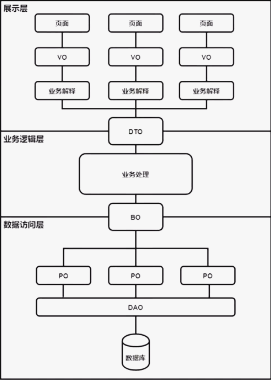
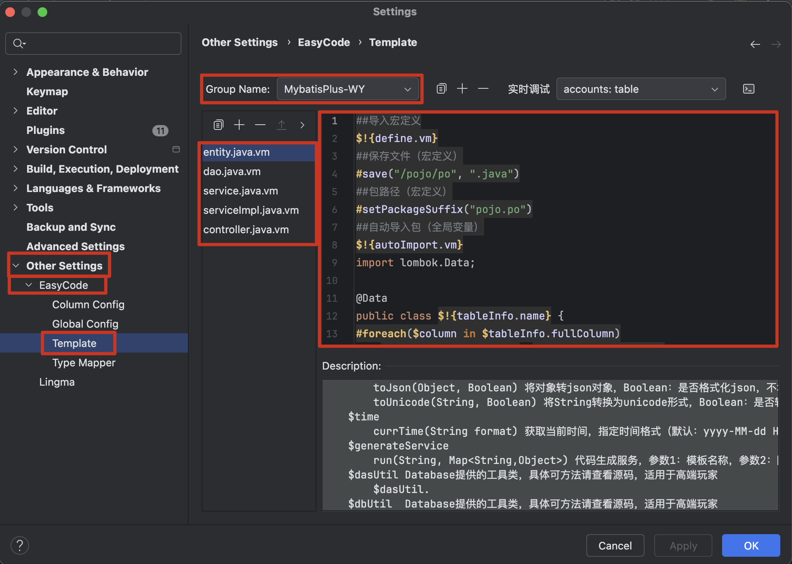
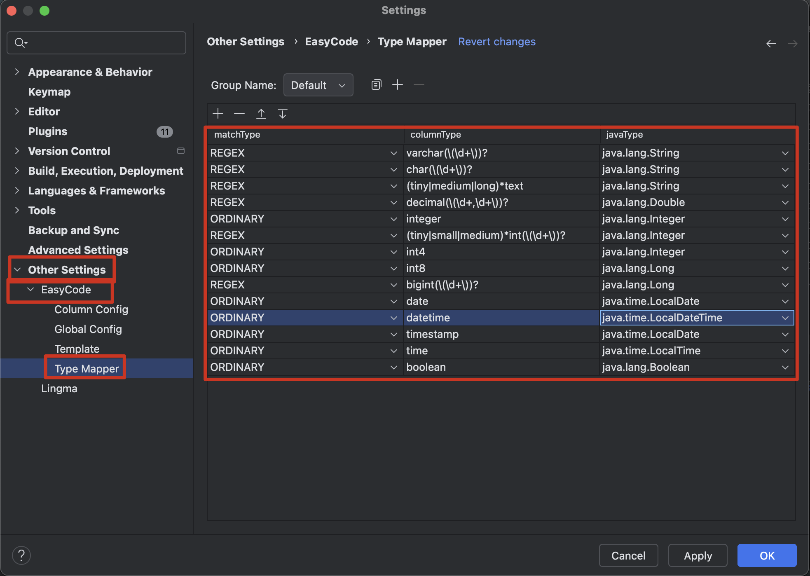

设计并创建好数据库和表之后，我们就可以编写 Java 代码了。

## 一、SpringBoot + MyBatis 项目目录结构划分

```
├─${project-name}/(项目名)
│  ├─src/(项目的源文件)
│  │  ├─main/
│  │  │  ├─java/(我们编写的 Java 代码都放在这个文件夹里)
│  │  │  │  ├─com.ineyee/(公司唯一标识)
│  │  │  │  │  ├─api/(给客户端响应数据和错误)
│  │  │  │  │  │  ├─error/(错误码和错误信息的枚举常量)
│  │  │  │  │  │  │  ├─Error.java(父接口)
│  │  │  │  │  │  │  ├─CommonError implements Error(通用错误码及错误信息)
│  │  │  │  │  │  │  ├─UserError implements Error(用户模块错误码及错误信息)
│  │  │  │  │  │  ├─exception/(业务异常和全局异常处理)
│  │  │  │  │  │  │  ├─ServiceException.java(业务异常)
│  │  │  │  │  │  │  ├─GlobalExceptionHandler.java(全局异常处理)
│  │  │  │  │  │  ├─HttpResult.java(给客户端响应数据和错误的包装类)
│  │  │  │  │  ├─config/(仍需手动配置的东西)
│  │  │  │  │  │  ├─FilterConfig.java(过滤器配置类)
│  │  │  │  │  │  ├─SpringMVCConfig.java(拦截器配置类)
│  │  │  │  │  ├─controller/(表现层之控制器层)
│  │  │  │  │  │  ├─UserController
│  │  │  │  │  ├─mapper/(数据层的接口)
│  │  │  │  │  │  ├─UserDao
│  │  │  │  │  ├─pojo/(表现层之模型层)
│  │  │  │  │  │  ├── po/(持久化对象)        # 数据库模型（Mapper 专用）
│  │  │  │  │  │  │  ├─User
│  │  │  │  │  │  ├── bo        # 业务模型（Service 内部）
│  │  │  │  │  │  ├── dto       # 服务/接口传输模型（可进可出）
│  │  │  │  │  │  ├── query     # 查询条件（分页 / 筛选）
│  │  │  │  │  │  ├── req       # 请求体（新增 / 修改）
│  │  │  │  │  │  └── vo        # 接口返回模型
│  │  │  │  │  ├─filter/(各种过滤器)
│  │  │  │  │  │  ├─CachedBodyFilter(HTTP 请求体缓存过滤器)
│  │  │  │  │  ├─interceptor/(各种拦截器)
│  │  │  │  │  │  ├─HttpLogInterceptor(HTTP 请求日志拦截器)
│  │  │  │  │  ├─service/(业务层)
│  │  │  │  │  │  ├─UserService
│  │  │  │  │  │  ├─UserServiceImpl implements UserService
│  │  │  │  │  ├─Application.java(项目的入口类)
│  │  │  ├─resources/(我们编写的配置文件都放在这个文件夹里，如 .properties、.xml 文件)
│  │  │  │  ├─mappers/(数据层的实现)
│  │  │  │  │  ├─user.xml
│  │  │  │  ├─static/(SpringBoot 项目的静态资源固定放在 static 目录下)
│  │  │  │  │  ├─img/(图片资源)
│  │  │  │  │  │  ├─logo.png(http://localhost:8080/img/logo.png 即可访问到)
│  │  │  │  ├─application.yml(项目的主配置文件)
│  │  │  │  ├─application-dev.yml(项目的子配置文件、开发环境)
│  │  │  │  ├─application-prd.yml(项目的主配置文件、生产环境)
│  │  │  │  ├─logback-spring.xml(logger 的配置文件)
│  ├─target/(项目的打包产物)
│  ├─pom.xml(项目的配置文件，里面记录着项目的很多信息)
```

## ✅ 二、创建 yml 配置文件，Tomcat 部署配置

```yaml
# application.yml

spring:
  profiles:
    # 通过子配置文件名来"引入、激活"子配置文件，这里是个数组
    # 开发环境用 dev，生产环境用 prd
    active:
      - dev
  mvc:
    servlet:
      # DispatcherServlet 的加载时机：默认是 -1（延迟加载，第一次请求接口时才初始化）
      # 设置为 >=0 表示在项目启动时就初始化 DispatcherServlet，数字越小优先级越高
      load-on-startup: 0

# MyBatis-Plus 相关配置（MyBatis 相关配置转交给了 MyBatis-Plus）
myBatis-plus:
  configuration:
    # 是否开启驼峰命名自动映射，即数据库表自动转 Java Bean 时是否从经典数据库列名 create_time 映射到经典 Java 属性名 createTime
    map-underscore-to-camel-case: true
  # type-aliases-package，用来给 xml 文件（如 mappers 里的 xml 文件、MyBatis 的配置文件等）里的类型自动取别名、短类名，如 type、parameterType、resultType 这种以 type 结尾的属性都是接收一个类型
  # 包名.类名，全类名，比较长；我们可以给全类名取个别名，短类名，比较短，写起来更方便；当然如果你偏好于写全类名，那也可以不定义别名
  type-aliases-package: com.ineyee.pojo
  # mapper 层实现的位置
  # 单表的 mapper 层实现，一般用 MyBatis-Plus 自动生成的就够用了
  # 多表的 mapper 层实现，才需要像以前一样自定义 mapper 文件、自己去编写 SQL 语句（跟 MyBatis-Plus 一起使用不会冲突）
  mapper-locations: classpath:mappers/*.xml
  global-config:
    db-config:
      # 主键生成策略：
      # MyBatis-Plus 默认就是 ASSIGN_ID——雪花 ID，微服务、分布式时全局唯一。它会在 Java 代码里自动生成主键，此时我们就不需要设计主键为 AUTO_INCREMENT 了
      # 而单库单表时我们更推荐使用 AUTO——自增主键，性能和稳定性更好。是由数据库负责生成主键，此时我们就需要设计主键为 AUTO_INCREMENT 了
      id-type: ASSIGN_ID
```

```yaml
# application-dev.yml

# 服务器相关配置（SpringBoot 内置的 Web 容器 Tomcat）
# 假设在开发环境下端口号是 9999，Application Context Path 是 /tp-dev
server:
  # 监听的端口，默认是 8080
  port: 9999
  # Application Context Path，默认是 /，注意前面的 / 不能少，这个应用上下文就是 Tomcat 用来查找对应的项目的
  servlet:
    context-path: "/tp-dev"

# 数据源相关配置（数据库连接池、连接、数据库）
# com.mysql.cj.jdbc.Driver：MySQL 数据库驱动库的类名
# jdbc:mysql://：MySQL 的固定写法
# localhost、3306：域名和端口号
# db_hello_mysql：数据库的名称
# serverTimezone=UTC：告诉数据库驱动 MySQL 已经把默认时区设置为了 0 时区
# root、mysqlroot：数据库的用户名和密码
# initialSize、maxActive：初始化创建几条连接、最大连接数
spring:
  datasource:
    type: com.alibaba.druid.pool.DruidDataSource
    driver-class-name: com.mysql.cj.jdbc.Driver
    url: jdbc:mysql://localhost:3306/test_db?serverTimezone=UTC
    username: root
    password: mysqlroot
    druid:
      initial-size: 5
      max-active: 10

# 跨域处理配置，静态资源服务器的源白名单（cors 是我们自定义的属性绑定）
cors:
  allowed-origins:
    - http://127.0.0.1:5500
    - http://127.0.0.1:8888
```

```yaml
# application-prd.yml

# 服务器相关配置（SpringBoot 内置的 Web 容器 Tomcat）
# 假设在生产环境下端口号是 8888，Application Context Path 是 /tp
server:
  # 监听的端口，默认是 8080
  port: 8080
  # Application Context Path，默认是 /，注意前面的 / 不能少，这个应用上下文就是 Tomcat 用来查找对应的项目的
  servlet:
    context-path: "/tp"

# 数据源相关配置（数据库连接池、连接、数据库）
# com.mysql.cj.jdbc.Driver：MySQL 数据库驱动库的类名
# jdbc:mysql://：MySQL 的固定写法
# 8.136.43.114、3306：域名和端口号
# db_mysql：数据库的名称
# serverTimezone=UTC：告诉数据库驱动 MySQL 已经把默认时区设置为了 0 时区
# root、MySQLRoot666!：数据库的用户名和密码
# initialSize、maxActive：初始化创建几条连接、最大连接数
spring:
  datasource:
    type: com.alibaba.druid.pool.DruidDataSource
    driver-class-name: com.mysql.cj.jdbc.Driver
    url: jdbc:mysql://8.136.43.114:3306/test_db?serverTimezone=UTC
    username: root
    password: MySQLRoot666!
    druid:
      initial-size: 5
      max-active: 10

# 跨域处理配置，静态资源服务器的源白名单（cors 是我们自定义的属性绑定）
cors:
  allowed-origins:
    - http://8.136.43.114:5500
    - http://8.136.43.114:8888
```

## ✅ 三、编辑 pom.xml 文件，Maven 项目配置

```xml
<!-- pom.xml -->

<project xmlns="http://maven.apache.org/POM/4.0.0" xmlns:xsi="http://www.w3.org/2001/XMLSchema-instance"
         xsi:schemaLocation="http://maven.apache.org/POM/4.0.0 http://maven.apache.org/xsd/maven-4.0.0.xsd">
    <!--
      声明 pom.xml 文件的版本，就像 .html 文件里声明是 H5 那样，决定了该文件里能写什么标签不能写什么标签
      目前都使用 4.0.0，是必要元素
    -->
    <modelVersion>4.0.0</modelVersion>

    <!--
      groupId：com.ineyee，公司域名倒写，我们创建项目时填写的
      artifactId：默认就是项目名，我们创建项目时填写的
      version：1.0.0，项目版本号，我们创建项目时填写的
    -->
    <groupId>com.ineyee</groupId>
    <artifactId>03-springboot-combine-mybatis</artifactId>
    <version>1.0.0</version>

    <!--
        添加 parent 标签，让当前项目继承自 spring-boot-starter-parent 项目
        这个项目里已经帮我们锁定了一堆常用三方库的版本，从而避免开发中依赖间的版本冲突
    -->
    <parent>
        <groupId>org.springframework.boot</groupId>
        <artifactId>spring-boot-starter-parent</artifactId>
        <version>3.2.5</version>
    </parent>

    <!-- 所有的依赖 -->
    <dependencies>
        <!--
            添加一个 spring-boot-devtools 依赖，不用指定版本号，因为上面 spring-boot-starter-parent 项目里已经帮我们锁定好了
            这个库里已经帮我们添加了热部署功能，debug 模式下，它会监控 classpath 里字节码的变化（不是 target 里的），完成热部署
            也就是说，开发过程中，我们修改了代码，只需要重新 build 构建下项目，classpath 里字节码就会发生变化（不是 target 里的，所以只能用 IDEA 自带的 build，不能用 maven 的），就能完成热部署了，不用重新运行项目

            热部署 = 修改代码 + [fn cmd f9] 构建项目 + 查看效果
        -->
        <dependency>
            <groupId>org.springframework.boot</groupId>
            <artifactId>spring-boot-devtools</artifactId>
        </dependency>
      
        <!--
            属性绑定相关依赖：把 yml 配置文件里属性的值一次性注入到某个对象的属性上去
            在编译期间帮助生成 setter、getter、toString 等代码
        -->
        <dependency>
          <groupId>org.projectlombok</groupId>
          <artifactId>lombok</artifactId>
        </dependency>
        <!--
            属性绑定相关依赖：把 yml 配置文件里属性的值一次性注入到某个对象的属性上去
            在 application-*.yml 配置文件里编写属性名时能提示
        -->
        <dependency>
          <groupId>org.springframework.boot</groupId>
          <artifactId>spring-boot-configuration-processor</artifactId>
        </dependency>
    </dependencies>

    <!-- 属性信息 -->
    <properties>
        <!-- 告诉 Maven 编译、打包源码时使用 UTF-8，避免有些环境（如 Windows 服务器）使用系统默认的 GBK、ISO-8859-1 编码 -->
        <project.build.sourceEncoding>UTF-8</project.build.sourceEncoding>
        <!-- 告诉 Maven 编译器插件，把源码编译成兼容 JDK8 的字节码文件 -->
        <maven.compiler.source>8</maven.compiler.source>
        <maven.compiler.target>8</maven.compiler.target>
    </properties>

    <!-- 构建信息，比如输出产物的名字、插件配置等 -->
    <build>
        <!-- 输出产物的名字 -->
        <finalName>tp</finalName>
        <!-- 插件配置 -->
        <plugins>
            <!-- 开发结束后把项目打包成 runnable jar 的插件 -->
            <plugin>
                <groupId>org.springframework.boot</groupId>
                <artifactId>spring-boot-maven-plugin</artifactId>
            </plugin>
        </plugins>
    </build>

    <!--
      打包方式，比如 jar、war 等
      如果不写这个标签，默认是打包成 jar
      之前没用 SpringBoot 的时候，需要打包成 war，然后部署在 Tomcat 上运行
      现在用了 SpringBoot，内置了 Tomcat，可以直接打包成 runnable jar 运行
    -->
    <packaging>jar</packaging>
</project>
```

## ✅ 四、添加依赖

> SpringBoot 官方提供的 starter 都是以 spring-boot-starter-xxx 开头，非 SpringBoot 官方提供的 starter 都是以 xxx-spring-boot-starter 结尾

#### 1、Spring、SpringMVC 相关依赖

* （必选）spring-boot-starter-web

```xml
<!--
    添加一个 spring-boot-starter-web 依赖，不用指定版本号，因为上面 spring-boot-starter-parent 项目里已经帮我们锁定好了
    这个库里已经帮我们添加了 Spring、SpringMVC 常用的依赖，还有 Tomcat 和日志打印相关依赖，就不用我们自己手动添加一大堆依赖了

    spring-context
    spring-webmvc
    spring-boot-starter-tomcat、jakarta.servlet-api
    jackson-databind
    logback-classic
-->
<dependency>
    <groupId>org.springframework.boot</groupId>
    <artifactId>spring-boot-starter-web</artifactId>
</dependency>
```

* （可选）然后我们可以安装 Spring AOP 相关的库，以便使用 Spring 的面向切面编程往业务层里切入代码、如事务管理

```xml
<!--
    spring-boot-starter-aop
        aspectj
        aspectjweaver
-->
<dependency>
    <groupId>org.springframework.boot</groupId>
    <artifactId>spring-boot-starter-aop</artifactId>
</dependency>
```

* （可选）SpringMVC 把所有参数都获取到一个请求参数模型里时，添加校验参数是否必传相关的库

```xml
<!--
    spring-boot-starter-validation
        jakarta.validation-api 是接口库
        hibernate-validator 是实现库
-->
<dependency>
    <groupId>org.springframework.boot</groupId>
    <artifactId>spring-boot-starter-validation</artifactId>
</dependency>
```

#### 2、MyBatis、Spring 整合 MyBatis 相关依赖

* （必选）mybatis-spring-boot-starter

```xml
<!--
    添加一个 mybatis-spring-boot-starter 依赖，需要指定版本号，因为 mybatis-spring-boot-starter 是 MyBatis 官方提供的 starter，不是 SpringBoot 官方提供的 starter，所以 spring-boot-starter-parent 不会帮我们管理它的版本
    这个库里已经帮我们添加了 MyBatis、Spring 整合 MyBatis 常用的依赖，就不用我们自己手动添加一大堆依赖了

    mybatis
    mybatis-spring
    spring-jdbc
-->
<dependency>
    <groupId>org.mybatis.spring.boot</groupId>
    <artifactId>mybatis-spring-boot-starter</artifactId>
    <version>3.0.5</version>
</dependency>
```

* （必选）然后我们知道 MyBatis 对应的是之前的 JDBC API，所以我们还需要安装数据库驱动、连接池

```xml
<!-- 可以不指定版本号，因为 MySQL 太常用了、spring-boot-starter-parent 会管理它的版本 -->
<dependency>
    <groupId>com.mysql</groupId>
    <artifactId>mysql-connector-j</artifactId>
</dependency>
<!-- 必须指定版本号，因为它是阿里巴巴的第三方库，SpringBoot 不管理它的版本 -->
<dependency>
    <groupId>com.alibaba</groupId>
    <artifactId>druid-spring-boot-starter</artifactId>
    <version>1.2.23</version>
</dependency>
```

* （可选）MyBatis-Plus 相关的库

```xml
<!-- MyBatis-Plus -->
<dependency>
  <groupId>com.baomidou</groupId>
  <artifactId>mybatis-plus-boot-starter</artifactId>
  <version>3.5.15</version>
  <scope>compile</scope>
</dependency>
<!-- MyBatis-Plus JSqlParser 依赖，3.5.9+ 版本需要单独引入才能使用分页插件 -->
<dependency>
  <groupId>com.baomidou</groupId>
  <artifactId>mybatis-plus-jsqlparser</artifactId>
  <version>3.5.15</version>
</dependency>
```


#### 3、其它依赖

* （可选）单元测试

```xml
<!--
    单元测试：
    JUnit Jupiter（JUnit 5）
    Mockito（Mock 框架）
    AssertJ（断言库）
    Hamcrest（匹配器）
    Spring Test（Spring 测试支持）
-->
<dependency>
    <groupId>org.springframework.boot</groupId>
    <artifactId>spring-boot-starter-test</artifactId>
    <scope>test</scope>
</dependency>
```

## ✅ 五、创建项目的入口类和入口方法，跟 controller、service、mapper 目录平级

```java
// Application.java

// 创建项目的入口类，我们一般把它命名为 Application
//
// 用 @SpringBootApplication 注解修饰一下这个类，来标识它是项目的入口类
// 并且 @SpringBootApplication 注解还包含了 @ComponentScan 注解的功能，它默认的扫描路径就是当前类所在包及其子包下所有的类，扫描到用 @Component 注解修饰的类后就会自动创建对象并放到 IoC 容器中
// 所以 controller 层、service 层、其它目录里的众多类，都会被自动创建对象并放到 IoC 容器中
//
// mapper 层是通过 @MapperScan 注解来扫描的，Spring 会自动创建所有的 mapper 对象并放入 IoC 容器中
@SpringBootApplication
@MapperScan("com.ineyee.mapper")
public class Application {
    // 为项目的入口类添加 main 方法，作为项目的入口方法
    public static void main(String[] args) {
        // 固定写法，启动项目
        SpringApplication.run(Application.class, args);
    }
}
```

## ✅ 六、SLF4J + Logback 日志系统搞一下

#### 1、添加 logger 的依赖

SpringBoot 项目的 spring-boot-starter-web 会默认添加 Logback 依赖，而 Logback 依赖会默认添加 SLF4J 依赖，所以我们不需要再手动添加。

#### 2、创建 logger 的配置文件

> 名字固定为 logback-spring.xml

```xml
<?xml version="1.0" encoding="utf-8" ?>
<!--
    scan="true" scanPeriod="30 seconds"
    让 logback 每隔 30 秒重新扫描一下配置文件，并应用最新的配置文件
-->
<configuration scan="true" scanPeriod="30 seconds">
    <!--
        使用 property 标签定义一个变量，抽取日志文件所在目录
            线上 Linux 系统，我们输出到 /var/log/${AppName}/app.log 文件中
    -->
    <property name="LOG_FILE_HOME" value="/var/log/slf4j_logback"/>

    <!-- 定义一个输出目标：控制台 -->
    <appender name="consoleAppender" class="ch.qos.logback.core.ConsoleAppender">
        <!-- 控制台的输出格式与编码方式 -->
        <encoder class="ch.qos.logback.classic.encoder.PatternLayoutEncoder">
            <!--
                输出格式
                    %highlight：彩色输出
                    %d：时间
                    %p：日志级别
                    %t：线程
                    %c：消息是在哪个类里输出的
                    %m：消息
                    %n：换行
            -->
            <pattern>%highlight([%d{yyyy-MM-dd HH:mm:ss.SSS}] [%-5p] [%t] [%c]: %m%n)</pattern>
            <!-- 编码方式：UTF-8 -->
            <charset>UTF-8</charset>
        </encoder>
    </appender>

    <!-- 把 rollingFileAppender 搞成异步的，这样一来把日志写入到文件的操作就会变成异步的 -->
    <appender name="asyncRollingFileAppender" class="ch.qos.logback.classic.AsyncAppender">
        <!-- 定义一个输出目标：文件 -->
        <appender name="rollingFileAppender" class="ch.qos.logback.core.rolling.RollingFileAppender">
            <!-- 文件的输出格式与编码方式 -->
            <encoder class="ch.qos.logback.classic.encoder.PatternLayoutEncoder">
                <!--
                    输出格式
                        %highlight：彩色输出，文件里面没有彩色
                        %d：时间
                        %p：日志级别
                        %t：线程
                        %c：消息是在哪个类里输出的
                        %m：消息
                        %n：换行
                -->
                <pattern>[%d{yyyy-MM-dd HH:mm:ss.SSS}] [%-5p] [%t] [%c]: %m%n</pattern>
                <!-- 编码方式：UTF-8 -->
                <charset>UTF-8</charset>
            </encoder>
            <!-- 文件的路径 -->
            <file>${LOG_FILE_HOME}/app.log</file>
            <!--
                文件的滚动策略，基于文件大小和时间
                    每隔一天，自动生成新文件，以当天日期命名
                    同一天内单个文件最大 100M，超过 100M 时自动生成新文件，以当天日期命名
                    所有文件总大小最大 10G，超过 10G 时自动清理最早的文件
                    自动清理超过 30 天的文件

                /var/log/${AppName}/
                ├─app.log                 <- 当前
                ├─app.log.2026.01.04.0    <- 今天的第 1 个文件（100M）
                ├─app.log.2026.01.04.1    <- 今天的第 2 个文件（100M）
                ├─app.log.2026.01.03.0    <- 昨天的文件
            -->
            <rollingPolicy class="ch.qos.logback.core.rolling.SizeAndTimeBasedRollingPolicy">
                <!-- 自动生成的新文件名，时间精确到天，支持压缩文件（可节省 70%~90% 的存储空间） -->
                <fileNamePattern>${LOG_FILE_HOME}/app.log.%d{yyyy-MM-dd}.%i.gz</fileNamePattern>
                <!-- 单个文件最大大小 -->
                <maxFileSize>100MB</maxFileSize>
                <!-- 所有文件总大小 -->
                <totalSizeCap>10GB</totalSizeCap>
                <!-- 最多保留多少天，这里的单位取决于 fileNamePattern 里的时间精确到什么单位 -->
                <maxHistory>30</maxHistory>
            </rollingPolicy>
        </appender>
    </appender>

    <!--
        开发环境的 logger 配置
        application.yml 里的 active: - dev | - prd 会自动匹配这里的环境
    -->
    <springProfile name="dev">
        <!--
            项目里所有 logger 的配置都写在这个 root 标签里
                日志级别为：DEBUG
                是否给父 logger 传递日志事件：false
                输出目标为：控制台
        -->
        <root level="DEBUG" additivity="false">
            <appender-ref ref="consoleAppender"/>
        </root>
    </springProfile>

    <!--
        生产环境的 logger 配置
        application.yml 里的 active: - dev | - prd 会自动匹配这里的环境
    -->
    <springProfile name="prd">
        <!--
            项目里所有 logger 的配置都写在这个 root 标签里
                日志级别为：INFO
                是否给父 logger 传递日志事件：false
                输出目标为：文件
        -->
        <root level="INFO" additivity="false">
            <appender-ref ref="asyncRollingFileAppender"/>
        </root>
    </springProfile>
</configuration>
```

#### 3、编写 Java 代码，输出日志

> 实际开发中，建议为每个类写一个独立的 logger，而不是整个项目只写一个全局的 logger。因为“整个项目只写一个全局的 logger”无法区分日志来源于哪个包哪个类哪行代码、无法按包或按类进行日志级别控制

```java
package com.ineyee.controller;

import com.ineyee.service.TestService;
import org.slf4j.Logger;
import org.slf4j.LoggerFactory;
import org.springframework.beans.factory.annotation.Autowired;
import org.springframework.web.bind.annotation.GetMapping;
import org.springframework.web.bind.annotation.RestController;

@RestController
public class TestController {
    @Autowired
    private TestService testService;

    // LoggerFactory.getLogger 的时候把当前类传进去，就能在日志中看到当前类名
    private static final Logger logger = LoggerFactory.getLogger(TestController.class);

    @GetMapping("/test")
    public String test() {
        logger.debug("我是调试_DEBUG");
        logger.info("我是信息_INFO");
        logger.warn("我是警告_WARN");
        logger.error("我是错误_ERROR");

        testService.test();

        return "test";
    }
}
```

```java
package com.ineyee.service;

import lombok.extern.slf4j.Slf4j;
import org.springframework.stereotype.Service;

// 并且如果我们的项目里使用了 lombok
// 那么只要用 @Slf4j 注解修饰一下类，lombok 就会自动创建一个变量名为 log 的静态 logger 对象
// 这样一来我们就不用在每个类里手动创建 logger 对象了，直接输出日志即可
@Slf4j
@Service
public class TestService {
    public void test() {
        log.debug("我是调试_DEBUG");
        log.info("我是信息_INFO");
        log.warn("我是警告_WARN");
        log.error("我是错误_ERROR");
    }
}
```

## ✅ 七、api 目录里的东西

api 目录里的东西基本都是固定的，可以直接拷贝一份到项目里，后续再根据实际业务做扩展。

## 八、表现层之模型层 pojo

> * 一般来说一个项目对应一个数据库，比如 hello-project-architecture 这个项目和数据库
> * 一个数据库里可以有多张表，比如 user、product 这两张表
> * 一张表对应一组 mapper、service、pojo、controller，比如 UserMapper、UserService、UserXxo、UserController、ProductMapper、ProductService、ProductXxo、ProductController 这两组

之前我们是根据每张表手动创建每个 domain 的，但实际开发中有那么多张表，我们手动创建每个 po 的话就显得效率非常低，所以我们一般都是用 EasyCode 来自动生成 po：


***


***


## 九、数据层 mapper

> * 一般来说一个项目对应一个数据库，比如 hello-project-architecture 这个项目和数据库
> * 一个数据库里可以有多张表，比如 user、product 这两张表
> * 一张表对应一组 mapper、service、pojo、controller，比如 UserMapper、UserService、UserXxo、UserController、ProductMapper、ProductService、ProductXxo、ProductController 这两组

#### 1、Java 代码：MyBatis-Plus 自动生成 mapper 接口类的方法和 mapper 实现

之前我们是根据每张表手动创建一个对应的 mapper 接口类，为这个接口类添加 get、list、insert、insertBatch、delete、deleteBatch、update、updateBatch 等方法；然后再手动创建一个对应的 mapper 实现，在这个 mapper 实现里编写对应的 SQL 语句来访问数据库。但实际开发中有那么多张表，我们手动创建的接口类和实现的内容其实都差不多，所以我们国内开发者搞了一个库 MyBatis-Plus 来帮我们自动生成 mapper 接口类的方法和 mapper 实现：

* 添加 MyBatis-Plus 依赖

```xml
<!-- MyBatis-Plus，自动生成 mapper 接口类的方法和 mapper 实现 -->
<dependency>
  <groupId>com.baomidou</groupId>
  <artifactId>MyBatis-Plus-boot-starter</artifactId>
  <version>3.5.16</version>
  <scope>compile</scope>
</dependency>
```

* 在 application.yml 文件里添加 MyBatis-Plus 的配置（MyBatis 的配置转交给 MyBatis-Plus 了）

```yml
# MyBatis-Plus 相关配置（MyBatis 的配置转交给 MyBatis-Plus 了）
MyBatis-Plus:
  configuration:
    map-underscore-to-camel-case: true
  type-aliases-package: com.ineyee.pojo
  # 建议优先使用 MyBatis-Plus 提供的 SQL 实现，所以这个暂时就不需要了
  # 除非我们有自定义 SQL 语句的需要，再打开这个，然后去自定义 mapper.xml，此时依旧可以跟 MyBatis-Plus 一起使用
#  mapper-locations: classpath:mappers/*.xml
```

* 在 mapper 目录下创建一个 XxxMapper 的空接口类即可，这样 mapper 层的 Java 代码就算完成了

```java
// 在 mapper 目录下创建一个 XxxMapper 的空接口类即可
// 只要让接口类继承自 BaseMapper，那么该 mapper 层就自动实现了众多接口方法和 mapper 实现
// 泛型指定一下对应的 po 类
public interface SingerMapper extends BaseMapper<Singer> {
}
```

#### 2、配置

把数据层 mapper 相关配置的值都写在 application.yml（MyBatis-Plus）、application-dev.yml（开发环境的数据源） 和 application-prd.yml（生产环境的数据源） 这三个配置文件里。

只要我们在前面“添加依赖”那里引入了相应的 starter，并且在 yml 配置文件里做好配置，SpringBoot 就会自动创建 DruidDataSource、SqlSessionFactoryBean 等对象，并通过属性绑定技术把 yml 配置文件里的值自动绑定到这些对象上去，其它的我们啥也不用再干，不再需要像以前一样“在 Spring 的主配置文件里配置一大堆东西”。

## 十、业务层 service

> * 一般来说一个项目对应一个数据库，比如 hello-project-architecture 这个项目和数据库
> * 一个数据库里可以有多张表，比如 user、product 这两张表
> * 一张表对应一组 mapper、service、pojo、controller，比如 UserMapper、UserService、UserXxo、UserController、ProductMapper、ProductService、ProductXxo、ProductController 这两组

#### 1、Java 代码：MyBatis-Plus 自动生成 service 接口类的方法和 service 实现

会自动生成众多业务层方法，如果满足我们的需要那就直接使用提供的就好了，如果不满足我们的需要（如需要做很多业务规则校验），那就重写提供的接口方法自己实现即可。

之前我们是根据每张表手动创建一个对应的 mapper 接口类，为这个接口类添加 get、list、insert、insertBatch、delete、deleteBatch、update、updateBatch 等方法；然后再手动创建一个对应的 mapper 实现，在这个 mapper 实现里编写对应的 SQL 语句来访问数据库。但实际开发中有那么多张表，我们手动创建的接口类和实现的内容其实都差不多，所以我们国内开发者搞了一个库 MyBatis-Plus 来帮我们自动生成 mapper 接口类的方法和 mapper 实现：

先定义一个 service 接口，然后再定义一个 service 接口的实现类、用 @Service 修饰一下放入父 IoC 容器里、自动注入 dao。

#### 2、配置

只要我们在前面“添加依赖”那里引入了相应的 starter，SpringBoot 就会自动创建和配置事务管理器 DataSourceTransactionManager 对象，并自动启动事务管理 @EnableTransactionManagement，我们同样不再需要像以前一样“在 Spring 的主配置文件里配置一大堆东西”。只需要在想使用事务管理的 Service 类上加一个 @Transactional 注解就完事了，这样一来这个业务类里所有的方法都会自动加上事务管理的代码，当然我们也可以只在某一个方法上加上一个 @Transactional 注解，其它的我们啥也不用再干。

## 十一、控制器层 controller

> * 一般来说一个项目对应一个数据库，比如 hello-project-architecture 这个项目和数据库
> * 一个数据库里可以有多张表，比如 user、product 这两张表
> * 一张表对应一组 mapper、service、pojo、controller，比如 UserMapper、UserService、UserXxo、UserController、ProductMapper、ProductService、ProductXxo、ProductController 这两组

#### 数据查询对象 Query 补充在这里吧，毕竟是在写接口的时候才会去创建

#### 1、Java 代码

定义一个 controller 类、用 @Controller 修饰一下放入子 IoC 容器里、自动注入 service。

#### 2、配置

只要我们在前面“添加依赖”那里引入了相应的 starter，SpringBoot 就会自动配置消息转换器（String 和 JSON 响应体的编码方式、默认就是 UTF-8，LocalDateTime 序列化为 ISO-8601 字符串格式等），自动配置参数是否必传的验证器，我们同样不再需要像以前一样“在 Spring 的子配置文件里配置一大堆东西”。controller 里该用啥用啥，其它的我们啥也不用再干。

***

## 临时

 **PO - 数据库层面**

```java
 @Entity

 @Table(name = "orders")

 public class OrderPO {

   @Id

   private Long id;


   // 数据库存储用整数，节省空间

   @Column(name = "status")

   private Integer status; // 0:待支付 1:已支付 2:已发货 3:已完成 

 4:已取消


   @Column(name = "created_at")

   private Timestamp createdAt;

 }
```


 **BO - 业务逻辑层面**


```java
public class OrderBO {

   private Long id;


   // 使用枚举，业务语义清晰

   private OrderStatus status;


   private LocalDateTime createdAt;


   // 业务方法：状态流转逻辑

   public void pay() {

​     if (status != OrderStatus.PENDING_PAYMENT) {

​       throw new BusinessException("订单状态不允许支付");

​     }

​     this.status = OrderStatus.PAID;

   }


   public void ship() {

​     if (status != OrderStatus.PAID) {

​       throw new BusinessException("订单未支付，不能发货");

​     }

​     this.status = OrderStatus.SHIPPED;

   }


   // 业务规则：是否可以取消

   public boolean canCancel() {

​     return status == OrderStatus.PENDING_PAYMENT

​       || status == OrderStatus.PAID;

   }

 }


 enum OrderStatus {

   PENDING_PAYMENT, PAID, SHIPPED, COMPLETED, CANCELLED

 }
```


 **DTO - 接口传输层面**

```java
// 给第三方物流系统的 DTO

 public class OrderShipmentDTO {

   private String orderId;


   // 简化状态，物流系统只关心是否需要发货

   private String shipmentStatus; // "TO_SHIP", "SHIPPED"


   private String recipientAddress;

 }


 // 给支付系统的 DTO

 public class OrderPaymentDTO {

   private String orderId;

   private String paymentStatus; // "UNPAID", "PAID"

   private BigDecimal amount;

 }


```


 


 **VO - 前端展示层面**

```java
 public class OrderVO {

   private String orderId;


   // 前端展示用中文描述

   private String statusText; // 

 "待支付"、"已支付"、"已发货"、"已完成"、"已取消"


   // 前端需要的状态颜色

   private String statusColor; // "warning", "success", "info", 

 "default", "error"


   // 前端需要的可操作按钮

   private List<String> availableActions; // ["支付", "取消订单"]


   // 格式化的时间

   private String createdTime; // "2026-01-12 14:30:25"

 }
```

## 九九、补充

#### 1、domain -> pojo（表现层之模型层）

响应体模型和请求参数模型统称为 POJO（Plain Ordinary Java Object、简单的 Java 对象）。

###### ✅ 1.1 响应体模型

之前的响应体模型，我们是搞了一个 domain 目录，然后在 domain 目录下创建数据库里每张表对应的 Xxx domain 类，这些 Xxx domain 类就是纯粹地存储数据，domain 的字段必须和数据库表里的字段一一对应。总之是“一个 domain 走天下”：从数据库表映射出 domain、把 domain 从数据层传到业务层、把 domain 从业务层传到控制器层、把 domain 返回给客户端。但是实际开发中“一个 domain 走天下”可能并不太合适，而是会有各种模型：



| 模型                                        | 职责                                                         | 阶段                                                | 是否必须有                                                   |
| ------------------------------------------- | ------------------------------------------------------------ | --------------------------------------------------- | ------------------------------------------------------------ |
| PO：Persistent Object<br />持久化对象       | po 关注的是数据库存储<br /><br />po 其实就对应我们原来的 domain，po 就是纯粹地存储数据，po 的字段必须和数据库表里的字段一一对应<br /><br />这个类内部一般就是编写构造方法、成员变量、setter&getter 方法、toString 方法 | 从数据库表映射出 po                                 | po 必须有                                                    |
| BO：Business Object<br />业务对象           | bo 关注的是业务<br /><br />一个业务就对应一个 bo，一个业务可能只需要一张表、也就是一个 po 就能完成，也可能需要联合多张表、也就是多个 po 才能完成（比如个人简介是一个 po、技术栈是一个 po、项目经验是一个 po，而个人简历则是一个 bo，由三个 po 联合完成）<br /><br />这个类内部一般就是编写构造方法、成员变量**（但是成员变量的类型可以跟数据库里不一样了，应该更加注重业务语义，比如数据库里用 0、1、2 这种整型来代表枚举，这个类里就可以用枚举类型了）**、setter&getter 方法、toString 方法、**业务逻辑相关的大量方法** | 把 po 转换成 bo、把 bo 从数据层传到业务层           | bo 可以没有<br /><br />但有的话，业务语义更加清晰、业务逻辑也可以抽取到这里复用 |
| DTO：Data Transfer Object<br />数据传输对象 | dto 关注的是数据传输效率<br /><br />po 和 bo 的属性其实都还是跟数据库表里的字段一一对应，只不过 po 没有业务语义、bo 有业务语义，但很多时候我们并不需要把 po 或 bo 里的全部属性都返回给客户端，而是会根据业务需要删减或增加某些属性，只返回必要的属性，这就是 dto 对象、dto 对象就用来封装这些必要的属性<br /><br />这个类内部一般就是编写**需要返回给客户端的必要属性** | 把 po 或 bo 转换成 dto、把 dto 从业务层传到控制器层 | dto 可以没有<br /><br />但有的话，可以减少冗余数据传输、提高数据传输效率 |
| VO：View Object<br />视图对象               | vo 关注的是前端展示<br /><br />控制器层收到 dto 对象后，并不会把 dto 对象直接返回给客户端、dto 对象只是预返回对象，而是会把 dto 对象再转换成 vo 对象，所谓 vo 对象就是前端拿到数据后就能直接拿来展示的对象（比如 dto 里的数据是没有国际化的，而 vo 里的数据就是经过国际化后的数据）<br /><br />这个类内部一般就是编写 **dto 里的数据“翻译”成前端界面能直接展示的数据** | 把 dto 转换成 vo、把 vo 返回给客户端                | vo 可以没有<br /><br />但有的话，前端的界面展示会更加动态化  |

###### 1.2 请求参数模型

之前我们学习了很多种接收请求参数的方式，现在汇总敲定一下规范：

* get 请求时，不需要注解修饰、把所有参数都接收到一个请求参数模型里
* post 请求
  * 表单提交时，不需要注解修饰、把所有参数都接收到一个请求参数模型里
  * JSON 提交时，使用 @RequestBody 注解修饰、把所有参数都接收到一个请求参数模型里

把所有参数都接收到一个请求参数模型里的好处是可以设置参数是否必传、参数统一管理 & 扩展参数方便，所以该创建类就创建类、不要觉得累赘。请求参数模型一般有下面几种：

```
├─pojo/
│  ├─req/
│  │  ├─XxxCreateReq
│  │  ├─XxxCreateBatchReq
│  │  ├─XxxDeleteReq
│  │  ├─XxxDeleteBatchReq
│  │  ├─XxxUpdateReq
│  │  ├─XxxUpdateBatchReq
│  ├─query/
│  │  ├─param/(公共查询条件，可被多个业务复用)
│  │  │  ├─PageParam(分页查询条件)
│  │  │  ├─SortParam(排序查询条件)
│  │  │  ├─KeywordParam(模糊查询条件)
│  │  │  ├─
│  │  ├─XxxQuery(特有业务条件 + 选择性持有上面的公共查询条件)

为什么 XxxQuery 没有 Req 后缀？因为 Create、Update、Delete 跟 Controller 强绑定，语义绝对是“这是一次 HTTP 请求”；而 Query 则可能被 Controller 以外的其它地方使用，所以它的语义不绝对是“这是一次 HTTP 请求”，而仅仅是一个查询条件模型。
```

```java
/*
 单个保存：请求参数直接用对象

 url = http://localhost:9999/tp-dev/singer/save
 body = {
    "name": "库里",
    "sex": "男"
 }
 */
@Data
public class SingerCreateReq {
    // @NotNull name 字段必填
    @NotNull
    private String name;
    private String sex;
}

/*
 批量保存：请求参数最好包一层对象，而不是直接用数组

 url = http://localhost:9999/tp-dev/singer/save
 body = {
    "singerList": [
        { "name": "三三", "sex": "女" },
        { "name": "四四", "sex": "男" },
        { "name": "五五" }
    ]
 }
 */
@Data
public class SingerCreateBatchReq {
    // @NotEmpty 保证至少有一条，不是 null、不是 []
    // @Valid 触发内部 name 必填校验
    @NotEmpty
    private List<@Valid SingerCreateReq> singerList;
}
```

```java
/*
 单个删除：请求参数直接用对象

 url = http://localhost:9999/tp-dev/singer/remove
 body = {
    "id": 1
 }
 */
@Data
public class SingerDeleteReq {
    // @NotNull id 字段必填
    @NotNull
    private Long id;
}

/*
 批量删除：请求参数最好包一层对象，而不是直接用数组

 url = http://localhost:9999/tp-dev/singer/removeBatch
 body = {
    "idList": [1, 2, 3]
 }
 */
@Data
public class SingerDeleteBatchReq {
    // @NotEmpty 保证至少有一条，不是 null、不是 []
    // @NotNull 数组里的 id 不能是 null
    @NotEmpty
    private List<@NotNull Long> idList;
}
```

```java
/*
 单个更新：请求参数直接用对象

 url = http://localhost:9999/tp-dev/singer/update
 body = {
    "id": 1,
    "name": "Curry"
 }
 */
@Data
public class SingerUpdateReq {
    // @NotNull id 字段必填
    @NotNull
    private Long id;

    private String name;
    private String sex;
}

/*
 批量更新：请求参数最好包一层对象，而不是直接用数组

 url = http://localhost:9999/tp-dev/singer/updateBatch
 body = {
    "singerList": [
        { "id": 1, "name": "三三" },
        { "id": 2, "sex": "男" },
        { "id": 3, "name": "五五", "sex": "女" }
    ]
 }
 */
@Data
public class SingerUpdateBatchReq {
    // @NotEmpty 保证至少有一条，不是 null、不是 []
    // @Valid 触发内部 id 必填校验
    @NotEmpty
    private List<@Valid SingerUpdateReq> singerList;
}
```

```java
// 单个查询：url = http://localhost:9999/tp-dev/singer/get?id=1
@Data
public class SingerGetQuery {
    // @NotNull id 字段必填
    @NotNull
    private Long id;
}

@Data
public class ListQuery {
    // 分页参数（可选）
    // 如果数据量巨大时
    // 一页一条数据，那么 pageNum 就会很大，所以用 Long
    // 一页多条数据，那么 pageSize 就会很大，所以用 Long
    private Long pageNum;
    private Long pageSize;

    public Long getPageNum() {
        if (pageNum == null) {
            // null 是有意义的，代表不搞分页
            return null;
        }

        // 最小是 1，上不封顶
        return Math.max(pageNum, 1L);
    }

    public Long getPageSize() {
        if (pageSize == null) {
            // null 是有意义的，代表不搞分页
            return null;
        }

        // 最小是 10，上不封顶
        return Math.max(pageSize, 10L);
    }

    // 模糊搜索参数（可选）
    private String keyword;
}
// 列表查询：url = http://localhost:9999/tp-dev/singer/list?pageNum=1&pageSize=10
@EqualsAndHashCode(callSuper = true)
@Data
public class SingerListQuery extends ListQuery {
    // 可按需增加其它参数，如根据性别查询、根据起始日期和结束日期查询等
    // ......
}
```


#### 2、MyBatis-Plus（数据层 & 业务层）

一看到 MyBatis-Plus 这个名字里的“MyBatis”，我们可能会认为它跟 MyBatis 一样是个数据层的框架；一看到 MyBatis-Plus 这个名字里的“Plus”，我们可能会认为它是 MyBatis 的增强版、比 MyBatis 的 API 更好用了；换句话说我们可能会认为 MyBatis-Plus 是一个更好用的数据层框架，我们可以用它替换掉 MyBatis 来实现数据层，其实这个理解是错误的。

MyBatis-Plus 名字里的“MyBatis”是指它是一个基于 MyBatis 的框架、没有 MyBatis 它也将不复存在；MyBatis-Plus 名字里的“Plus”是指它是一个横跨数据层和业务层的框架；换句话说 **MyBatis-Plus 是一个基于 MyBatis、横跨数据层和业务层的数据访问基础设施框架，它的设计理念是减少单表 CRUD 在数据层和业务层的重复操作，所以多表查询还是得靠我们用老方法自己实现**。接下来我们就看看它能帮我们干些啥：

**MyBatis-Plus 虽然名字叫 mybatis，但它不仅是 mybatis 的xxx，而且还包含了业务层一些重复的、跟业务逻辑没关的、直接调用数据层 api 的操作，这样一来我们在业务层就可以真正专注于写业务相关的代码，这种跟业务无关的重复代码用它提供的就好了**

* 添加 MyBatis-Plus 依赖

```xml
<!-- MyBatis-Plus -->
<dependency>
  <groupId>com.baomidou</groupId>
  <artifactId>mybatis-plus-boot-starter</artifactId>
  <version>3.5.15</version>
  <scope>compile</scope>
</dependency>
<!-- MyBatis-Plus JSqlParser 依赖，3.5.9+ 版本需要单独引入才能使用分页插件 -->
<dependency>
  <groupId>com.baomidou</groupId>
  <artifactId>mybatis-plus-jsqlparser</artifactId>
  <version>3.5.15</version>
</dependency>
```

* 在 application.yml 文件里添加 MyBatis-Plus 的配置（MyBatis 的配置转交给 MyBatis-Plus 了）

```yml
# MyBatis-Plus 相关配置（MyBatis 的配置转交给 MyBatis-Plus 了）
myBatis-plus:
  configuration:
    map-underscore-to-camel-case: true
  type-aliases-package: com.ineyee.pojo
  # 单表 CRUD 一般用 MyBatis-Plus 提供的 SQL 实现就足够了，所以这个暂时就不需要了
  # 多表查询才有自定义 SQL 的必要，打开这个，去自定义 mapper.xml 实现，跟 MyBatis-Plus 一起使用不会冲突
#  mapper-locations: classpath:mappers/*.xml
  # 主键生成策略：
  # MyBatis-Plus 默认就是 ASSIGN_ID——雪花 ID，微服务、分布式时全局唯一。它会在 Java 代码里自动生成主键，此时我们就不需要设计主键为 AUTO_INCREMENT 了
  # 而单库单表时我们更推荐使用 AUTO——自增主键，性能和稳定性更好。是由数据库负责生成主键，此时我们就需要设计主键为 AUTO_INCREMENT 了
  global-config:
    db-config:
      id-type: ASSIGN_ID
```

###### 2.1 对数据层的影响

之前我们是根据每张表手动创建一个对应的 mapper 接口类 ①，为这个接口类添加 get、list、insert、insertBatch、delete、deleteBatch、update、updateBatch 等方法 ②；然后再手动创建一个对应的 mapper 实现 ③，在这个 mapper 实现里编写对应的 SQL 语句来访问数据库 ④。

但实际开发中有那么多张表，并且我们为每张表手动创建的 mapper 接口类里的内容和 mapper 实现里的内容其实都差不多，全手动搞的话就显得繁琐了。有了 MyBatis-Plus，我们只需要做“创建一个对应的 mapper 接口类”这一件事即可，其它三件事它都帮我们做了：

```java
// 在 mapper 目录下创建一个 XxxMapper 的空接口类即可
// 只要让接口类继承自 BaseMapper，那么该 mapper 层就自动实现了众多接口方法和 mapper 实现
// 泛型指定一下对应的 po 类
public interface SingerMapper extends BaseMapper<Singer> {
}
```

###### 2.2 对业务层的影响

之前我们是根据每张表手动创建一个对应的 service 接口类 ①，为这个接口类添加 get、list、save、saveBatch、remove、removeBatch、update、updateBatch 等方法 ②；然后再手动创建一个对应的 serviceImpl 实现 ③，在这个 serviceImpl 实现里编写对应业务规则校验 + 调用数据层的 API ④。

但实际开发中有那么多张表，并且我们为每张表手动创建的 service 接口类里的内容和 serviceImpl 实现里的内容其实都差不多，全手动搞的话就显得繁琐了。有了 MyBatis-Plus，我们只需要做“创建一个对应的 service 接口类”和“创建一个对应的 serviceImpl 实现”这两件事即可，其它两件事它都帮我们做了：

```java
// 在 service 目录下创建一个 XxxService 的空接口类即可
// 需要让我们的接口类继承自 MyBatis-Plus 的 IService 接口，这样一来当前接口类就自动拥有了众多接口方法
// 泛型需要指定一下对应的 po 类
public interface SingerService extends IService<Singer> {
}
```

```java
// 在 service 目录下创建一个 XxxServiceImpl 的空实现类即可
// 需要让我们的接口类继承自 MyBatis-Plus 的 ServiceImpl 接口，这样一来当前实现类就自动拥有了众多接口方法的实现
// 泛型需要指定一下对应的 mapper 类 和 po 类
@Service
@Transactional
public class SingerServiceImpl extends ServiceImpl<SingerMapper, Singer> implements SingerService {
}
```

#### 3、EasyCode

###### 3.1 安装 EasyCode

* 是一款基于 IntelliJ IDEA 开发的**代码生成插件**
* 支持**同时生成多张表的代码，每张表可以有独立的配置信息**
* 支持**自定义代码模板**，支持**自定义数据库类型与 Java 类型映射**


###### 3.2 自定义代码模板



* pojo

```velocity
##导入宏定义
$!{define.vm}
##保存文件（宏定义）
#save("/pojo/po", ".java")
##包路径（宏定义）
#setPackageSuffix("pojo.po")
##自动导入包（全局变量）
$!{autoImport.vm}
import lombok.Data;

@Data
public class $!{tableInfo.name} {
#foreach($column in $tableInfo.fullColumn)
    #if(${column.comment})//${column.comment}#end
    private $!{tool.getClsNameByFullName($column.type)} $!{column.name};
#end
}
```

* mapper

```velocity
##导入宏定义
$!{define.vm}
##设置表后缀（宏定义）
#setTableSuffix("Mapper")
##保存文件（宏定义）
#save("/mapper", "Mapper.java")
##包路径（宏定义）
#setPackageSuffix("mapper")

import com.baomidou.mybatisplus.core.mapper.BaseMapper;
import $!{tableInfo.savePackageName}.pojo.po.$!tableInfo.name;

public interface $!{tableName} extends BaseMapper<$!tableInfo.name> {

}
```

* service & serviceImpl

```velocity
##导入宏定义
$!{define.vm}
##设置表后缀（宏定义）
#setTableSuffix("Service")
##保存文件（宏定义）
#save("/service", "Service.java")
##包路径（宏定义）
#setPackageSuffix("service")

import com.baomidou.mybatisplus.extension.service.IService;
import $!{tableInfo.savePackageName}.pojo.po.$!tableInfo.name;

public interface $!{tableName} extends IService<$!tableInfo.name> {

}
```

```velocity
##导入宏定义
$!{define.vm}
##设置表后缀（宏定义）
#setTableSuffix("ServiceImpl")
##保存文件（宏定义）
#save("/service", "ServiceImpl.java")
##包路径（宏定义）
#setPackageSuffix("service")

import com.baomidou.mybatisplus.extension.service.impl.ServiceImpl;
import $!{tableInfo.savePackageName}.mapper.$!{tableInfo.name}Mapper;
import $!{tableInfo.savePackageName}.pojo.po.$!{tableInfo.name};
import org.springframework.stereotype.Service;
import org.springframework.transaction.annotation.Transactional;

@Service
@Transactional
public class $!{tableName} extends ServiceImpl<$!{tableInfo.name}Mapper, $!{tableInfo.name}> implements $!{tableInfo.name}Service {

}
```

* controller

```velocity
##导入宏定义
$!{define.vm}
##设置表后缀（宏定义）
#setTableSuffix("Controller")
##保存文件（宏定义）
#save("/controller", "Controller.java")
##包路径（宏定义）
#setPackageSuffix("controller")
##定义服务名
#set($serviceName = $!tool.append($!tool.firstLowerCase($!tableInfo.name), "Service"))

import $!{tableInfo.savePackageName}.service.$!{tableInfo.name}Service;
import org.springframework.beans.factory.annotation.Autowired;
import org.springframework.web.bind.annotation.*;

@RestController
@RequestMapping("/$!tool.firstLowerCase($!tableInfo.name)")
public class $!{tableName} {
    @Autowired
    private $!{tableInfo.name}Service $!{serviceName};
    
    
}
```

###### 3.3 自定义数据库类型与 Java 类型映射


