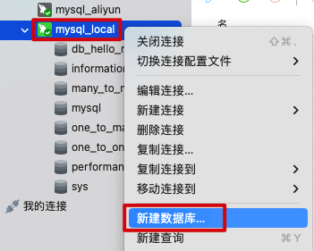
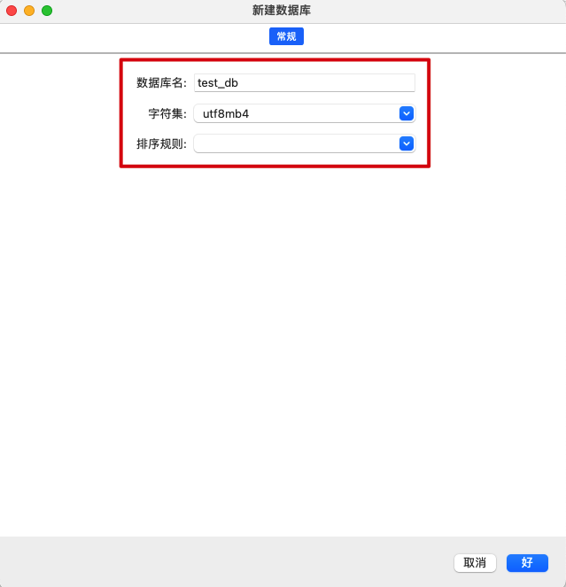
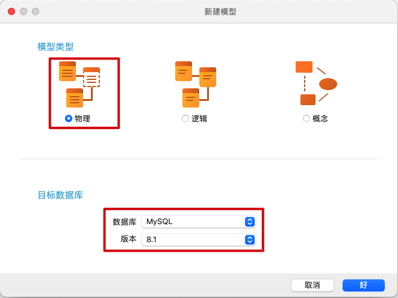
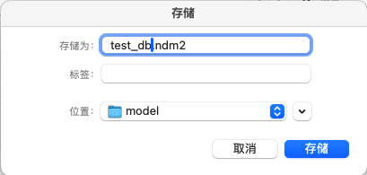
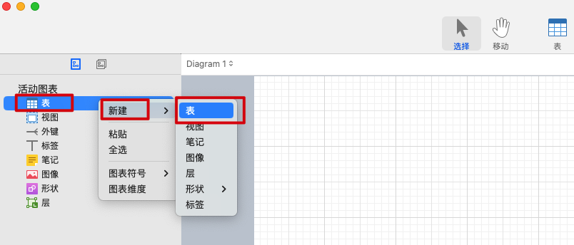
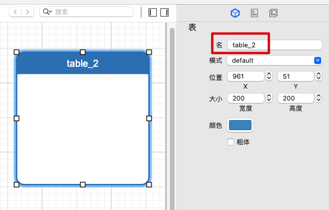
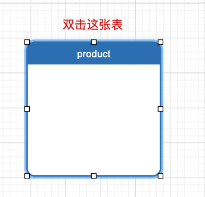
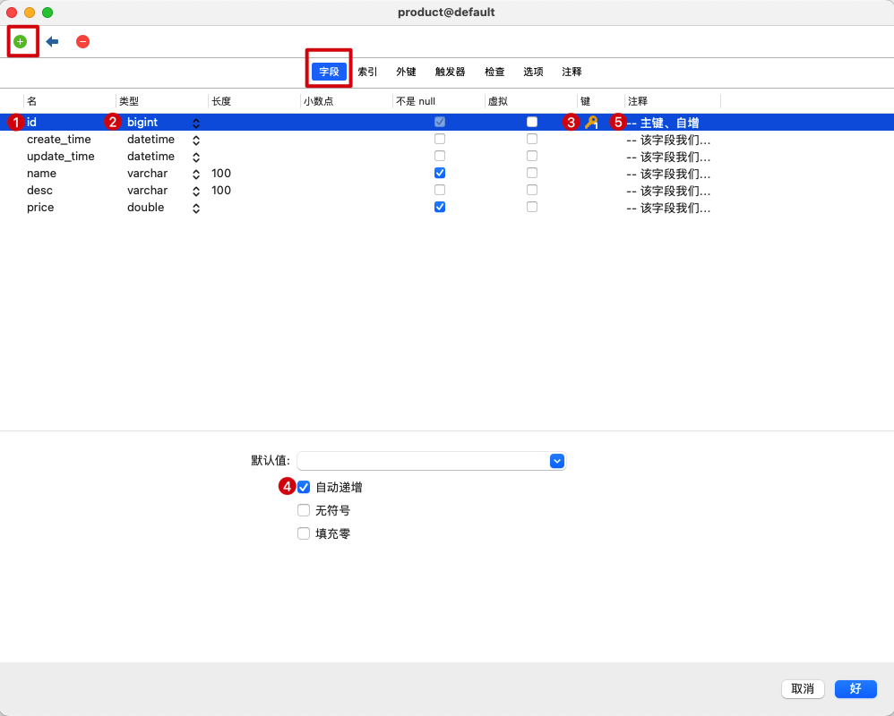

实际开发中，一般都是用 Navicat GUI 工具先把数据库和表创建好，项目里就只做些增删改查操作，很少在项目里通过代码来创建数据库和表。

## 一、用 Navicat Premium 创建数据库

> 一般来说一个项目对应一个数据库

***

## 二、用 Navicat Data Modeler 设计表

Navicat Data Modeler 是一个强大的设计表工具，本机安装 Navicat Data Modeler：

- Navicat Data Modeler 下载地址：https://www.5v13.com/macrj/37949.html
- 下载完双击安装即可，macOS 上会默认安装在应用程序
- Navicat Data Modeler 使用教程：https://www.navicat.com.cn/manual/online_manual/cn/navicat_data_modeler_4/mac_manual/#/about_0

#### 1、新建模型

> Navicat Data Modeler 里的模型其实就是数据库的设计图纸，我们就是在模型这个东西上设计数据库里一张一张的表，所以模型的名字可以跟数据库的名字保持一致
>
> 一个数据库里可以有多张表 => 一个模型里可以有多张表

***

***

#### 2、创建表

#### 3、命名表

#### 5、给表添加字段

